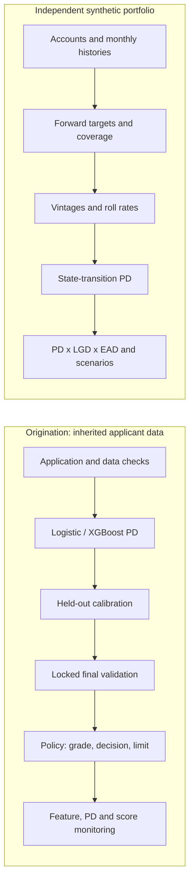

# Credit Risk Modeling & Decisioning Lab

A research lab for connecting credit risk estimates to underwriting decisions,
portfolio loss analysis and monitoring. It answers three business questions:
who appears risky at application, how a hypothetical credit policy changes
approvals and exposure, and how account migration affects portfolio losses.

**Research only; production use is not approved.** Models, limits and loss
assumptions require independent validation and policy approval. Nine findings
remain open in the [model risk register](reports/model_risk_register.md).

## Two data tracks, one risk workflow

The origination track uses the inherited 150,000-row applicant CSV. Its target
is `SeriousDlqin2yrs`, a source two-year delinquency label; it is not a newly
verified contractual default definition. There are no reliable borrower IDs or
observation dates. Duplicate predictor records are grouped across partitions;
validation is cross-sectional, not out of time.

The portfolio track uses explicitly synthetic accounts and monthly histories.
It demonstrates forward target construction, vintages, roll rates and expected
loss. These accounts are independent of the applicant CSV: origination PDs are
not joined onto synthetic accounts or presented as portfolio-calibrated PDs.



## What is implemented

| Capability | Evidence | Practical limit |
| --- | --- | --- |
| Data contracts and censored targets | [Data contracts](docs/data_contracts.md) | Original CSV has no longitudinal history |
| Logistic benchmark and XGBoost challenger | [Modeling](docs/pd_modeling.md) | Train-only preprocessing; no neural ensemble |
| Sigmoid/isotonic calibration, AUC/Gini/KS, PR, Brier, log loss, reliability and uncertainty | [Validation report](reports/validation_report.md) | Conditional bootstrap; no external validation |
| Vintages, account/balance migration, SQL cross-checks | [Portfolio analytics](docs/portfolio_analytics.md) | Synthetic data and coverage-aware denominators |
| Transition PD, exposure, concentration and scenario losses | [Expected loss](docs/expected_loss.md) | State-only Markov benchmark; assumed LGD/CCF |
| Risk grades, approve/review/decline, hypothetical credit limits | [Credit strategy](docs/credit_strategy.md) | No validated affordability or funded economics |
| Reject-inference selection-bias experiments | [Reject inference](docs/reject_inference.md) | Simulation and identification assumptions |
| Feature/PD/score PSI, KS, missingness and support alerts | [Monitoring](docs/monitoring.md) | Frozen development reference; no mature live outcomes |
| FastAPI scoring/decision endpoints and optional MLflow export | [API and tracking](docs/api_tracking.md) | Trusted artifacts required; research service |
| Tests, locked builds, CI definition and Docker recipe | [Engineering checks](docs/testing_ci_docker.md) | Hosted CI and local Docker execution unverified |
| Model card, risk register and evidence consistency checks | [Governance](docs/model_governance.md) | Procedural gates; independent approvals outstanding |

## Recorded model results

These are the existing Phase 5 final-holdout results, not a new evaluation.
Selection used the development partition; calibration used its separate fitting
partition. The 29,991-row final test contains 2,003 events and is **consumed**.
Do not remove the test-consumption marker or reuse this holdout for tuning.

<!-- evidence:final_metrics -->
| Selected model | AUC | Gini | KS | Average precision | Brier | Log loss | ECE | O/E |
| --- | ---: | ---: | ---: | ---: | ---: | ---: | ---: | ---: |
| logistic_regression / isotonic | 0.834776 | 0.669551 | 0.512370 | 0.345232 | 0.050967 | 0.188287 | 0.004050 | 1.026412 |
| xgboost / sigmoid | 0.868152 | 0.736304 | 0.577380 | 0.408630 | 0.048545 | 0.176030 | 0.002820 | 1.023134 |
<!-- /evidence:final_metrics -->

XGBoost with sigmoid calibration is the selected research candidate. Calibration
is assessed using probability quality as well as ranking: sigmoid marginally
improved raw XGBoost log loss while slightly worsening Brier score. No statistical
superiority claim follows from that small difference. See the
[model card](reports/model_card.md) for artifact hashes, segments and uncertainty.

## Install and verify

Use Python 3.11 and uv from the repository root. `uv.lock` fixes the dependency
resolution; the declared Python range is 3.11–3.14, while the historical model
bundle is tied to its recorded Python 3.11 dependency versions.

```console
uv sync --locked
uv run --no-sync credit-risk-lab check-config --config-dir configs
uv run --no-sync pytest --strict-config --strict-markers -q
uv run --no-sync ruff check src tests scripts api
uv run --no-sync ruff format --check src tests scripts api
uv run --no-sync python scripts/check_governance.py
uv run --no-sync python scripts/check_repository.py
uv build
uv run --no-sync python scripts/check_release.py --dist-dir dist
```

The fresh checkout supports fixture tests and the synthetic example below.
Original CSVs, fitted models, tracking databases and environments are ignored,
not distributed. See [data provenance](data/README.md). Imports do not load data
or deserialize a model. uv uses copy mode for OneDrive compatibility.

## Run the synthetic portfolio example

No original applicant data or fitted origination model is needed. Outputs must
be new paths: commands refuse to overwrite experiment evidence. The default
simulation has 500 accounts, 36 reporting months and seed 42.

```console
uv run --no-sync credit-risk-lab generate-portfolio --config configs/synthetic_portfolio.yaml --output-dir data/raw/readme-demo
uv run --no-sync credit-risk-lab build-targets --accounts data/raw/readme-demo/accounts.csv --history data/raw/readme-demo/history.csv --config configs/target.yaml --as-of 2024-12-31 --output data/processed/readme-demo/targets.csv
uv run --no-sync credit-risk-lab analyze-portfolio --accounts data/raw/readme-demo/accounts.csv --history data/raw/readme-demo/history.csv --source-manifest data/raw/readme-demo/manifest.json --config configs/portfolio.yaml --as-of 2024-12-31 --output-dir artifacts/readme-vintages
uv run --no-sync credit-risk-lab expected-loss --accounts data/raw/readme-demo/accounts.csv --history data/raw/readme-demo/history.csv --source-manifest data/raw/readme-demo/manifest.json --config configs/expected_loss.yaml --as-of 2024-12-31 --output-dir artifacts/readme-loss
```

Generated CSVs and manifests expose cohort coverage, censoring, transitions,
model provenance and scenario assumptions. Forward loss uses the portfolio
transition model, not the selected origination model. Existing default residual
loss is reported separately from new-default expected loss.

## Train and validate an origination experiment

Obtain an authorized source, verify its schema and record target semantics first.
The paths below describe a new research experiment on an independently designated
`data/raw/your-applicants.csv`; they do not refresh the recorded Phase 5 results.
Repeated experiments on the inherited source cannot manufacture a fresh test.

```console
uv run --no-sync credit-risk-lab validate-origination --csv data/raw/your-applicants.csv
uv run --no-sync credit-risk-lab train --csv data/raw/your-applicants.csv --config configs/model.yaml --development-config configs/development.yaml --output-dir artifacts/my-origination
uv run --no-sync credit-risk-lab validate --csv data/raw/your-applicants.csv --run-dir artifacts/my-origination --config configs/validation.yaml --output-dir artifacts/my-validation
uv run --no-sync credit-risk-lab compare-policies --csv data/raw/your-applicants.csv --run-dir artifacts/my-origination --validation-dir artifacts/my-validation --config configs/credit_strategy.yaml --output-dir artifacts/my-policies
```

Base models fit on training data, calibrators fit on calibration data, and
candidate/calibration choices use development log loss before final evaluation.
The runners write source, code, dependency and artifact identities. Defaults
approve below PD 0.03 and decline at or above 0.10; other cases require review.
Data-quality/limit guards can move an otherwise approved application to review.
Limit, EAD and loss outputs are illustrative quantities with unverified units.

## Serve the research model and optionally track evidence

```console
uv run --no-sync uvicorn credit_risk.api.main:create_app --factory --host 127.0.0.1 --port 8000
```

`GET /health`, `POST /score` and `POST /decision` use the serving config;
interactive API documentation is at `http://127.0.0.1:8000/docs`.
`configs/serving.yaml` points to the local historical source and Phase 4/5 bundle.
For another trusted bundle, set `CREDIT_RISK_SERVING_CONFIG` to your YAML.
A fresh clone without the bundle returns **503**, including readiness health.
Hashes verify consistency but do not make an untrusted pickle safe to load.
Request examples and response identities are in [API contracts](docs/api_tracking.md).

Optional local tracking exports existing evidence without refitting or scoring:

```console
uv sync --locked --extra tracking
uv run --no-sync credit-risk-lab track-experiment --kind origination --run-dir artifacts/my-origination --config configs/tracking.yaml
uv run --no-sync credit-risk-lab track-experiment --kind validation --run-dir artifacts/my-validation --config configs/tracking.yaml
```

Tracking is optional; the core package and container do not require MLflow.
For drift, use `freeze-monitor-reference` and `monitor` with the exact source,
selected bundle and current applicant file described in [monitoring commands](docs/monitoring.md).
Alerts do not automatically retrain models or change policy.

## Container and repository map

```console
docker build --tag credit-risk-lab:local .
python scripts/smoke_container.py --image credit-risk-lab:local
```

The recipe uses a non-root, core-only runtime and external read-only model/data
mounts. See [container instructions](docs/testing_ci_docker.md) for mount paths.
The local Docker engine was unavailable during the audit; build/runtime checks
remain unverified. GitHub Actions defines Windows/Linux and Python compatibility
lanes, but no hosted run has occurred for these unpushed commits.

| Location | Purpose |
| --- | --- |
| `src/credit_risk/` | Data, features, models, validation, portfolio, decisioning, monitoring, API, tracking |
| `configs/` | Typed YAML examples and explicit research assumptions |
| `tests/`, `scripts/`, `.github/workflows/` | Fixture tests, evidence/release guards and CI |
| `sql/` | Portfolio analytics counterparts checked against Python |
| `docs/`, `reports/` | Methods, governance, recorded aggregate results and final audit |
| `data/raw/`, `data/processed/`, `artifacts/` | Ignored local experiment outputs |

The inherited notebook, app.py, main.py and templates remain historical evidence,
excluded from release runtimes. The [V1 README archive](docs/history/README.md)
preserves the original bytes. Earlier commits still contain legacy generated
files; this project did not rewrite Git history.

For a walkthrough, follow the [model card](reports/model_card.md),
[validation report](reports/validation_report.md), [credit policy](reports/credit_policy.md)
and [final repository audit](reports/final_repository_audit.md). The audit maps the
mission to delivered capabilities and identifies remaining work, including real
behavioral feature windows, a validated WOE/IV scorecard layer, dated external
validation, fairness/explanations, live outcomes and independent approvals.
