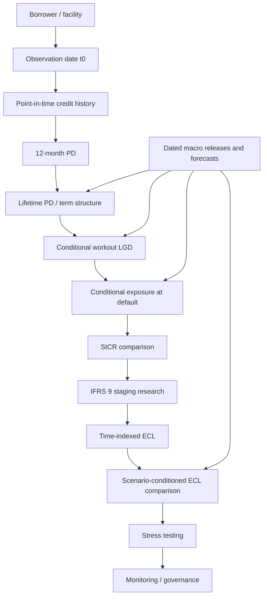

# Track B longitudinal credit data contract

Status: Task 0 research design, 2026-10-06. No dataset selected/downloaded, modeling, staging, ECL calculation or scenario generation.

## Purpose and Track A isolation

Track B studies dated credit-risk trajectories supporting time-dependent PD, workout LGD, exposure at default, SICR, staging, ECL and macroeconomic stress. Support must be established separately for each component before modeling. This contract specifies necessary concepts, not fields to manufacture in one dataset.

Track A is COMPLETE and remains the two-year serious-delinquency benchmark. Do not modify its models, predictions, artifacts, contracts, registry or evidence; never divide or relabel its probabilities as 12-month/lifetime PD. See the [Track A MDVR](../../reports/model_validation/MODEL_DEVELOPMENT_VALIDATION_REPORT.md). Existing [synthetic contracts](../data_contracts.md) are architecture demonstrations only. Generic hashing/validation utilities may be reused later only after their temporal/identity assumptions are reviewed.

## Architecture and relationships

The chain orders research dependencies, not causation. Macro scenarios condition components before loss aggregation. Borrowers link to facilities; facilities have dated snapshots/default episodes; episodes link to recovery/cost cash flows. Coverage records determine observable risk intervals. Macro links use justified geography/frequency/vintage, not borrower identity. Co-borrowers, transfers, restructurings and renumbering need versioned mapping where applicable. Separate datasets may support separate components without representing one real portfolio.

## Field-register conventions

REQUIRED means necessary for the stated core entity/analysis. CONDITIONALLY REQUIRED means necessary when the stated product/component/design is claimed. OPTIONAL means purpose-justified enrichment. Requirement and nullability differ: a conditional field can be absent for an out-of-scope component; once applicable, its nullability rule applies. Unknown is never silently zero/false/not applicable.

PD denotes 12-month/lifetime risk unless narrowed; STRESS denotes macro sensitivity/stress research. All money needs currency, units, sign/precision conventions; rates need annualization/compounding/day-count definitions. IDs are stable pseudonymous keys, never row positions/profile hashes. Dates need calendar/timezone/granularity; timestamps are timezone-aware. Monthly events do not manufacture daily dates. Every predictor-bearing entity inherits the lineage fields below. Protected characteristics are not predictive-model prerequisites; any fairness study requires separate lawful-use/access decisions.

Tables explicitly record field definition, type, temporal meaning, requirement, nullability, purpose/component, leakage control and source expectations. Entity is each table heading. Proposed child tables/references are conceptual, not implemented modules.

### Entity: Lineage / source version

| Field | Definition | Type | Temporal meaning | Requirement | Nullability | Purpose/components | Leakage control | Source expectation |
| --- | --- | --- | --- | --- | --- | --- | --- | --- |
| dataset_id | Source namespace/version | string | Extraction/version | REQUIRED | No | All | No row-number joins | Licensed manifest |
| source_record_id | Traceable source record/version | string | Record identity | REQUIRED | No | All | Audit key, not predictor | Original lineage |
| available_at | Earliest availability to intended scoring process | timestamp | Knowledge time | REQUIRED | No for predictors | All | At/before t0 | Release/ingestion evidence or conservative documented lag |
| effective_from | Start of real-world validity | date/timestamp | Valid time | REQUIRED | No | All | Does not replace availability | Historical version ledger |
| effective_to | End of validity | date/timestamp | Version boundary | CONDITIONALLY REQUIRED | Yes for open version | All | Future supersession not t0 feature | Non-overlapping intervals |
| revision_id | Correction/restatement identity | string | Information vintage | REQUIRED | No; initial release is a version | All | Retain original/revised values | Revision policy |
| definition_version | Dictionary/derivation identity | string | Definition in force | REQUIRED | No | All | No silent relabeling | Versioned dictionary/code |

### Entity: Borrower

| Field | Definition | Type | Temporal meaning | Requirement | Nullability | Purpose/components | Leakage control | Source expectation |
| --- | --- | --- | --- | --- | --- | --- | --- | --- |
| borrower_id | Stable obligor identity/namespace | string | Across facilities/snapshots | REQUIRED | No for borrower-linked work | PD, LGD, EAD, SICR, ECL, STRESS | Not predictor; prevent overlap | Pseudonymous validated master |
| borrower_type | Individual/business/declared segment | categorical | Version at t0 | CONDITIONALLY REQUIRED | No if segmented | PD, LGD, EAD, STRESS | No future status rewrite | Classification history |
| relationship_start_date | First observed relationship date | date | Known history start | OPTIONAL | Yes | PD/EAD tenure | No retrospective discovery | Coverage definition |
| segment_attributes | Individually registered purpose-justified fields | typed register | Measured/available before t0 | OPTIONAL | Yes, explicit | PD, LGD, EAD, STRESS | No outcome-derived refresh | Dated definitions/lawful use |

segment_attributes is a registration mechanism, not an arbitrary implemented feature blob. Lack of protected-group data does not prove fairness.

### Entity: Facility / contractual version

| Field | Definition | Type | Temporal meaning | Requirement | Nullability | Purpose/components | Leakage control | Source expectation |
| --- | --- | --- | --- | --- | --- | --- | --- | --- |
| facility_id | Stable account/facility key | string | Across observations/episodes | REQUIRED | No | All credit components | Resolve transfers/renumbering | Reconciled master |
| borrower_id | Obligor link | string | Ownership at observation | REQUIRED | No for linked full scope | PD, LGD, EAD, SICR, ECL | No matching-profile inference | Validated mapping |
| product_type | Term/revolving/other family | categorical | Contract version at t0 | REQUIRED | No | PD, EAD, ECL, STRESS | No future restructure terms | Product dictionary |
| origination_date | Booking date | date | Origination event | REQUIRED | No | PD, EAD, SICR | Preserve original/modifications | Booking record |
| initial_recognition_date | Accounting risk-comparison reference | date | Recognition event | CONDITIONALLY REQUIRED | No for SICR/staging/ECL | SICR, ECL | Booking proxy only if justified | Accounting lineage |
| maturity_date | Expiry under current terms | date | Terms known at t0 | CONDITIONALLY REQUIRED | No for finite-term lifetime work; declared not-applicable for open-end | PD, EAD, ECL | No later extensions | Historical terms |
| currency | Amount currency | code | Applicable version | CONDITIONALLY REQUIRED | No for monetary work | LGD, EAD, ECL, STRESS | No future FX as current input | Currency/FX policy |
| original_balance | Booking amount advanced | decimal | Origination amount | CONDITIONALLY REQUIRED | No if original exposure/amortization used | EAD, LGD, ECL | No overwrite with later balance | Booking reconciliation |
| credit_limit | Authorized commitment | decimal | Effective limit | CONDITIONALLY REQUIRED | No for revolving EAD | EAD, ECL | Later cuts are later events | Limit history |
| contractual_schedule | Due dates, principal/interest/fees | child table | Version known at t0 | CONDITIONALLY REQUIRED | No for scheduled EAD/ECL | EAD, ECL | Not realized future payments | Contract/amortization ledger |
| contractual_rate_terms | Rate/index/reset/fee terms | typed terms | Known at t0 | CONDITIONALLY REQUIRED | No for cash-flow work | EAD, ECL | Future realized resets need scenarios | Rate dictionary |
| effective_interest_rate | Applicable EIR/convention | decimal plus metadata | Recognition/applicable basis | CONDITIONALLY REQUIRED | No for IFRS-oriented discounting | LGD, ECL | No future inferred rate | Accounting calculation lineage |
| collateral_reference | Security, priority, dated valuation | child reference | Valuation/rights dates | CONDITIONALLY REQUIRED | Yes if unsecured; no when effects claimed | LGD, ECL, STRESS | Exclude realized proceeds from initial features | Valuation/allocation policy |
| impairment_scope | Instrument eligibility and credit-impaired-at-recognition status | categorical plus evidence | Recognition/version | CONDITIONALLY REQUIRED | No for staging/ECL | SICR, ECL | No inference from later default | Accounting scope including POCI |

### Entity: Observation / snapshot

| Field | Definition | Type | Temporal meaning | Requirement | Nullability | Purpose/components | Leakage control | Source expectation |
| --- | --- | --- | --- | --- | --- | --- | --- | --- |
| facility_id | Facility link | string | Snapshot ownership | REQUIRED | No | All credit components | Validate cardinality | Reconciled key |
| observation_date | t0 scoring/reporting cutoff | date/timestamp | Information cutoff | REQUIRED | No | All credit components | Explicit calendar/cutoff | Extraction convention |
| credit_state | Performing/delinquent/default/closed state | categorical | At t0 | REQUIRED | No for risk-set assignment | PD, SICR, ECL | No future maximum DPD | State/transition dictionary |
| outstanding_balance | Drawn exposure/carrying amount under declared basis | decimal | At t0 | CONDITIONALLY REQUIRED | No for exposure/loss work | EAD, LGD, ECL | No default-time balance substitution | Reconciled ledger/accrual basis |
| available_limit | Authorized undrawn amount | decimal | At t0 | CONDITIONALLY REQUIRED | No for revolving EAD | EAD, ECL | No realized future draws/cancellations | Balance/limit reconciliation |
| days_past_due | Arrears age under policy | integer | At t0 | CONDITIONALLY REQUIRED | No if state/default/SICR uses it | PD, SICR, ECL | No future DPD or gap fill as current | Due/payment/materiality logic |
| arrears_amount | Defined overdue amount | decimal | At t0 | CONDITIONALLY REQUIRED | No if materiality rule uses it | PD, SICR, ECL | No later collection outcomes | Ledger allocation |
| payment_history | Actual payments/due obligations | child table | Before t0 for predictors | CONDITIONALLY REQUIRED | No for behavioral features | PD, EAD, SICR | Separate future label events | Event, posting, availability and reversals |
| score_or_rating | Risk measure, scale and model version | numeric/categorical plus metadata | Effective/available at t0 | CONDITIONALLY REQUIRED | No when risk comparison used | PD, SICR, STRESS | No backfilled later scores | Archived score vintages |
| forbearance_status | Restructuring/concession state/reason | categorical | Dated decision/status | CONDITIONALLY REQUIRED | No if relied on | PD, SICR, ECL | No future restructuring at past t0 | Decision/effective dates |
| qualitative_risk_flags | Registered adverse indicators | typed register | Known at t0 | CONDITIONALLY REQUIRED | No if staging/default uses them | SICR, ECL, PD | Unknown is not false | Policy-linked adjudication |

Utilization can be derived from consistent balance/limit definitions. Zero/nonpositive undrawn amounts, over-limit balances and canceled lines require product-specific definitions, not invented thresholds.

### Entity: Default episode / impairment event

| Field | Definition | Type | Temporal meaning | Requirement | Nullability | Purpose/components | Leakage control | Source expectation |
| --- | --- | --- | --- | --- | --- | --- | --- | --- |
| default_episode_id | Unique episode identity | string | First/recurrent default | REQUIRED | No for events | PD, LGD, EAD, ECL | Separate cure/re-default episodes | Stable event ledger |
| event_entity_id | Borrower/facility key plus declared event scope | string plus enum | Affected entity | REQUIRED | No | PD, LGD, EAD, ECL | Explicit contagion, no duplicate counting | Scope/linkage policy |
| default_date | First qualifying event occurrence | date or bounded interval | Outcome time | REQUIRED | No; interval permitted if coarsened | PD, LGD, EAD, ECL | Future date only as outcome | Adjudication or sufficient event history |
| default_definition_id | Event definition/version and scope | string | Applicable definition | REQUIRED | No | PD, LGD, EAD, ECL | No silent target changes | Trigger/materiality/eligibility policy |
| default_derivation | Supplied-event or derived-rule lineage | reference | Label method/version | REQUIRED | No | PD, LGD, EAD, ECL | Separate label and feature logic | Source rule or reproducible derivation |
| default_reason | Qualifying trigger(s) | categorical/list | Event reason | CONDITIONALLY REQUIRED | No for derived/trigger-specific study | PD, LGD, SICR, ECL | No future reasons in PD | Reason codes/precedence |
| credit_impaired_status | Accounting impairment evidence/date | categorical plus evidence | Reporting state | CONDITIONALLY REQUIRED | No for Stage 3 | SICR, ECL | Research default is not automatic impairment | Accounting adjudication |
| cure_date | Date cure criteria are met | date | Post-default transition | CONDITIONALLY REQUIRED | Yes if uncured; unknown distinguished | LGD, PD transitions, ECL | Outcome, not pre-default feature | Cure/probation logic |
| write_off_date | Accounting write-off date | date | Accounting event | CONDITIONALLY REQUIRED | Yes if absent; unknown distinguished | LGD, ECL | Not universal default/completion date | Write-off ledger/policy |
| exposure_at_default | Exposure allocated to episode | decimal | Default-date basis | CONDITIONALLY REQUIRED | No for observed EAD/LGD | EAD, LGD, ECL | EAD outcome, not t0 feature | Balance-date, accrual, FX and allocation |

### Entity: Recovery / workout cash flow

| Field | Definition | Type | Temporal meaning | Requirement | Nullability | Purpose/components | Leakage control | Source expectation |
| --- | --- | --- | --- | --- | --- | --- | --- | --- |
| cash_flow_id | Flow/reversal key | string | Transaction identity | REQUIRED | No for workouts | LGD, ECL | Deduplicate reversals | Collections/ledger key |
| default_episode_id | Episode allocation | string | Workout linkage | REQUIRED | No for episode LGD | LGD, ECL | No unrelated proceeds | Allocation policy |
| cash_flow_date | Recovery/cost occurrence date | date | Discount timing | REQUIRED | No for discounted LGD | LGD, ECL | Future flow is outcome | Value/posting-date convention |
| cash_flow_amount | Signed recovery/cost amount | decimal | Transaction amount | REQUIRED | No; zero must be observed | LGD, ECL | No final totals as initial predictors | Reconciled amounts |
| cash_flow_type | Recovery/cost/collateral/adjustment | categorical | Flow purpose | REQUIRED | No for net-loss reconstruction | LGD, ECL | Avoid gross/net double counting | Cost attribution/gross-net policy |
| cash_flow_currency | Transaction currency | code | Transaction date | REQUIRED | No for monetary work | LGD, ECL | Versioned conversion | FX/currency source |
| workout_end_date | Completion or administrative cutoff | date plus completion status | Workout follow-up boundary | REQUIRED | Open workout allowed with extraction cutoff | LGD, ECL | Incomplete is not ultimate loss | Completion/late-recovery policy |
| discount_basis | Rate/reference-date/convention | policy reference | Valuation basis | CONDITIONALLY REQUIRED | No for discounted loss | LGD, ECL | Research/accounting rates distinct | Documented discount assumptions |

Collateral proceeds are a flow type, not an extra duplicated total. Write-off need not end recoverability; cure, debt sale and later recoveries require episode allocation.

### Entity: Coverage / exit

| Field | Definition | Type | Temporal meaning | Requirement | Nullability | Purpose/components | Leakage control | Source expectation |
| --- | --- | --- | --- | --- | --- | --- | --- | --- |
| entity_id | Key matching risk unit | string | Coverage ownership | REQUIRED | No | PD, LGD, EAD, ECL | Same namespace as outcomes | Coverage ledger |
| coverage_start_date | First reliable observation | date | Entry/left truncation | REQUIRED | No | PD, LGD, EAD, ECL | Pre-entry history unknown | Source coverage metadata |
| followup_end_date | Last reliable ascertainment | date | Outcome boundary after t0 | REQUIRED | No for labeling | PD, LGD, EAD, ECL | Label metadata, never predictor | Completeness/transfer tracing |
| exit_date | Closure/prepayment/transfer/loss to follow-up | date | Risk-set change | CONDITIONALLY REQUIRED | Yes if none; unknown distinguished | PD, EAD, ECL | Not automatically non-default | Exit events |
| exit_reason | Economic competing event vs administrative censoring | categorical | Exit reason | CONDITIONALLY REQUIRED | No if exit exists | PD, EAD, ECL | Distinguish prepaid/transferred/unobserved | Exit dictionary |
| coverage_gaps | Unreliable observation intervals | interval list | Ascertainment gaps | REQUIRED | Empty only if continuous coverage verified | PD, LGD, EAD, ECL | No missing-month good-state interpolation | Cadence/coverage guarantees |

### Entity: Origination risk / policy reference

| Field | Definition | Type | Temporal meaning | Requirement | Nullability | Purpose/components | Leakage control | Source expectation |
| --- | --- | --- | --- | --- | --- | --- | --- | --- |
| facility_id | Recognition-linked instrument | string | Original/current identity | CONDITIONALLY REQUIRED | No for SICR | SICR, ECL | Resolve modifications/derecognition | Instrument lineage |
| initial_risk_reference | Initial rating/term structure/horizon | structured reference | Recognition information set | CONDITIONALLY REQUIRED | No for risk-change comparison | SICR, ECL | No hindsight as original observation | Archived scores/models/features |
| current_risk_reference | Comparable remaining-life current risk | structured reference | Reporting information set | CONDITIONALLY REQUIRED | No for risk comparison | SICR, ECL | Align horizons/scales/model versions | Risk evidence/comparability bridge |
| sicr_policy_version | Relative/absolute/qualitative criteria | reference | Applicable policy | CONDITIONALLY REQUIRED | No for SICR/staging | SICR, ECL | Not chosen on final outcomes | Declared heuristic or accounting/institution policy |
| stage_reason_record | Reasons and overrides | structured record | Classification decision time | CONDITIONALLY REQUIRED | No when stages claimed | SICR, ECL | Missing reasons are not clean evidence | Inputs/reviewer/override history |

### Entity: Macroeconomic observation / release vintage

| Field | Definition | Type | Temporal meaning | Requirement | Nullability | Purpose/components | Leakage control | Source expectation |
| --- | --- | --- | --- | --- | --- | --- | --- | --- |
| series_id | Economically justified macro series | string | Series identity | CONDITIONALLY REQUIRED | No for macro work | PD, LGD, EAD, ECL, STRESS | Not arbitrary feature enrichment | Provider dictionary/license |
| geography | Economic region/coverage | categorical | Exposure linkage | CONDITIONALLY REQUIRED | No for macro linkage | PD, LGD, EAD, ECL, STRESS | Disclose geographic proxy | Region mapping |
| reference_period | Period measured | date/interval | Economic valid time | CONDITIONALLY REQUIRED | No | PD, LGD, EAD, ECL, STRESS | Not publication time | Frequency/calendar |
| release_date | Public/source release date | timestamp | Knowledge time | CONDITIONALLY REQUIRED | No for PIT macro analysis | PD, LGD, EAD, ECL, STRESS | Known by t0 | Release archive |
| macro_vintage_id | Initial/revised release identity | string | Revision vintage | CONDITIONALLY REQUIRED | No for PIT macro analysis | PD, LGD, EAD, ECL, STRESS | No latest revisions in historical real-time claims | Vintage archive or declared restrictions |
| macro_value | Value/unit/transformation basis | numeric plus metadata | Selected-vintage value | CONDITIONALLY REQUIRED | No for used regressors; gaps explicit | PD, LGD, EAD, ECL, STRESS | Available-period transforms only | Seasonal adjustment/units |

Unemployment, GDP growth, inflation and rates are candidate concepts, not mandatory variables. House prices require relevant collateral/geography. Reference dates alone do not prove availability; no real-time macro backtest is claimed without vintages or defensible conservative availability evidence.

### Entity: Scenario forecast / valuation run

| Field | Definition | Type | Temporal meaning | Requirement | Nullability | Purpose/components | Leakage control | Source expectation |
| --- | --- | --- | --- | --- | --- | --- | --- | --- |
| scenario_id | Baseline/upside/downside or justified alternative | string | Scenario identity | CONDITIONALLY REQUIRED | No for scenarios | ECL, STRESS | Labels are not fabricated paths | Provider/methodology |
| forecast_as_of | When forecasts/weights became available | timestamp | Forecast knowledge time | CONDITIONALLY REQUIRED | No | ECL, STRESS | At/before valuation cutoff | Archived forecast release |
| forecast_period | Future period represented | date/interval | Forecast horizon | CONDITIONALLY REQUIRED | No | ECL, STRESS | Not later realized observation | Forecast calendar |
| forecast_value | Series/geography/period scenario value | numeric plus metadata | Future assumption known at issuance | CONDITIONALLY REQUIRED | No for required horizon; extrapolation disclosed | ECL, STRESS | Separate forecast and realization | Versioned coherent paths |
| scenario_weight | Nonnegative probability weight | decimal | As of valuation | CONDITIONALLY REQUIRED | No for weighted ECL; optional for deterministic stress | ECL | Sum to one; not fitted against final losses | Justified/reviewed weights |
| valuation_horizon_basis | Remaining/behavioral life and time grid | policy reference | Set using t0 knowledge | CONDITIONALLY REQUIRED | No for lifetime/ECL | PD, EAD, ECL | No realized future closure as predicted life | Contract/product policy |

## Observation-time correctness

Set t0 = observation / scoring date. Ask for every predictor: **Could this information genuinely have been known at t0?** Event/effective time and knowledge time must both meet the cutoff. An old effective date on a later correction does not make it historically available.

1. Features use events ending at/before t0 and posted/published by t0. Record lookback boundaries, minimum history, lags and join/aggregation lineage. Future payments, future peak delinquency and later balances cannot enter PD/EAD features.
2. Defaults after t0 and recoveries belong to outcomes. Already-defaulted t0 exposures leave the incident-default risk set. Post-default LGD/remaining-recovery research declares a separate valuation date/information set.
3. Contract schedules and authentic forecasts known at t0 can describe future periods. Realized future payments/macroeconomic values cannot be substituted for forecasts.
4. Join macro by release vintage and justified lag. Latest revised data may support a declared retrospective association study, but not a real-time backtest. Do not set release_date equal to reference_period without evidence.
5. Later modeling must fit transforms/select variables only in training information sets, then validate chronologically and by entity. Repeated snapshots are correlated, not independent borrowers.
6. Default labels, eligibility and follow-up use outcome information separately from predictors. Track A's consumed population and profile fingerprints cannot establish a fresh Track B final test or real borrower identity.

## Default and 12-month PD labels

Require explicit dated default with a documented definition, or enough dated event history to derive a clearly stated research definition. Preserve event scope, triggers, materiality where relevant, event/availability times, derivation version, repeat episodes and cure/probation rules. No universal regulatory definition or DPD-only default rule is adopted. A proxy remains labeled a proxy.

Estimate P(default within next 12 months given information at t0) among exposures eligible and not defaulted at t0. Define D as the first qualifying event after t0. Define H by calendar addition of 12 months with a stated convention, not automatically 365 days. Event window: (t0, H]; a t0 event is prevalent default. Coarsened dates may require interval censoring, not invented daily precision.

| Label state | Evidence | Treatment |
| --- | --- | --- |
| Positive | Valid linked qualifying event in (t0, H] | Can be established before H; later cure does not erase event |
| Negative | No event through H with verified ascertainment, no unhandled gaps and declared competing-event policy | Absence of a record is not no default |
| Censored | Reliable risk time ends before H without default, or interval timing prevents binary adjudication | Preserve duration/reason; future censoring-aware method or explicitly limited exclusion |
| Insufficient follow-up | Cutoff/gaps/entry metadata cannot establish label or valid risk interval | Unknown, never silently negative; recover evidence or restrict/reject component |
| Not incident-risk eligible | Already defaulted at t0 or outside declared population | Separate analysis, not a new-default negative |

Prepayment/closure may remove facility risk or constitute a competing event; borrower default regardless of facility closure is a different estimand. Transfers without tracing are not proved repayment. Define each exit treatment. Assess informative censoring and left truncation; survival modeling does not automatically remove those biases. Realized follow-up length is label metadata, not a predictor.

## Lifetime PD and term structures

PD(t) must specify conditional interval hazard q_k, marginal first-default mass m_k or cumulative risk F_k. Without competing exits: S_k = product over j<=k of (1 - q_j); m_k = S_(k-1) * q_k; F_k = 1 - S_k = sum of m_j. With competing exits, default cumulative incidence requires their explicit risk-set treatment; this single-event formula cannot be used blindly.

| Research approach, not selected/implemented | Necessary history | Main qualification |
| --- | --- | --- |
| Discrete-time hazard | Entity-period risk sets, dated/interval events, entry/exit/censoring and PIT covariates | Gaps, time-varying predictors and exposure intervals explicit |
| Survival analysis | Durations, delayed entry, events, censoring/competing risks, PIT features | Test method assumptions and observation process later |
| Transition models | Comparable repeated credit states, transition intervals and exits/cures | State definitions/default absorption are declared assumptions |
| Multi-period binary models | Valid forward labels per horizon, common identities and censoring | Check coherent cumulative risk on comparable eligible populations |

Contractual maturity is not automatically expected behavioral life, especially for revolving credit. Extrapolation beyond observed maturities/defaults/regimes is an assumption requiring uncertainty and external validation.

## LGD and EAD requirements

LGD = economic loss / exposure at default under a stated amount/reference-date basis. Reconcile discounted episode recoveries, collection costs and collateral proceeds; avoid net/gross double counting. Observe completion or later justify a censored-workout method. Current recoveries on unfinished workouts do not establish ultimate loss. Review invalid denominators and possible negative losses/LGD above one instead of silent clipping.

Observed workout LGD uses actual exposure and timed workouts. Simplified research LGD declares omitted costs/timing/discount assumptions. Regulatory/downturn LGD additionally requires applicable definitions, downturn evidence and adjustments. These are not interchangeable. Recoveries are outcomes for pre-default predictions; known recoveries can be predictors only in separately dated post-default research.

Term-loan EAD needs t0 drawn balance, current schedules/rate/fee/accrual terms, subsequent payments/draws/prepayments and matched default-date exposure. Revolving EAD needs drawn/undrawn amounts, limit changes, draw/payment history, cancellation/over-limit treatment and event-date exposure. Future drawdown is an outcome. A future CCF study could examine (EAD - drawn_t0) / undrawn_t0 under declared horizons/units, with explicit zero/nonpositive denominators and limit-change handling. No CCF is computed here; default-conditioned behavior is not automatically representative of every account.

## SICR and IFRS 9 staging requirements

Compare archived initial-recognition risk with comparable current remaining-life risk, rating migration, dated delinquency, forbearance and qualitative evidence. Separate elapsed maturity, model-version changes and genuine deterioration. A research heuristic, accounting policy and institution-specific implementation are distinct. No universal SICR threshold is created.

Under the general impairment approach, Stage 1 needs in-scope instruments without qualifying SICR/current credit impairment; Stage 2 needs supported SICR without Stage 3 impairment; Stage 3 needs credit-impaired evidence under applicable policy. Performing status alone does not distinguish Stage 1 and Stage 2; research default and credit impairment are not automatically identical. Purchased/originated credit-impaired (POCI) assets and simplified approaches require separate scope/treatment, not forced assignment to this basic flow. See the [BIS IFRS 9 summary](https://www.bis.org/publications/fsi-summary-ifrs-9-and-expected-loss-provisioning-executive-summary).

## ECL and scenarios

For eligible initially non-defaulted instruments, a possible future decomposition is ECL(t0) = sum_s w_s * sum_k m_(k,s) * LGD_(k,s) * EAD_(k,s) * DF_(k,s), only when definitions and conditional factorization justify it. m is marginal first-default mass, not cumulative PD or conditional hazard alone. Products of unconditional component means may ignore dependence. Components need compatible default-time/scenario conditioning or a validated cash-shortfall approach. Credit-impaired exposures require their own expected-cash-flow treatment rather than mechanical new-default probabilities.

Stage 1 limits the default-event horizon to the appropriate next-year period, but losses following those defaults can extend beyond that year. Lifetime treatment uses the justified remaining exposure horizon. Discounting requires applicable EIR/research basis, currency and cash-flow timing. These are conceptual requirements, not calculated losses. The [BIS horizon explanation](https://www.bis.org/publications/fsi-summary-ifrs-9-and-expected-loss-provisioning-executive-summary) distinguishes default-event horizons from subsequent cash shortfalls.

Baseline/upside/downside are roles, not fabricated paths. Require dated forecast vintages, aligned horizon/frequency/geography, justified variables, coherent paths and reviewed nonnegative weights summing to one for probability-weighted ECL. Deterministic stress need not claim scenario probabilities. Disclose revision, lag and extrapolation limits. The [IFRS Foundation scenario material](https://www.ifrs.org/news-and-events/news/2016/07/25-webcast-on-ifrs-9/) discusses forward-looking information and multiple scenarios; it supplies no dataset-specific weights or certification of this proposal.

## Governance evidence and next gate

| Future stage | Required research evidence |
| --- | --- |
| Model Development | Accepted component scope, license/lineage, PIT contract, targets, splits, assumptions and versioned reproducible runs |
| Independent Validation | Recorded reviewer independence, untouched suitable validation populations, challenges to temporal/identity/calibration/stress assumptions |
| Findings | Reproducible issue, severity rationale, affected scope and evidence reference |
| Developer Response | Documented agreement/disagreement, response evidence and residual-risk rationale |
| Remediation | Versioned changes and appropriate fresh checks; reused data not portrayed as independent |
| Approval Simulation | Explicit research-only roles/conditions/findings; not actual bank approval |
| Monitoring | Mature cohorts, coverage/censoring, drift, calibration, component/aggregate loss error and ownership |
| Recalibration/Redevelopment Trigger | Declared investigation criteria, decision record, new-data validation and rollback/version control |

[BCBS ECL guidance](https://www.bis.org/committees/bcbs/basel-consolidated-guidelines/module/pap/20) supports documented forward-looking processes and independent review. These are proposed research evidence requirements, not compliance or actual independent bank validation.

The next gate is [Candidate Dataset Discovery and Comparative Suitability Assessment](DATASET_SEARCH_STRATEGY.md) using the [component-specific framework](DATASET_SUITABILITY_FRAMEWORK.md). No downloads or model implementation in Task 0.
