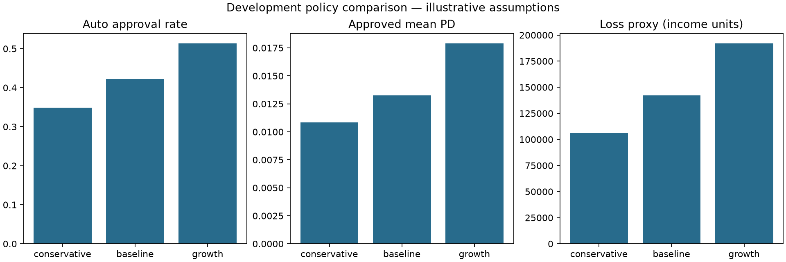

# Phase 8: decisioning and credit-limit strategy

The frozen Phase 5 XGBoost/sigmoid model scored 22,483 original development
applicants. No model was fitted and no final-test rows were scored. Policies use
identical grade and affordability assumptions; only approval/decline PD thresholds
vary. All 22,483 applicants receive exactly one decision in each comparison.

| Policy | Approve | Review | Decline | Approval rate | Approved mean PD | Historical selected bad rate | Loss proxy |
| --- | ---: | ---: | ---: | ---: | ---: | ---: | ---: |
| conservative | 7,847 | 10,062 | 4,574 | 34.90% | 1.09% | 0.97% | 106,214.99 |
| baseline | 9,486 | 9,466 | 3,531 | 42.19% | 1.32% | 1.22% | 142,216.24 |
| growth | 11,539 | 8,506 | 2,438 | 51.32% | 1.79% | 1.60% | 191,946.97 |

Growth adds 3,692 automatic approvals relative to conservative, while approved
mean PD and total loss proxy increase. This is a tradeoff demonstration, not a
chosen policy or evidence of optimal profitability. Manual review remains large,
in part because raw income and proxy input guards can override low-PD eligibility.

Conservative approves G1: 3,595 and G2: 4,252; baseline approves G1: 3,595 and
G2: 5,891; growth adds G3: 2,053. Offered limits total 47,067,700 / 53,559,800 /
59,221,800 source income units respectively. At assumed drawdown .5, EAD totals
23,533,850 / 26,779,900 / 29,610,900. LGD is an assumed .45, so the loss proxy is
sum(PD * .45 * EAD). Review and decline receive zero automatic offered exposure.

PD is a two-year delinquency estimate; source income units and DebtRatio basis
are unverified. These are hypothetical limits and loss proxies, not contractual
default forecasts, accounting ECL or verified affordability. Historical selected
bad rates reuse development labels and are neither independent policy validation
nor future funded performance. Reject inference is deferred to Phase 9.

Reproduction and exact boundary/formula definitions are in
[credit_strategy.md](../docs/credit_strategy.md). Aggregate evidence and hashes are
in [phase8_policy_summary.json](phase8_policy_summary.json). Detailed row artifacts
remain ignored under artifacts/phase8-policy-002. The original V1 remains intact.

Validation: 176 tests passed, including threshold endpoints, grade inclusivity,
missing/zero income and proxy guards, monotone limits, downward rounding,
label-independent decisions, loss arithmetic and count conservation, checksum
rejection before deserialization, calibration provenance, and development-only
scoring without fitting. Lint, formatting, configuration, packaging and V1
preservation checks also passed.

## Phase 13 policy governance and current serving configuration

Baseline is the current API demonstration configuration, not a policy selected
by profitability or approved for lending. Approval is strictly PD < .03;
.03 <= PD < .10 enters manual review; PD >= .10 declines. Grades use inclusive
upper bounds .01/.03/.06/.10/1.0, so a grade boundary does not imply approval.
Decline takes priority over affordability guards. Otherwise-eligible approval
becomes review when raw income is missing/zero, DebtRatio/utilization is missing
or above one, or the rounded limit is below 500. Imputed income never supplies
automatic policy affordability. Review and decline receive zero offered limit.

The indicative limit starts with min(10,000, 2 × raw income), divides by
(1 + DebtRatio) and (1 + utilization), applies grade factors
1/.8/.6/.4/.2 and (1 − PD), then rounds down in 100-unit increments. No minimum
is rounded up into a funded offer. EAD=.5 × offered limit and loss proxy=PD ×
.45 × EAD are assumptions. Unknown source income/debt units prevent treating
these as verified cash-flow affordability or monetary loss forecasts.

Policy threshold/grade/limit/LGD/EAD changes require a separate versioned review
of development or new eligible data, approval/review/decline counts, exposure,
composition, missingness/segments and economic assumptions. Historical development
selected bad rates above reuse model-selection data and unknown source selection;
they are not funded performance, independent policy validation or reject outcomes.
No real adverse-action explanation, fairness or compliance approval is supplied
by illustrative model/policy reason codes. Independent policy validation and
qualified domain review remain required before real offers.

No credit-policy approver or approved exceptions process exists. A future manual
review/override must record its reason, authorized actor, input/model/policy
identities and outcome; it cannot silently alter predicted PD or fit a model.
This is a proposed control, not an implemented manual-review queue or audit log.
See [model governance](../docs/model_governance.md),
[model card](model_card.md) and [GOV-004–GOV-006](model_risk_register.md).
