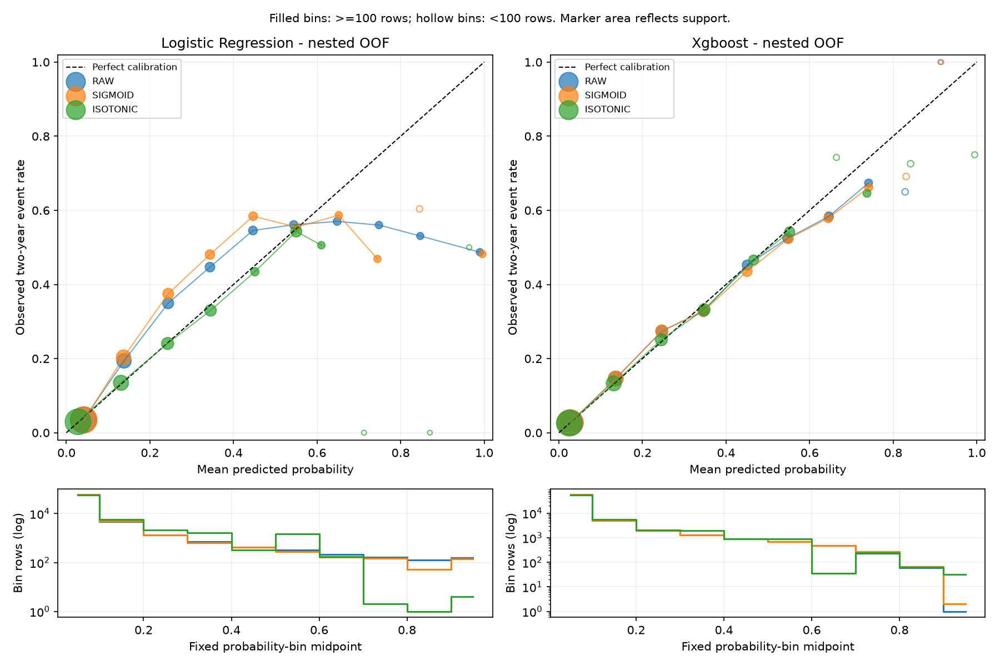

# Nested training-only probability calibration study

## Executive decision

This experiment compares six fixed model/method combinations on untouched outer folds, and separately evaluates a method-selection procedure whose decisions are made on inner data. Recommendations are research assessments; no model artifact or lending policy is changed.

## Dataset and nesting

Only 67,562 original training rows (4,514 two-year serious-delinquency outcomes) are parsed by the anchored Task 4 loader. Original development, calibration and consumed test partitions are excluded. Five outer StratifiedGroupKFold folds use seed 42 and exact raw predictor groups. Within each outer-training partition, another five grouped folds use seed 42 + outer fold number: inner role 0 fits calibrators, role 1 selects methods, and roles 2-4 fit the base pipeline. This is roughly 60%/20%/20% of outer training, subject to group stratification. All preprocessing fits only on the base-fit rows. No base refit occurs after calibration. Both base candidates use fixed existing configurations and each mapping shares the same base fit. The fitting function receives only outer-training data; the prediction function receives predictors only. Outer labels are used for stratified fold allocation and scoring, never fitting or selection. Fold identities, role sizes/event counts, calibrator parameters and seeds are recorded in JSON.

## Prespecified selection and practical importance

Primary objective: minimum inner-selection Brier score. A calibrated method must improve absolute Brier by at least 0.0001 and not worsen inner-selection log loss. Otherwise choose RAW. Ties among eligible calibrators favor sigmoid's lower complexity. This numerical margin was fixed before running the study; it is a research tolerance, not a lender-derived economic or regulatory threshold. No hyperparameters or classification thresholds are selected. Each selected mapping is frozen before outer prediction. The post-study research assessment additionally requires the conditional paired Brier interval to lie wholly beyond the minimum gain and the log-loss interval to show no deterioration. That assessment does not alter any outer prediction or turn the selected method's score into a fresh test.

## Full model x calibration comparison

Pooled Task 5 outer OOF predictions; raw probabilities bypass the existing calibrator's clipping, so they remain exactly as the base model emits them. Sigmoid fits a positive slope and intercept on logit probabilities (Platt-style log-odds scaling); isotonic fits a flexible nondecreasing mapping. The reused calibrator clips fit inputs and transformed outputs to [1e-6, 1-1e-6]. Calibration diagnostic logits separately use epsilon 1e-12. CITL fixes slope at 1; the reported slope comes from a joint intercept/slope fit. Joint intercepts and undefined fit reasons are stored in JSON.

| Model | Method | AUC | Gini | PR-AUC | Brier | Log loss | CITL | Slope |
| --- | --- | --- | --- | --- | --- | --- | --- | --- |
| logistic_regression | RAW | 0.832935 | 0.665870 | 0.333730 | 0.053077 | 0.206306 | -0.003473 | 0.947478 |
| logistic_regression | SIGMOID | 0.833021 | 0.666042 | 0.333417 | 0.053321 | 0.205907 | 0.011426 | 1.040826 |
| logistic_regression | ISOTONIC | 0.831077 | 0.662153 | 0.333601 | 0.051587 | 0.191449 | 0.011591 | 0.938122 |
| xgboost | RAW | 0.860465 | 0.720931 | 0.381395 | 0.049778 | 0.180376 | -0.000628 | 0.992087 |
| xgboost | SIGMOID | 0.859982 | 0.719964 | 0.381474 | 0.049797 | 0.180492 | 0.003263 | 0.975086 |
| xgboost | ISOTONIC | 0.859319 | 0.718637 | 0.381184 | 0.049868 | 0.182308 | 0.002169 | 0.927989 |

PR-AUC uses trapezoidal integration; average precision is stored separately. Raw Task 5 models use smaller base-fit sets than Task 4: their metrics are not a repeated Task 4 evaluation.

## Does Logistic Regression benefit from post-hoc calibration?

sigmoid: Brier delta +0.000244, log-loss delta -0.000399; isotonic: Brier delta -0.001490, log-loss delta -0.014857. Lowest point-estimate Brier: ISOTONIC. Conditional paired evidence meets prespecified Brier gain and log-loss guard. Research recommendation: **ISOTONIC**. The Brier reduction is 2.81% relative, with AUC delta -0.001858. This improves probability quality while sacrificing some ranking through ties. Near-ideal global CITL/slope alone do not exclude nonlinear local miscalibration; inspect the reliability curve and sparse tails before interpreting the gain.

## Does XGBoost benefit from post-hoc calibration?

sigmoid: Brier delta +0.000019, log-loss delta +0.000116; isotonic: Brier delta +0.000090, log-loss delta +0.001931. Lowest point-estimate Brier: RAW. No calibrated method meets both prespecified conditional evidence requirements; prefer simplicity. Research recommendation: **RAW**.

## Which method gives the best probability quality?

The lowest point-estimate Brier method is identified above for each model. Brier and log loss need not agree: report both and preserve the prespecified primary objective. Small numerical improvements alone do not justify additional complexity. Ranking quality (AUC/Gini) and probability quality (Brier/log loss/reliability) answer different questions.

## Are improvements practically meaningful, and is complexity justified?

The prespecified margin and paired intervals determine the research recommendations, rather than assuming a calibrated method must win. Even a statistical difference here does not establish economic value without a lender's exposure, loss severity, costs and decision policy. A raw model already calibrated in this population can be harmed by unnecessary recalibration. A logistic link does not guarantee calibration; tree boosting does not automatically require recalibration.

## Honest evaluation of inner method selection

Methods listed here were chosen on inner-selection data before outer evaluation. These scores evaluate the entire prespecified selection procedure, rather than hindsight selection of the best outer-fold method. Fixed-method comparisons above are reported separately.

| Model | Inner choices across folds | OOF AUC | OOF Brier | OOF log loss |
| --- | --- | --- | --- | --- |
| logistic_regression | {'isotonic': 5} | 0.831077 | 0.051587 | 0.191449 |
| xgboost | {'raw': 5} | 0.860465 | 0.049778 | 0.180376 |

## Fold stability

Five fold means +/- sample SD (ddof=1). Complete fold values for AUC/Gini/PR-AUC/AP/Brier/log loss and fold ranking checks are in JSON. SD is descriptive, not an independent-fold standard error.

| Model | Method | AUC | Brier | Log loss |
| --- | --- | --- | --- | --- |
| logistic_regression | raw | 0.833146 +/- 0.007817 | 0.053077 +/- 0.000378 | 0.206306 +/- 0.006573 |
| logistic_regression | sigmoid | 0.833146 +/- 0.007817 | 0.053321 +/- 0.000434 | 0.205907 +/- 0.005786 |
| logistic_regression | isotonic | 0.831462 +/- 0.007383 | 0.051587 +/- 0.000283 | 0.191449 +/- 0.002480 |
| xgboost | raw | 0.860569 +/- 0.008572 | 0.049778 +/- 0.000579 | 0.180376 +/- 0.002883 |
| xgboost | sigmoid | 0.860569 +/- 0.008572 | 0.049797 +/- 0.000596 | 0.180492 +/- 0.003009 |
| xgboost | isotonic | 0.859869 +/- 0.008335 | 0.049868 +/- 0.000574 | 0.182308 +/- 0.003013 |

## Paired uncertainty

200 paired exact-predictor-group bootstrap replicates, seed 92, 95% percentile intervals. Each method uses the same sampled group weights as raw; all four comparisons use the same seed. Differences are calibrated minus raw: negative Brier/log loss favors calibration. These are marginal, conditional intervals on fixed OOF predictions, not simultaneous familywise intervals or proof of temporal generalization. Shared training folds and unidentified borrowers limit inference. No refitting uncertainty, multiple-testing-adjusted significance or regulatory claim is made. Valid/skipped replicate counts are recorded separately for every comparison in JSON.

| Model | Calibrator | Metric | Point delta | 95% lower | 95% upper |
| --- | --- | --- | --- | --- | --- |
| logistic_regression | sigmoid | brier | 0.000244 | 0.000156 | 0.000349 |
| logistic_regression | sigmoid | log_loss | -0.000399 | -0.001164 | 0.000206 |
| logistic_regression | sigmoid | roc_auc | 0.000086 | -0.000270 | 0.000485 |
| logistic_regression | isotonic | brier | -0.001490 | -0.001837 | -0.001180 |
| logistic_regression | isotonic | log_loss | -0.014857 | -0.019835 | -0.010702 |
| logistic_regression | isotonic | roc_auc | -0.001858 | -0.002910 | -0.000978 |
| xgboost | sigmoid | brier | 0.000019 | -0.000013 | 0.000052 |
| xgboost | sigmoid | log_loss | 0.000116 | 0.000031 | 0.000223 |
| xgboost | sigmoid | roc_auc | -0.000484 | -0.000777 | -0.000221 |
| xgboost | isotonic | brier | 0.000090 | -0.000022 | 0.000202 |
| xgboost | isotonic | log_loss | 0.001931 | 0.000967 | 0.003083 |
| xgboost | isotonic | roc_auc | -0.001147 | -0.001955 | -0.000372 |

## Ranking investigation

A single monotone mapping preserves order; isotonic flats and output clipping introduce ties. The implementation checks for rank inversions and records AUC changes in every outer fold. Fold-specific monotone maps may reorder observations across folds, so pooled AUC can change even when every within-fold sigmoid AUC is identical. Material-change flags use |delta AUC| > 0.001. Isotonic changes are interpreted with its reduced unique-score counts, not automatically as better ranking. [Method reference](https://scikit-learn.org/stable/modules/calibration.html).

| Model | Calibrator | Min fold AUC delta | Max fold AUC delta | Pooled AUC delta | Unique scores per fold |
| --- | --- | --- | --- | --- | --- |
| logistic_regression | sigmoid | 0.000000 | 0.000000 | 0.000086 | 13442, 13438, 13444, 13441, 13444 |
| logistic_regression | isotonic | -0.003710 | -0.000927 | -0.001858 | 61, 68, 65, 69, 66 |
| xgboost | sigmoid | 0.000000 | 0.000000 | -0.000484 | 13345, 13363, 13317, 13354, 13357 |
| xgboost | isotonic | -0.001640 | 0.000036 | -0.001147 | 81, 92, 84, 67, 64 |

## Reliability and bin support

Common fixed-width bins: [0, 0.1, ..., 1]; p=1 is in the last bin. ECE = sum of bin count / total count x absolute difference between bin observed rate and mean p. ECE depends on binning and is not a regulatory metric. Empty bins remain explicit. Solid markers/lines indicate bins with at least 100 rows; hollow markers indicate sparse bins and are not connected. Marker area reflects support; lower panels give log-scale counts. The sparse flag alone does not guarantee enough events. Wilson bounds in JSON are approximate row-binomial intervals, not borrower-cluster robust; no visual error bars imply otherwise.

| Model | Method | Observed event rate | Mean predicted p | ECE |
| --- | --- | --- | --- | --- |
| logistic_regression | raw | 0.066813 | 0.066994 | 0.015829 |
| logistic_regression | sigmoid | 0.066813 | 0.066201 | 0.018372 |
| logistic_regression | isotonic | 0.066813 | 0.066229 | 0.002561 |
| xgboost | raw | 0.066813 | 0.066843 | 0.003299 |
| xgboost | sigmoid | 0.066813 | 0.066655 | 0.003633 |
| xgboost | isotonic | 0.066813 | 0.066707 | 0.002380 |

| Model | Method | Bin | Rows | Mean p | Observed rate | Sparse <100 |
| --- | --- | --- | --- | --- | --- | --- |
| logistic_regression | raw | 0.0-0.1 | 59328 | 0.040544 | 0.034233 | False |
| logistic_regression | raw | 0.1-0.2 | 4761 | 0.137910 | 0.193657 | False |
| logistic_regression | raw | 0.2-0.3 | 1351 | 0.243665 | 0.349371 | False |
| logistic_regression | raw | 0.3-0.4 | 714 | 0.343663 | 0.446779 | False |
| logistic_regression | raw | 0.4-0.5 | 416 | 0.446526 | 0.545673 | False |
| logistic_regression | raw | 0.5-0.6 | 328 | 0.544278 | 0.560976 | False |
| logistic_regression | raw | 0.6-0.7 | 214 | 0.648120 | 0.570093 | False |
| logistic_regression | raw | 0.7-0.8 | 166 | 0.748165 | 0.560241 | False |
| logistic_regression | raw | 0.8-0.9 | 130 | 0.847002 | 0.530769 | False |
| logistic_regression | raw | 0.9-1.0 | 154 | 0.989774 | 0.487013 | False |
| logistic_regression | sigmoid | 0.0-0.1 | 59576 | 0.042499 | 0.034695 | False |
| logistic_regression | sigmoid | 0.1-0.2 | 4835 | 0.136936 | 0.203723 | False |
| logistic_regression | sigmoid | 0.2-0.3 | 1310 | 0.243879 | 0.374809 | False |
| logistic_regression | sigmoid | 0.3-0.4 | 647 | 0.343639 | 0.480680 | False |
| logistic_regression | sigmoid | 0.4-0.5 | 416 | 0.446985 | 0.584135 | False |
| logistic_regression | sigmoid | 0.5-0.6 | 274 | 0.550669 | 0.554745 | False |
| logistic_regression | sigmoid | 0.6-0.7 | 167 | 0.652022 | 0.586826 | False |
| logistic_regression | sigmoid | 0.7-0.8 | 145 | 0.744515 | 0.468966 | False |
| logistic_regression | sigmoid | 0.8-0.9 | 53 | 0.845339 | 0.603774 | True |
| logistic_regression | sigmoid | 0.9-1.0 | 139 | 0.995712 | 0.482014 | False |
| logistic_regression | isotonic | 0.0-0.1 | 55963 | 0.027875 | 0.029377 | False |
| logistic_regression | isotonic | 0.1-0.2 | 5834 | 0.130749 | 0.134556 | False |
| logistic_regression | isotonic | 0.2-0.3 | 2152 | 0.242365 | 0.240706 | False |
| logistic_regression | isotonic | 0.3-0.4 | 1652 | 0.345276 | 0.329903 | False |
| logistic_regression | isotonic | 0.4-0.5 | 320 | 0.451189 | 0.434375 | False |
| logistic_regression | isotonic | 0.5-0.6 | 1462 | 0.550154 | 0.543092 | False |
| logistic_regression | isotonic | 0.6-0.7 | 172 | 0.610266 | 0.505814 | False |
| logistic_regression | isotonic | 0.7-0.8 | 2 | 0.712464 | 0.000000 | True |
| logistic_regression | isotonic | 0.8-0.9 | 1 | 0.870038 | 0.000000 | True |
| logistic_regression | isotonic | 0.9-1.0 | 4 | 0.964096 | 0.500000 | True |
| xgboost | raw | 0.0-0.1 | 56657 | 0.027306 | 0.027005 | False |
| xgboost | raw | 0.1-0.2 | 5257 | 0.135905 | 0.146281 | False |
| xgboost | raw | 0.2-0.3 | 1981 | 0.246195 | 0.273599 | False |
| xgboost | raw | 0.3-0.4 | 1308 | 0.345782 | 0.327982 | False |
| xgboost | raw | 0.4-0.5 | 893 | 0.450728 | 0.452408 | False |
| xgboost | raw | 0.5-0.6 | 694 | 0.547335 | 0.524496 | False |
| xgboost | raw | 0.6-0.7 | 478 | 0.646211 | 0.583682 | False |
| xgboost | raw | 0.7-0.8 | 233 | 0.741061 | 0.673820 | False |
| xgboost | raw | 0.8-0.9 | 60 | 0.828450 | 0.650000 | True |
| xgboost | raw | 0.9-1.0 | 1 | 0.913150 | 1.000000 | True |
| xgboost | sigmoid | 0.0-0.1 | 56774 | 0.026808 | 0.027196 | False |
| xgboost | sigmoid | 0.1-0.2 | 5126 | 0.136207 | 0.145923 | False |
| xgboost | sigmoid | 0.2-0.3 | 1953 | 0.246240 | 0.274962 | False |
| xgboost | sigmoid | 0.3-0.4 | 1292 | 0.346326 | 0.328173 | False |
| xgboost | sigmoid | 0.4-0.5 | 903 | 0.450405 | 0.435216 | False |
| xgboost | sigmoid | 0.5-0.6 | 703 | 0.549388 | 0.523471 | False |
| xgboost | sigmoid | 0.6-0.7 | 475 | 0.644815 | 0.578947 | False |
| xgboost | sigmoid | 0.7-0.8 | 266 | 0.741435 | 0.661654 | False |
| xgboost | sigmoid | 0.8-0.9 | 68 | 0.831003 | 0.691176 | True |
| xgboost | sigmoid | 0.9-1.0 | 2 | 0.915326 | 1.000000 | True |
| xgboost | isotonic | 0.0-0.1 | 55715 | 0.024795 | 0.025846 | False |
| xgboost | isotonic | 0.1-0.2 | 5652 | 0.131088 | 0.133050 | False |
| xgboost | isotonic | 0.2-0.3 | 2106 | 0.245231 | 0.250712 | False |
| xgboost | isotonic | 0.3-0.4 | 1930 | 0.347709 | 0.332124 | False |
| xgboost | isotonic | 0.4-0.5 | 882 | 0.466218 | 0.465986 | False |
| xgboost | isotonic | 0.5-0.6 | 908 | 0.552378 | 0.541850 | False |
| xgboost | isotonic | 0.6-0.7 | 35 | 0.664094 | 0.742857 | True |
| xgboost | isotonic | 0.7-0.8 | 240 | 0.737328 | 0.645833 | False |
| xgboost | isotonic | 0.8-0.9 | 62 | 0.841653 | 0.725806 | True |
| xgboost | isotonic | 0.9-1.0 | 32 | 0.995025 | 0.750000 | True |

## Preserved evidence and scientific limitations

Task 4 raw OOF evidence remains unchanged in [PD diagnostics](PD_DIAGNOSTICS.md). Historical locked-holdout XGBoost results remain separately retained: AUC 0.868152, Brier 0.048545, log loss 0.176030. No historical holdout predictions or frozen models were loaded; registry history is unchanged. Public data have no usable temporal information or reliable borrower identities. **This is not out-of-time validation.** The target is not twelve-month regulatory PD. Exact profiles proxy grouping, not true borrowers. A single deterministic split design and smaller inner base-fit samples limit generalization. Previously explored training data are not a fresh holdout. Flexible isotonic fitting can overfit, especially at sparse tails; clipping avoids infinite log loss but does not fix poor tail estimates. No deployment readiness or regulatory calibration is claimed.

## Reproduction

Run `.venv/Scripts/python.exe scripts/calibration_study.py --source cs-training.csv` from the root. [Versioned results](calibration_study.json) include source/code/split/registry hashes, seeds, configurations, fold metrics, intervals and recommendations. No applicant rows or OOF prediction vectors are committed.

## Final recommendations

Logistic Regression: **ISOTONIC**. XGBoost: **RAW**. These retain or recommend research probability outputs only; frozen historical artifacts are untouched.
