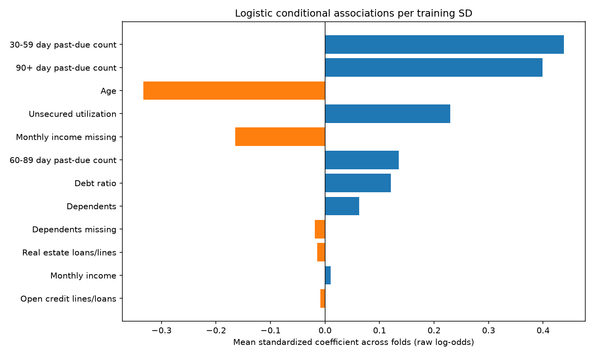
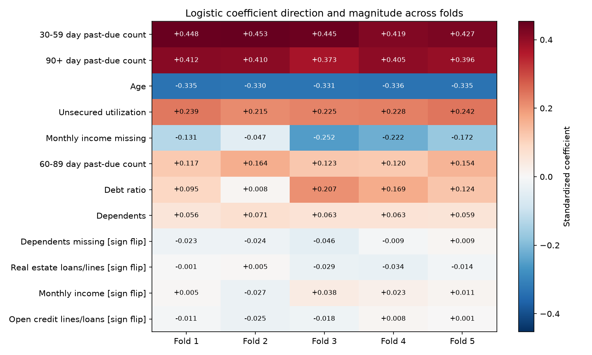
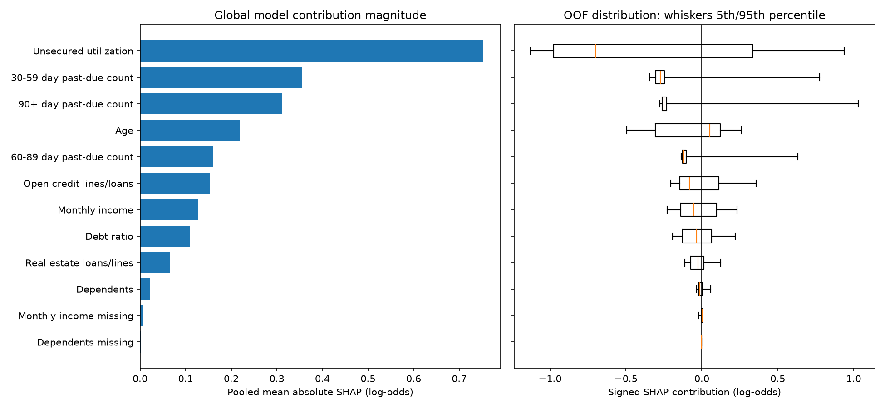
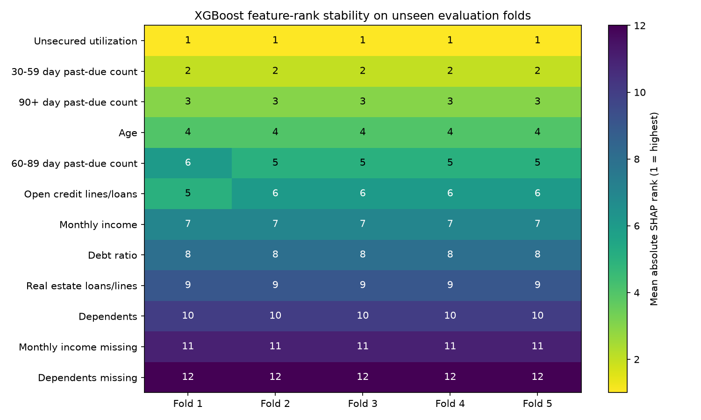
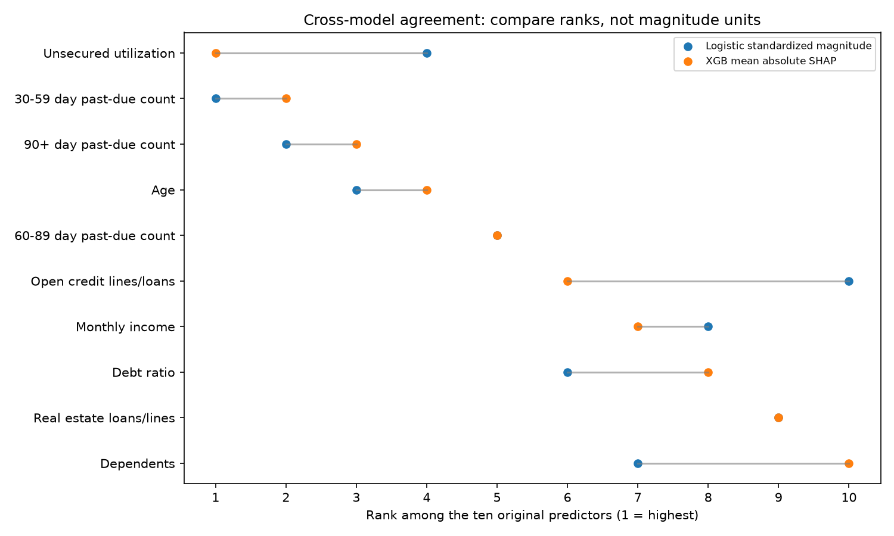
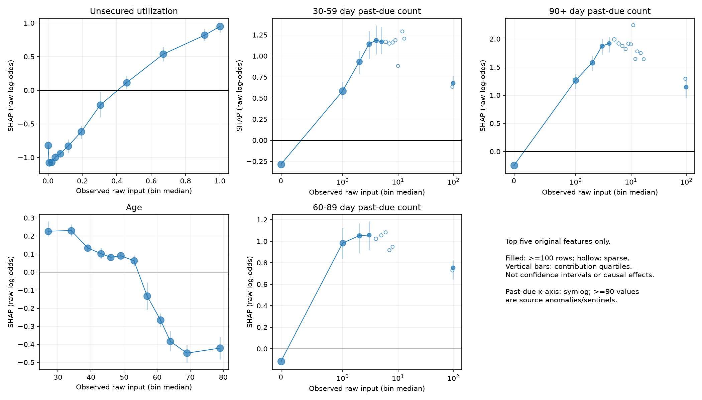

# Training-only model explainability and explanation stability

## Executive Summary

Fresh fixed-specification models explain 67,562 saved training rows across five grouped evaluation folds. Leading logistic associations: 30-59 day past-due count, 90+ day past-due count, Age, Unsecured utilization, Monthly income missing. Leading XGBoost contributions: Unsecured utilization, 30-59 day past-due count, 90+ day past-due count, Age, 60-89 day past-due count. Mean pairwise fold Spearman agreement for the ten original XGB predictors is 0.9952. Explanations describe the fitted models, not causal drivers or lending decisions. No frozen model or consumed holdout prediction was loaded; Tasks 4/5 and registry history are unchanged.

## Methodology

The anchored Task 4 training-only loader checks source/split/sample identities and excludes consumed rows before parsing. StratifiedGroupKFold, five folds, shuffle seed 42 and exact raw predictor groups match Task 4. Both candidates use the existing fixed model configuration and model seed 42 in every fold. Every pipeline fits only on that fold's training rows; explanation functions accept evaluation predictors only. All evaluation rows receive exact native TreeSHAP. No new tuning, calibration or predictive model is introduced. The source target is inherited two-year serious delinquency, not twelve-month regulatory PD.

## Logistic Regression Interpretation

The pipeline caps inputs at training quantiles 0.001/0.999, applies log1p to all original fields except age, median-imputes missing values, adds missing indicators, and standardizes all resulting columns using training means and population SDs. A stored coefficient beta therefore changes raw log-odds per one training SD of that imputed/transformed column, conditional on the other columns. exp(beta) is the corresponding modeled odds ratio. beta / training_scale is the coefficient per transformed unit; exp(beta / scale) is its odds ratio. These are not raw currency-unit effects for log-transformed income or literal count effects after capping. For age, a transformed unit is a year only within the fitted caps. Indicator 0-to-1 changes use its transformed-unit coefficient. A constant feature has no observed SD contrast and is flagged. Per-fold coefficients, scales and odds ratios are in JSON. exp(mean beta) below summarizes fold associations; it is neither a pooled-model estimate nor mean fold odds ratio. All associations are noncausal. Task 5's isotonic recommendation concerns logistic probability quality; coefficients/local logit sums here explain the raw base logistic model, not odds ratios of isotonic-calibrated probabilities.

## Logistic Coefficient Stability

Sample SD uses ddof=1; no independent-fold confidence interval is claimed. Sign consistency is the fraction in the modal positive/negative/near-zero category (tolerance 1e-8). A sign flip requires both positive and negative fitted coefficients. Absent indicator columns are not estimated, rather than imputed as zero coefficients. Rank ties use average ranks; presentation ties are ordered by feature name.

Direction-flip flags: Dependents missing, Real estate loans/lines, Monthly income, Open credit lines/loans. A flipped association should not be presented as having a robust direction.

| Feature | Mean beta | SD | Min | Max | exp(mean beta) | Direction | Sign consistency | Sign flip | Mean rank |
| --- | --- | --- | --- | --- | --- | --- | --- | --- | --- |
| 30-59 day past-due count | 0.4384 | 0.0145 | 0.4191 | 0.4531 | 1.5503 | positive | 1.0000 | False | 1.0000 |
| 90+ day past-due count | 0.3991 | 0.0159 | 0.3728 | 0.4115 | 1.4905 | positive | 1.0000 | False | 2.0000 |
| Age | -0.3335 | 0.0025 | -0.3362 | -0.3304 | 0.7164 | negative | 1.0000 | False | 3.0000 |
| Unsecured utilization | 0.2298 | 0.0106 | 0.2153 | 0.2416 | 1.2584 | positive | 1.0000 | False | 4.2000 |
| Monthly income missing | -0.1649 | 0.0806 | -0.2521 | -0.0472 | 0.8480 | negative | 1.0000 | False | 5.2000 |
| 60-89 day past-due count | 0.1356 | 0.0218 | 0.1169 | 0.1640 | 1.1453 | positive | 1.0000 | False | 6.2000 |
| Debt ratio | 0.1206 | 0.0761 | 0.0076 | 0.2067 | 1.1282 | positive | 1.0000 | False | 7.4000 |
| Dependents | 0.0625 | 0.0058 | 0.0561 | 0.0714 | 1.0645 | positive | 1.0000 | False | 7.6000 |
| Dependents missing | -0.0187 | 0.0202 | -0.0458 | 0.0086 | 0.9815 | negative | 0.8000 | True | 10.0000 |
| Real estate loans/lines | -0.0145 | 0.0168 | -0.0338 | 0.0050 | 0.9856 | negative | 0.8000 | True | 10.6000 |
| Monthly income | 0.0100 | 0.0242 | -0.0268 | 0.0383 | 1.0101 | positive | 0.8000 | True | 9.8000 |
| Open credit lines/loans | -0.0088 | 0.0136 | -0.0249 | 0.0083 | 0.9912 | negative | 0.6000 | True | 11.0000 |

## XGBoost Global SHAP

Native XGBoost pred_contribs=True, approx_contribs=False computes exact tree-path-dependent TreeSHAP. Training tree cover provides the reference weighting; no external or evaluation background is fitted. The scale is raw binary margin/log-odds: baseline + sum(feature SHAP) approximately equals the margin, and sigmoid(margin) matches pipeline probability. Additivity and feature alignment are checked on all rows. Mean absolute SHAP ranks contribution magnitude to model output. Signed distribution summaries do not establish a universal feature direction or causal importance. The native XGBoost version is recorded; no separate SHAP package is required. Missing indicators retain their own columns.

Whiskers are empirical 5th/95th percentiles, boxes 25th/75th and centers medians of full evaluation-row contributions. They are distribution summaries, not uncertainty intervals. [XGBoost prediction reference](https://xgboost.readthedocs.io/en/stable/prediction.html); [TreeSHAP research](https://www.nature.com/articles/s42256-019-0138-9).

## XGBoost SHAP Stability

Global magnitude is row-weighted pooled mean absolute SHAP. SD describes unweighted fold-level means. Absent tree columns contribute zero to the model, with presence counts recorded. Average rank and rank SD summarize folds; original-feature Spearman comparisons use all ten predictors. Fold fits overlap in training rows, so agreement is descriptive and does not establish future temporal stability.

| Feature | Pooled mean abs SHAP | Fold SD | Global rank | Fold ranks | Mean rank | Rank SD |
| --- | --- | --- | --- | --- | --- | --- |
| Unsecured utilization | 0.7532 | 0.0145 | 1.0000 | 1.0000, 1.0000, 1.0000, 1.0000, 1.0000 | 1.0000 | 0.0000 |
| 30-59 day past-due count | 0.3556 | 0.0113 | 2.0000 | 2.0000, 2.0000, 2.0000, 2.0000, 2.0000 | 2.0000 | 0.0000 |
| 90+ day past-due count | 0.3121 | 0.0122 | 3.0000 | 3.0000, 3.0000, 3.0000, 3.0000, 3.0000 | 3.0000 | 0.0000 |
| Age | 0.2193 | 0.0053 | 4.0000 | 4.0000, 4.0000, 4.0000, 4.0000, 4.0000 | 4.0000 | 0.0000 |
| 60-89 day past-due count | 0.1609 | 0.0140 | 5.0000 | 6.0000, 5.0000, 5.0000, 5.0000, 5.0000 | 5.2000 | 0.4472 |
| Open credit lines/loans | 0.1539 | 0.0059 | 6.0000 | 5.0000, 6.0000, 6.0000, 6.0000, 6.0000 | 5.8000 | 0.4472 |
| Monthly income | 0.1273 | 0.0081 | 7.0000 | 7.0000, 7.0000, 7.0000, 7.0000, 7.0000 | 7.0000 | 0.0000 |
| Debt ratio | 0.1102 | 0.0069 | 8.0000 | 8.0000, 8.0000, 8.0000, 8.0000, 8.0000 | 8.0000 | 0.0000 |
| Real estate loans/lines | 0.0650 | 0.0086 | 9.0000 | 9.0000, 9.0000, 9.0000, 9.0000, 9.0000 | 9.0000 | 0.0000 |
| Dependents | 0.0227 | 0.0054 | 10.0000 | 10.0000, 10.0000, 10.0000, 10.0000, 10.0000 | 10.0000 | 0.0000 |
| Monthly income missing | 0.0051 | 0.0023 | 11.0000 | 11.0000, 11.0000, 11.0000, 11.0000, 11.0000 | 11.0000 | 0.0000 |
| Dependents missing | 0.0013 | 0.0014 | 12.0000 | 12.0000, 12.0000, 12.0000, 12.0000, 12.0000 | 12.0000 | 0.0000 |

## Cross-Model Comparison

Ranks below compare the ten original features only. Logistic ranks use mean absolute standardized coefficients; XGBoost ranks use pooled mean absolute SHAP. Indicator explanations remain visible separately above. Ranking units differ; their magnitudes are not directly comparable. Disagreement does not make either model wrong: scaling, correlations, thresholds and interactions can redistribute attribution.

| Feature | Logistic rank | Logistic direction | Sign flip | XGB SHAP rank |
| --- | --- | --- | --- | --- |
| Unsecured utilization | 4.0000 | positive | False | 1.0000 |
| Age | 3.0000 | negative | False | 4.0000 |
| 30-59 day past-due count | 1.0000 | positive | False | 2.0000 |
| Debt ratio | 6.0000 | positive | False | 8.0000 |
| Monthly income | 8.0000 | positive | True | 7.0000 |
| Open credit lines/loans | 10.0000 | negative | True | 6.0000 |
| 90+ day past-due count | 2.0000 | positive | False | 3.0000 |
| Real estate loans/lines | 9.0000 | negative | True | 9.0000 |
| 60-89 day past-due count | 5.0000 | positive | False | 5.0000 |
| Dependents | 7.0000 | positive | False | 10.0000 |

## Nonlinear Model Behavior

Only the top five original XGB predictors are investigated. Exact input values are used when at most 24 values occur; otherwise 12 unique-edge quantile bins of nonmissing raw inputs are used. The displayed x coordinate is the bin median input; y is mean SHAP, with contribution quartiles for supported bins. These are associations across observed contexts, not partial dependence or counterfactual intervention. Hollow markers indicate fewer than 100 rows and are not connected. Quartiles are not confidence intervals. Missing inputs are excluded from dependence bins and counted in JSON, while global SHAP retains them. The pipeline caps/imputes inputs; explanations are therefore about the fitted capped representation. Past-due counts >=90 are source anomalies/sentinels and should not be read as literal delinquency counts.

| Feature | Bin median input | Rows | Mean SHAP | Sparse <100 |
| --- | --- | --- | --- | --- |
| 30-59 day past-due count | 0.0000 | 56710 | -0.2850 | False |
| 30-59 day past-due count | 1.0000 | 7264 | 0.5836 | False |
| 30-59 day past-due count | 2.0000 | 2061 | 0.9315 | False |
| 30-59 day past-due count | 3.0000 | 798 | 1.1414 | False |
| 30-59 day past-due count | 4.0000 | 334 | 1.1866 | False |
| 30-59 day past-due count | 5.0000 | 153 | 1.1683 | False |
| 30-59 day past-due count | 6.0000 | 61 | 1.1668 | True |
| 30-59 day past-due count | 7.0000 | 25 | 1.1475 | True |
| 30-59 day past-due count | 8.0000 | 13 | 1.1593 | True |
| 30-59 day past-due count | 9.0000 | 7 | 1.1863 | True |
| 30-59 day past-due count | 10.0000 | 2 | 0.8813 | True |
| 30-59 day past-due count | 12.0000 | 1 | 1.2906 | True |
| 30-59 day past-due count | 13.0000 | 1 | 1.2051 | True |
| 30-59 day past-due count | 96.0000 | 3 | 0.6341 | True |
| 30-59 day past-due count | 98.0000 | 129 | 0.6802 | False |
| 60-89 day past-due count | 0.0000 | 64093 | -0.1162 | False |
| 60-89 day past-due count | 1.0000 | 2617 | 0.9824 | False |
| 60-89 day past-due count | 2.0000 | 500 | 1.0522 | False |
| 60-89 day past-due count | 3.0000 | 151 | 1.0573 | False |
| 60-89 day past-due count | 4.0000 | 46 | 1.0227 | True |
| 60-89 day past-due count | 5.0000 | 15 | 1.0544 | True |
| 60-89 day past-due count | 6.0000 | 5 | 1.0823 | True |
| 60-89 day past-due count | 7.0000 | 2 | 0.9167 | True |
| 60-89 day past-due count | 8.0000 | 1 | 0.9481 | True |
| 60-89 day past-due count | 96.0000 | 3 | 0.7282 | True |
| 60-89 day past-due count | 98.0000 | 129 | 0.7552 | False |
| 90+ day past-due count | 0.0000 | 63821 | -0.2477 | False |
| 90+ day past-due count | 1.0000 | 2381 | 1.2644 | False |
| 90+ day past-due count | 2.0000 | 680 | 1.5779 | False |
| 90+ day past-due count | 3.0000 | 293 | 1.8725 | False |
| 90+ day past-due count | 4.0000 | 128 | 1.9219 | False |
| 90+ day past-due count | 5.0000 | 57 | 1.9913 | True |
| 90+ day past-due count | 6.0000 | 36 | 1.9190 | True |
| 90+ day past-due count | 7.0000 | 13 | 1.8743 | True |
| 90+ day past-due count | 8.0000 | 3 | 1.8213 | True |
| 90+ day past-due count | 9.0000 | 9 | 1.9161 | True |
| 90+ day past-due count | 10.0000 | 2 | 1.9039 | True |
| 90+ day past-due count | 11.0000 | 2 | 2.2436 | True |
| 90+ day past-due count | 12.0000 | 1 | 1.6437 | True |
| 90+ day past-due count | 13.0000 | 2 | 1.7777 | True |
| 90+ day past-due count | 15.0000 | 1 | 1.7480 | True |
| 90+ day past-due count | 17.0000 | 1 | 1.6399 | True |
| 90+ day past-due count | 96.0000 | 3 | 1.2923 | True |
| 90+ day past-due count | 98.0000 | 129 | 1.1436 | False |
| Unsecured utilization | 0.0000 | 5631 | -0.8177 | False |
| Unsecured utilization | 0.0062 | 5630 | -1.0793 | False |
| Unsecured utilization | 0.0207 | 5630 | -1.0727 | False |
| Unsecured utilization | 0.0409 | 5630 | -0.9980 | False |
| Unsecured utilization | 0.0700 | 5630 | -0.9449 | False |
| Unsecured utilization | 0.1182 | 5630 | -0.8282 | False |
| Unsecured utilization | 0.1936 | 5630 | -0.6167 | False |
| Unsecured utilization | 0.3041 | 5630 | -0.2197 | False |
| Unsecured utilization | 0.4576 | 5630 | 0.1127 | False |
| Unsecured utilization | 0.6705 | 5630 | 0.5365 | False |
| Unsecured utilization | 0.9115 | 5163 | 0.8192 | False |
| Unsecured utilization | 1.0000 | 6098 | 0.9483 | False |
| Age | 27.0000 | 4948 | 0.2262 | False |
| Age | 34.0000 | 5890 | 0.2301 | False |
| Age | 39.0000 | 5035 | 0.1339 | False |
| Age | 43.0000 | 5752 | 0.1020 | False |
| Age | 46.0000 | 4968 | 0.0820 | False |
| Age | 49.0000 | 6740 | 0.0903 | False |
| Age | 53.0000 | 4858 | 0.0629 | False |
| Age | 57.0000 | 6067 | -0.1335 | False |
| Age | 61.0000 | 6098 | -0.2647 | False |
| Age | 64.0000 | 5353 | -0.3835 | False |
| Age | 69.0000 | 5981 | -0.4490 | False |
| Age | 79.0000 | 5872 | -0.4213 | False |

### Limited interaction analysis

Native pred_interactions values are computed on 200 evaluation rows per fold, sampled proportionally from predicted-score deciles (seed 142 in each fold). No labels or interesting explanations select samples. Global SHAP uses all rows; this subset is only for exploratory interactions. Pair magnitude below is 2 x mean absolute off-diagonal allocation, accounting for both symmetric halves. Symmetry and row-sum additivity to main SHAP contributions are verified. Only the top three pairs are discussed; these do not prove a causal interaction or explain a measured share of the performance advantage.

| Feature A | Feature B | Mean abs two-sided interaction |
| --- | --- | --- |
| Age | 30-59 day past-due count | 0.0446 |
| Unsecured utilization | 30-59 day past-due count | 0.0437 |
| Unsecured utilization | 90+ day past-due count | 0.0333 |

## Illustrative Local Explanations

The same three evaluation examples from fold 1 are chosen at XGB score percentiles 10, 50 and 90, with ties resolved by evaluation order. Raw values, source-row IDs and outcomes are not committed. Contributions raise or lower each raw model's log-odds relative to its own baseline. Logistic's baseline is its intercept at centered transformed inputs; XGB's is the tree reference expectation. They are different reference points, not identical borrower archetypes. These are model explanations, not approval/decline decisions or borrower quality labels. Complete contribution sums and residuals are in JSON.

| Example | Model | Baseline log-odds | Raw p | Leading upward contributions | Leading downward contributions |
| --- | --- | --- | --- | --- | --- |
| fold1-p10 | logistic | -2.9897 | 0.0088 | Open credit lines/loans +0.025; Real estate loans/lines +0.002; Monthly income +0.001 | Age -0.826; Monthly income missing -0.262; Unsecured utilization -0.171 |
| fold1-p10 | xgboost | -2.6614 | 0.0069 | Real estate loans/lines +0.002 | Unsecured utilization -0.953; Age -0.344; 30-59 day past-due count -0.338 |
| fold1-p50 | logistic | -2.9897 | 0.0664 | 30-59 day past-due count +0.615; Monthly income missing +0.065; Dependents +0.032 | Unsecured utilization -0.161; 90+ day past-due count -0.080; Age -0.059 |
| fold1-p50 | xgboost | -2.6614 | 0.0216 | 30-59 day past-due count +0.708; Open credit lines/loans +0.063; Monthly income missing +0.004 | Unsecured utilization -0.913; 90+ day past-due count -0.237; Debt ratio -0.226 |
| fold1-p90 | logistic | -2.9897 | 0.1639 | 30-59 day past-due count +0.615; Age +0.459; Unsecured utilization +0.229 | 90+ day past-due count -0.080; Debt ratio -0.046; 60-89 day past-due count -0.021 |
| fold1-p90 | xgboost | -2.6614 | 0.1623 | Unsecured utilization +0.735; 30-59 day past-due count +0.547; Age +0.214 | 90+ day past-due count -0.245; Debt ratio -0.128; 60-89 day past-due count -0.117 |

## Scientific questions

RQ1: 30-59 and 90+ day past-due counts, age and utilization have consistent coefficient directions across all five folds. The first three also retain ranks 1-3. Income missingness remains negative but its magnitude varies substantially; it is a source/model association, not a reason to prefer incomplete applications.

RQ2: utilization, 30-59 day past-due count, 90+ day past-due count and age hold XGB ranks 1-4 in every fold. 60-89 day past-due count and open credit lines swap ranks 5/6 in the first fold. The other original predictor ranks are unchanged.

RQ3: both families share the same top five original predictors. Utilization ranks fourth in logistic versus first in XGB; open credit lines rank tenth versus sixth. Logistic places more standardized magnitude on debt ratio and dependents. Different attribution units and correlated inputs prevent direct magnitude comparisons.

RQ4: monthly income, open credit lines, real estate loans and the dependents-missing indicator change logistic sign. Their weak mean associations should not be assigned a robust direction. Debt ratio and income missingness retain signs but show appreciable magnitude variation. XGB rank agreement is high, without proving unchanged attribution sizes or future stability.

RQ5: utilization contributions rise from negative at low nonzero values toward positive at high values, with an exception in the zero-input bin. Past-due contributions jump between zero and one and then flatten; the 90+ count has further steps through roughly four. Age contributions fall most visibly across middle-to-older age bins and flatten later. These observed-context shapes and the leading age/utilization-by-delinquency interactions are richer than an additive capped/log-transformed logistic specification. They do not establish lending cutoffs or causal effects. Sparse tails and counts 96/98 cannot support literal count extrapolation.

RQ6: the shared predictor families, nonlinear shapes and limited interactions are consistent with nonlinear modeling benefit, but cannot prove absence of unidentified leakage. No feature-removal ablation or interaction-removal experiment establishes the source of a performance advantage. Unknown decision-time availability, borrower identities and dates remain unresolved; neither these explanations nor Tasks 4/5 random-fold performance resolve them.

## Limitations

Association is not causation. SHAP explains the fitted model, not the real-world data-generating process. Correlated predictors can share or shift attribution. Borrower identity is unknown, no usable temporal structure exists, and the inherited target is two-year serious delinquency. Fold stability does not prove future stability. Feature explainability is not a fairness assessment; absent protected characteristics do not establish absence of discrimination or bias. Sparse bins, source anomalies and unknown decision-time availability constrain interpretation. No causal, regulatory-calibration or deployment-readiness claim is made.

## Governance Interpretation

Tasks 4/5 remain separate research evidence: [PD diagnostics](PD_DIAGNOSTICS.md) and [calibration study](CALIBRATION_STUDY.md). Raw XGBoost is the development recommendation; logistic isotonic calibration is not refitted here. Historical locked-holdout XGBoost metrics remain separately retained: AUC 0.868152, Brier 0.048545, log loss 0.176030. Frozen artifacts and registry history are unchanged. Explanations do not become operational reason codes or automatically change policy.

## Reproduction

Run `.venv/Scripts/python.exe scripts/explainability_study.py --source cs-training.csv` from the repository root. [Versioned aggregate results](explainability_stability.json) record source/split/code/registry hashes, model configuration, versions, fold definitions, output scale and interaction sampling. No trained model or full row-level attribution/prediction matrix is written.
