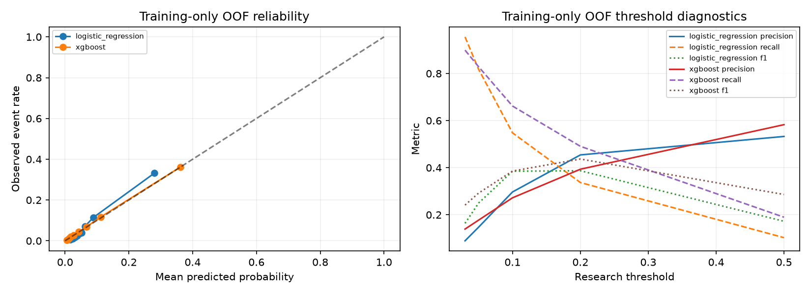

# PD validation diagnostics

## Executive Summary

New evidence uses only 67,562 saved training rows (4,514 events), with five stratified group folds and fresh raw logistic/XGBoost candidates. No frozen model was loaded, no original holdout prediction accessed, and no registry entry changed. Compare ranking, probability quality and stability together; this research does not promote a new champion.

Pooled OOF AUC: logistic 0.829387, XGBoost 0.861182. Brier: 0.053323 versus 0.049605; log loss: 0.206154 versus 0.179870. The paired intervals below support the observed difference conditional on these predictions, without establishing future performance.

## Dataset / Target Reminder

The target is the **two-year serious-delinquency outcome**, inherited from SeriousDlqin2yrs. It is not 12-month regulatory PD. Source attribution and timing limitations remain in [target definition](../../docs/TARGET_DEFINITION.md) and [leakage review](../data/LEAKAGE_REVIEW.md). Original development, calibration and consumed test rows are excluded.

## Discrimination

ROC-AUC measures ranking; Gini = 2 AUC - 1. PR-AUC uses trapezoidal integration, whereas average precision is a separate step-weighted measure. Both conventions are recorded in JSON. Ranking alone says nothing about probability accuracy or lending costs.

## Calibration

Calibration-in-the-large estimates intercept a with slope fixed at 1: logit(E[y]) = a + logit(p). The separate joint fit estimates a and b in logit(E[y]) = a + b logit(p); its intercept is stored separately. Ideal CITL intercept is 0 and slope is 1. Positive CITL means underprediction; negative means overprediction. Slope below 1 suggests overly extreme probabilities; above 1 suggests insufficient dispersion. Fits use unpenalized logistic maximum likelihood, rejecting separated/ill-conditioned joint fits. Only diagnostic logits clip p to [1e-12, 1-1e-12] to avoid infinity; scoring uses original probabilities. Coefficient CIs are omitted because shared training fits and unknown borrowers invalidate a simple iid claim. Bin Wilson intervals in JSON are approximate row-binomial intervals, not borrower-cluster robust. Sparse bins (<100 rows) are flagged; bin counts are always shown.

| Model | Observed event rate | Mean predicted probability |
| --- | --- | --- |
| logistic_regression | 0.066813 | 0.066826 |
| xgboost | 0.066813 | 0.066791 |

| Model | Bin rows | Mean p | Observed rate | Sparse |
| --- | --- | --- | --- | --- |
| logistic_regression | 6757 | 0.01711 | 0.00651 | False |
| logistic_regression | 6756 | 0.02358 | 0.01125 | False |
| logistic_regression | 6756 | 0.02826 | 0.01451 | False |
| logistic_regression | 6756 | 0.03329 | 0.01954 | False |
| logistic_regression | 6756 | 0.03872 | 0.02590 | False |
| logistic_regression | 6756 | 0.04461 | 0.03390 | False |
| logistic_regression | 6756 | 0.05166 | 0.03922 | False |
| logistic_regression | 6756 | 0.06225 | 0.07105 | False |
| logistic_regression | 6756 | 0.08857 | 0.11427 | False |
| logistic_regression | 6757 | 0.28020 | 0.33195 | False |
| xgboost | 6757 | 0.00577 | 0.00340 | False |
| xgboost | 6756 | 0.00821 | 0.00607 | False |
| xgboost | 6756 | 0.01071 | 0.00710 | False |
| xgboost | 6756 | 0.01375 | 0.01421 | False |
| xgboost | 6756 | 0.01861 | 0.01969 | False |
| xgboost | 6756 | 0.02783 | 0.02709 | False |
| xgboost | 6756 | 0.04291 | 0.04411 | False |
| xgboost | 6756 | 0.06657 | 0.06794 | False |
| xgboost | 6756 | 0.11232 | 0.11738 | False |
| xgboost | 6757 | 0.36120 | 0.36111 | False |

## Threshold Diagnostics

Predeclared research thresholds are 0.03, 0.05, 0.10, 0.20 and 0.50; predicted positive means p >= threshold. These are event classifications, not an approval policy. Confusion matrix is [[TN, FP], [FN, TP]]. Each fold also evaluates a threshold equal to its training prevalence (in JSON), without using evaluation labels to select it. Generic selection tooling supports explicitly labelled training/development max-F1 or Youden J and chooses the higher threshold on ties; no threshold was optimized on pooled OOF outcomes here. Precision/F1 are zero when no positives are predicted; recall/specificity/balanced accuracy are undefined when their actual class is absent. Lending thresholds require costs, risk appetite and policy constraints.

| Model | Threshold | Confusion matrix | Precision | Recall | Specificity | F1 | Balanced accuracy |
| --- | --- | --- | --- | --- | --- | --- | --- |
| logistic_regression | 0.03 | [[19157, 43891], [201, 4313]] | 0.0895 | 0.9555 | 0.3038 | 0.1636 | 0.6297 |
| logistic_regression | 0.05 | [[41689, 21359], [822, 3692]] | 0.1474 | 0.8179 | 0.6612 | 0.2498 | 0.7396 |
| logistic_regression | 0.1 | [[57194, 5854], [2041, 2473]] | 0.2970 | 0.5479 | 0.9072 | 0.3852 | 0.7275 |
| logistic_regression | 0.2 | [[61221, 1827], [2993, 1521]] | 0.4543 | 0.3370 | 0.9710 | 0.3869 | 0.6540 |
| logistic_regression | 0.5 | [[62641, 407], [4050, 464]] | 0.5327 | 0.1028 | 0.9935 | 0.1723 | 0.5482 |
| xgboost | 0.03 | [[37964, 25084], [455, 4059]] | 0.1393 | 0.8992 | 0.6021 | 0.2412 | 0.7507 |
| xgboost | 0.05 | [[45692, 17356], [773, 3741]] | 0.1773 | 0.8288 | 0.7247 | 0.2921 | 0.7767 |
| xgboost | 0.1 | [[55059, 7989], [1527, 2987]] | 0.2721 | 0.6617 | 0.8733 | 0.3857 | 0.7675 |
| xgboost | 0.2 | [[59635, 3413], [2299, 2215]] | 0.3936 | 0.4907 | 0.9459 | 0.4368 | 0.7183 |
| xgboost | 0.5 | [[62435, 613], [3658, 856]] | 0.5827 | 0.1896 | 0.9903 | 0.2861 | 0.5900 |

## Cross-Validation

StratifiedGroupKFold, five folds, shuffled seed 42, groups = saved-compatible exact raw predictor profiles. Duplicate profiles stay together; labels are excluded from group identities. Both candidates use identical folds and fixed existing configurations. Every fold refits capping, imputation and applicable scaling/log transforms using its training rows only. Fold standard deviation uses ddof=1 and is descriptive, not a standard error. **This is not out-of-time validation.** No usable temporal information exists. [Implementation reference](https://scikit-learn.org/stable/modules/cross_validation.html).

| Model | Metric | Mean | SD | Fold values |
| --- | --- | --- | --- | --- |
| logistic_regression | roc_auc | 0.829457 | 0.007508 | 0.825886, 0.833448, 0.817868, 0.834806, 0.835278 |
| logistic_regression | gini | 0.658914 | 0.015016 | 0.651771, 0.666895, 0.635737, 0.669612, 0.670556 |
| logistic_regression | pr_auc | 0.331492 | 0.008013 | 0.321921, 0.333061, 0.339286, 0.338737, 0.324456 |
| logistic_regression | average_precision | 0.332402 | 0.007974 | 0.322791, 0.334104, 0.340066, 0.339607, 0.325442 |
| logistic_regression | brier | 0.053323 | 0.000430 | 0.053682, 0.053043, 0.052938, 0.053066, 0.053888 |
| logistic_regression | log_loss | 0.206154 | 0.006175 | 0.207897, 0.215112, 0.200754, 0.199894, 0.207112 |
| xgboost | roc_auc | 0.861331 | 0.009194 | 0.857821, 0.869230, 0.849572, 0.872016, 0.858017 |
| xgboost | gini | 0.722662 | 0.018389 | 0.715641, 0.738460, 0.699144, 0.744033, 0.716034 |
| xgboost | pr_auc | 0.387384 | 0.013447 | 0.375470, 0.404746, 0.375532, 0.398297, 0.382876 |
| xgboost | average_precision | 0.388132 | 0.013281 | 0.376573, 0.405333, 0.376376, 0.398909, 0.383469 |
| xgboost | brier | 0.049605 | 0.000640 | 0.050165, 0.048768, 0.050113, 0.049078, 0.049898 |
| xgboost | log_loss | 0.179870 | 0.003294 | 0.181843, 0.176438, 0.183541, 0.176334, 0.181193 |

## Statistical Uncertainty

Paired exact-predictor-group bootstrap: 200 replicates, seed 43, 95% percentile intervals; 200 valid, 0 single-class replicates skipped. Both models receive identical group weights. Resampling assumes independence between observed profile groups and cannot account for unidentified repeated borrowers across profiles. A row bootstrap would likewise assume independent rows and miss those borrowers. These intervals are conditional on fixed OOF predictions, not refitting or future temporal uncertainty; overlapping fold training data limits inferential claims. No p-values, independent-fold t-test or general deployment significance claim is made.

| Model | Metric | Lower | Upper |
| --- | --- | --- | --- |
| logistic_regression | roc_auc | 0.822773 | 0.836637 |
| logistic_regression | gini | 0.645546 | 0.673275 |
| logistic_regression | brier | 0.052073 | 0.054720 |
| logistic_regression | log_loss | 0.200019 | 0.212353 |
| logistic_regression | average_precision | 0.315526 | 0.344829 |
| xgboost | roc_auc | 0.855996 | 0.867486 |
| xgboost | gini | 0.711991 | 0.734971 |
| xgboost | brier | 0.048385 | 0.050752 |
| xgboost | log_loss | 0.175922 | 0.183630 |
| xgboost | average_precision | 0.371769 | 0.403661 |

Paired differences: **XGBoost minus logistic**. Positive AUC/Gini/AP favors XGBoost; negative Brier/log loss favors it.

| Metric | Difference lower | Difference upper |
| --- | --- | --- |
| roc_auc | 0.028398 | 0.035640 |
| gini | 0.056796 | 0.071280 |
| brier | -0.004259 | -0.003264 |
| log_loss | -0.031713 | -0.021896 |
| average_precision | 0.049048 | 0.067599 |

## Champion/Challenger Comparison

The table contains pooled **new training-only OOF** results, not historical final-test scores. Logistic remains the interpretable benchmark; XGBoost offers nonlinear complexity. A champion decision must weigh discrimination, calibration, stability, interpretability, reproducibility and operational requirements. Neither maximum AUC nor a bootstrap interval alone authorizes promotion.

| Model | AUC | Gini | PR-AUC | Brier | Log loss | CITL intercept | Joint slope |
| --- | --- | --- | --- | --- | --- | --- | --- |
| logistic_regression | 0.829387 | 0.658774 | 0.328910 | 0.053323 | 0.206154 | -0.000259 | 0.988270 |
| xgboost | 0.861182 | 0.722365 | 0.386904 | 0.049605 | 0.179870 | 0.000433 | 1.001734 |

**Historical locked-holdout result, retained and not reevaluated:** XGBoost AUC 0.868152, Brier 0.048545, log loss 0.176030. Historical sigmoid calibration slightly improved log loss while slightly worsening Brier; that is not an improvement on every measure. Historical calibrated model and new raw CV models have different evaluation designs and cannot be treated as directly comparable.

## Limitations

No usable temporal information; no true out-of-time validation; borrower identity unknown; target not 12-month regulatory PD; holdout already consumed historically. Public source provenance and feature availability at an actual lending decision remain imperfect. OOF results reuse a previously explored training population and fixed candidate choices, so this is additional research evidence, not a new untouched test. No nested tuning or new calibration selection occurred. Probability fit coefficients are diagnostics, not deployed recalibration. No evidence of lender profitability, fairness, rejection performance or real-world rollout is claimed.

## Reproduction and provenance

Run `.venv/Scripts/python.exe scripts/pd_diagnostics.py --source cs-training.csv` from the repository root (substitute the verified local source path if different). It hashes source bytes and saved split metadata, then parses only anchored training positions. [Machine-readable results](pd_diagnostics.json) include source/split/training-position/registry/code hashes, dependency versions, configurations, seeds and fold identities. No row-level predictions or applicant records are committed. Results require the ignored original source and split artifacts, and the matching historical registry bridge version.
