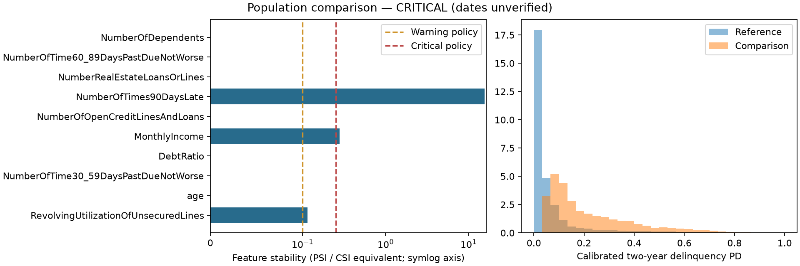

# Phase 10: monitoring and drift

The calibrated Phase 5 XGBoost/sigmoid model is monitored against a frozen reference
of 22,483 historical development applicants. Both comparison populations are
label-free derivatives of those same applicants: an unchanged control and an
explicitly controlled perturbation. Source observation dates are unavailable;
this is a monitoring mechanics demonstration, not a temporal production result.

The unchanged control returns OK, with no alerts and zero PD/score PSI. The
perturbation returns CRITICAL with 13 metric alerts. It multiplies utilization by
1.5, increments the 90-day-late count by one, reduces recorded income by 20%, and
independently masks income with probability .25 (seed 101). These operations are
recorded in the comparison provenance; they are not observed borrower behavior.

| Variable | PSI / CSI equivalent | Reference missing | Comparison missing | Alert |
| --- | ---: | ---: | ---: | --- |
| RevolvingUtilizationOfUnsecuredLines | 0.1139 | 0.00% | 0.00% | WARNING |
| MonthlyIncome | 0.2782 | 19.37% | 39.36% | CRITICAL |
| NumberOfTimes90DaysLate | 15.6567 | 0.00% | 0.00% | CRITICAL |
| pd | 7.3754 | 0.00% | 0.00% | CRITICAL |
| score | 7.3752 | 0.00% | 0.00% | CRITICAL |

Mean PD changes from 6.704% to 22.036% (+15.332 percentage points), and the
illustrative score changes from 615.18 to 556.88 (-58.30 points). Income missingness
changes from 19.366% to 39.363% (+19.997 percentage points). Missingness is measured
on raw inputs before model imputation. The inherited two-year delinquency target
is unchanged; shifted PD is not evidence that realized defaults increased.

The feature plot uses a symmetric logarithmic axis so very large and modest PSI
values remain visible. The PD histograms use common fixed [0,1] edges. Score is
a deterministic decreasing PD transform, so score and PD alerts are related,
not two independent confirmations. Small PSI differences arise from separate
quantile interpolation in the transformed space.

PSI bins are fitted from reference data only and frozen. Tied cut points are
collapsed. Constants have below/equal/above buckets, all-missing references have
an unseen-nonmissing bucket, and every profile has an explicit final missing
bucket. All rows are counted once. Empty buckets use additive proportion
smoothing followed by renormalization. Feature-level PSI is reported as a CSI
equivalent, without claiming a fitted WOE scorecard characteristic contribution.
Additional diagnostics include numeric KS distance, Wasserstein distance and its
reference-scale ratio, support-range excursions, and raw missingness deltas.

Default warning/critical settings are PSI .10/.25, absolute missingness change
.05/.10, KS distance .10/.20, support excursions .05/.10, absolute mean PD change
.01/.03, and score mean change 10/25. These are demonstration governance choices,
not universal significance cutoffs. The outcome checks explicitly return
unavailable: without dated mature performance, this run cannot conclude anything
about calibration, discrimination decay or concept drift. KS p-values are
only descriptive, especially for discrete/tied inputs and paired demo populations.

A critical alert calls for checking data pipelines, acquisition and policy mix,
feature quality and cohort provenance. If the population change is real, review
mature outcomes and the Phase 5 performance diagnostics before deciding whether
recalibration or retraining is needed. No model fitting, automatic policy change
or model promotion takes place. Small overall populations return
INSUFFICIENT_DATA; sparse numeric samples do not silently pass unavailable tests.

Reference/model/source identities and artifact hashes are enforced. Comparisons
matching original final-test source IDs or normalized predictor groups are
rejected before scoring. Source IDs are provenance, not verified borrower IDs;
external data should not reuse these identifiers. Neither original test rows nor
labels enter the demonstration scoring. V1 evidence remains intact.

[Aggregate evidence](phase10_monitoring_summary.json) includes exact metrics,
thresholds, alert records and hashes. Raw reference values, comparison CSVs and
row scores remain ignored in artifacts/ and data/raw/. Reproduction and metric
definitions are in [monitoring.md](../docs/monitoring.md).

Validation: 227 tests passed, including PSI arithmetic and scale invariance,
missing/constant/tied distributions, reference immutability, PD/score endpoints,
alert boundaries, insufficient populations, changed model/source rejection,
checksum protection and final-test scoring guards. Lint, format, configuration,
V1 preservation, wheel build and installed-package smoke checks passed.

## Phase 13 operating interpretation and proposed response

The Phase 10 results remain a controlled label-free mechanics demonstration,
not a live monitoring period. No new population or outcomes were scored here.
Current effective warning/critical thresholds are checked against the frozen
reference configuration and use the following units:

<!-- evidence:thresholds -->
| Alert channel | Warning | Critical | Unit |
| --- | ---: | ---: | --- |
| psi | 0.1 | 0.25 | PSI / feature CSI equivalent |
| missingness | 0.05 | 0.1 | Absolute proportion change |
| ks | 0.1 | 0.2 | Numeric KS distance |
| out_of_range | 0.05 | 0.1 | Fraction outside reference support |
| pd_mean | 0.01 | 0.03 | Absolute PD proportion change |
| score_mean | 10 | 25 | Absolute score points change |
<!-- /evidence:thresholds -->

Alerts include the boundary (`value >= threshold`); missingness, PD mean and score
mean changes use absolute magnitudes. PSI is reference-binned/smoothed, KS is a
numeric distribution distance, and out_of_range is the fraction outside observed
reference support. None is a calibrated probability of model failure. The minimum
overall population is 500; numeric diagnostics need 50 numeric observations in
both populations. Sparse/unavailable diagnostics must remain visible and are not
evidence of stability. These choices require review for any new population.

| State / observation | Proposed response | Current implementation limit |
| --- | --- | --- |
| Model/source/reference integrity failure | Reject scoring; inspect trusted bundle and lineage | Readiness/integrity guards exist; no incident ticket system |
| INSUFFICIENT_DATA or unavailable diagnostics | Establish coverage and sample support; do not label the cohort stable | Status/diagnostics exist; no automatic data collection |
| WARNING | Review input quality, channel/policy/segment mix and persistence; record evidence | Alerts computed; no notification or owner assigned |
| CRITICAL | Prioritize containment/triage and intended-use review; check pipeline faults first | No automated suspension or model/policy change |
| Mature calibration loss or segment error | Independent review of validated outcome windows, uncertainty and cause; consider recalibration/retraining with fresh holdout | Not observed in the label-free demonstration |

Proposed cadence is per-batch quality checks, monthly population/segment drift
review and monthly mature-outcome review when sufficient support exists, with
comprehensive review at least annually or after material change. It is neither
a running scheduler nor an approved institutional requirement. Establish a named
monitoring owner, dated eligible cohorts and decision/outcome linkage before
operating this process. Delayed/missing outcomes, acceptance bias and censoring
must be reported; immature or missing follow-up cannot become a good outcome.

For future performance monitoring, record outcome coverage/maturity, AUC/Gini/KS,
Brier/log loss, reliability/O:E, event rates and segment support, alongside
population and policy mix. Define prospective acceptance bands from intended-use
evidence before evaluating new holdouts; this lab supplies no universal numeric
recalibration/retraining trigger. Probability drift can prioritize investigation
but cannot establish concept drift. PD and score alerts are correlated transforms.

The incident record and release/reference change process are in
[model_governance.md](../docs/model_governance.md). Source/schema incidents need
pipeline correction; calibration drift with otherwise suitable ranking may call
for reviewed recalibration, while structural target/population or ranking failure
may require a new model. Every change needs new independent validation and
separate policy review. No automatic fit, silent rebinning or test-lock removal
is permitted by that procedure. See [GOV-007 and GOV-008](model_risk_register.md).
