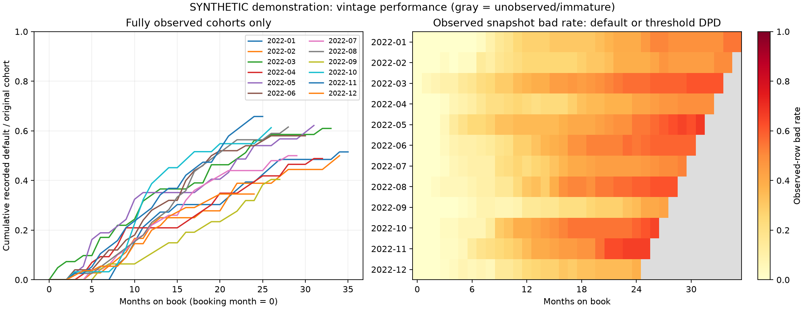
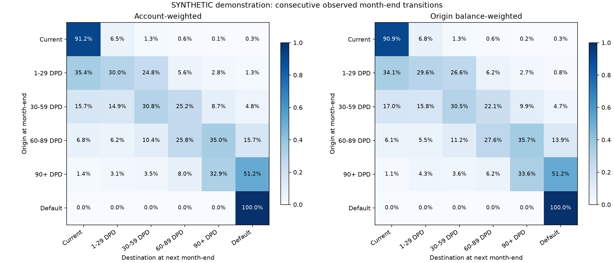

# Phase 6: vintage and roll-rate analytics

Phase 6 implements coverage-aware origination-month x months-on-book vintages and consecutive-month delinquency migration analytics. The measured results below use only the independent synthetic Phase 3 demo; they are not real borrower performance or forecasts. Origination models and the consumed Phase 5 holdout were not used for portfolio calculations.

## Provenance and definitions

Source: 500 synthetic accounts originated across January-December 2022, with 15,142 month-end snapshots through 2024-12-31. The preserved generator run is version 0.3.0, seed 42; analytics version is 0.6.0. Source-manifest hashes match both CSVs. No source data was regenerated or altered.

Accounts SHA-256: `d5f34bd3dcace07f99464ffa48b48c2ff5a2e05732e8406f3bc006f24a73c1c1`. History SHA-256: `cdee1724fa8ed25544f84b4d453b05a739e3651e6292fca6750f4d3478c7e453`.

Booking month is MOB 0. Snapshot bad is recorded default OR at least 90 DPD; delinquency is recorded default OR at least 30 DPD. Snapshot rates divide by observed accounts and report their coverage. Cumulative default is ever recorded default / original booked cohort, reported only where every account has every observation from MOB 0 through the horizon. Missing follow-up does not become good performance. Recorded default is distinct from a curable analytic 90-DPD event.

Exposure is observed closing balance in arbitrary source currency units. It is not modeled EAD, expected loss, or a regulatory provision. Mixed real/synthetic portfolios are rejected to avoid pooling incompatible provenance.

## Vintage evidence

The grid has 432 cells across 12 origination cohorts and MOB 0-35. There are 66 immature cells, zero mature cells with incomplete history, and zero cohorts below the configured minimum size of 20. Immature cells remain unavailable rather than zero-default cells.

| MOB | Mature/complete cohorts | Original accounts in complete cohorts | Cumulative recorded defaults | Cumulative default rate |
| ---: | ---: | ---: | ---: | ---: |
| 0 | 12/12 | 500 | 0 | 0.00% |
| 6 | 12/12 | 500 | 37 | 7.40% |
| 12 | 12/12 | 500 | 125 | 25.00% |
| 24 | 12/12 | 500 | 234 | 46.80% |
| 35 | 1/1 | 33 | 17 | 51.52% |

MOB 12 and MOB 24 compare all 500 accounts at common ages. MOB 35 includes only January 2022 (33 accounts); its 51.52% rate cannot be interpreted as a full-portfolio 35-month result. Differences between cohort curves reflect simulation variation and small cohorts; no macroeconomic or causal explanation is established.

## Roll-rate evidence

14,642 eligible origin snapshots produce 14,642 consecutive observed month-end pairs: 100% pair coverage, zero missing next snapshots and zero bridged gaps. The 500 December 2024 snapshots have next months beyond cutoff and are reported as not yet due, not missing outcomes. Monthly coverage and all monthly 6x6 matrices are exported separately.

| Origin state | Pairs | Roll forward | Roll back | Full cure to current | New recorded default | Stay |
| --- | ---: | ---: | ---: | ---: | ---: | ---: |
| CURRENT | 8,628 | 8.80% | 0.00% | 0.00% | 0.29% | 91.20% |
| DPD_1_29 | 923 | 34.56% | 35.43% | 35.43% | 1.30% | 30.01% |
| DPD_30_59 | 543 | 38.67% | 30.57% | 15.65% | 4.79% | 30.76% |
| DPD_60_89 | 337 | 50.74% | 23.44% | 6.82% | 15.73% | 25.82% |
| DPD_90_PLUS | 289 | 51.21% | 15.92% | 1.38% | 51.21% | 32.87% |
| DEFAULT | 3,922 | 0.00% | 0.00% | 0.00% | 0.00% | 100.00% |

Rates in this table divide by each origin state's observed pairs. Roll forward means any higher state, including DEFAULT; roll back includes partial improvement, while cure requires a return to CURRENT. Cure is a subset of roll back, and default entry is a subset of roll forward; these columns are not mutually exclusive categories. Monthly forward/default summaries use nondefault origins; monthly back/cure summaries use delinquent nondefault origins.

There are 10,720 nondefault-origin pairs and 264 entries to recorded default, giving a pooled per-observed-pair default-entry rate of 2.46%. The 3,922 DEFAULT-to-DEFAULT pairs are persistence and do not count as new defaults. This pooled rate combines different account ages/calendar months and is not an annual PD or an independent-account event frequency.

Count and balance weighting answer different questions. From CURRENT, 91.20% of accounts stay current, versus 90.91% of origin closing balance. From 30-59 DPD, the count-weighted cure rate is 15.65%, while the origin-balance-weighted cure rate is 17.03%. Balance weights use origin values so payments/write-offs after transition cannot distort the denominator.

All supported matrix rows sum to one. Unobserved states and zero-total-balance states produce unavailable probabilities in general; the tests verify these cases. The demo has supported rows in every state. DEFAULT is absorbing because the source contract requires it, not because an identity row was filled into the output.

## Latest synthetic snapshot and limits

At 2024-12-31 the source has 500 observed accounts, 264 recorded defaults and 1,020,693.33 units of closing balance. Accounts have different MOBs here, so this 52.8% recorded-default prevalence is a calendar snapshot, distinct from the common-age vintage rates above.

The high default prevalence is a deliberate simulation artifact. The generator uses illustrative transitions with latent risk tilts; the base configured transition matrix therefore need not equal measured unconditional migrations. It has no closures, recoveries or economic cycles. These outputs demonstrate analytics mechanics, not a fitted forecast, credit policy, contractual delinquency interpretation, or regulatory calculation.

For real data, missing account months cannot be assumed closed, current, or default. Official cumulative rates are suppressed under incomplete history; an explicitly labeled observed-default lower bound remains available. Snapshot rates and observed-pair roll rates can still suffer missingness/selection bias even when their denominators are reported. No survival correction, transition smoothing or uncertainty intervals are claimed in this phase.

## Engineering validation and reproduction

117 tests passed, including hand-calculated vintages/migrations, original denominator retention, missing and left-truncated history, default versus analytic bad, gap exclusion, terminal censoring, partial improvement versus cure, zero balance and unsupported states, maturity cutoffs, real/synthetic provenance, deterministic exports, no overwrite and CLI errors. The SQL companions match Python on complete, gapped, left-truncated and immature fixtures using DuckDB 1.5.6. Databricks execution is not yet verified.

Lint/format and original V1 preservation checks passed. Locked dependency sync, wheel/source-package contents and an isolated installed-wheel synthetic vintage/roll-rate check passed. No inherited origination CSV, historical notebook, V1 app, model artifact or day-trading file was changed.

Local run: `artifacts/phase6-portfolio-001`. Aggregate JSON: [phase6_portfolio_summary.json](phase6_portfolio_summary.json). The run contains vintage tables, pooled/monthly matrices, coverage/state/monthly summaries and the row-level transition pairs, which remain ignored. Source/config/code/artifact hashes and generator provenance are recorded in `analytics.json`.

Reproduction commands and metric definitions: [portfolio_analytics.md](../docs/portfolio_analytics.md). SQL companions: [vintage_analysis.sql](../sql/vintage_analysis.sql) and [roll_rates.sql](../sql/roll_rates.sql). Next authorized phase would be Phase 7: expected loss and portfolio analytics.
