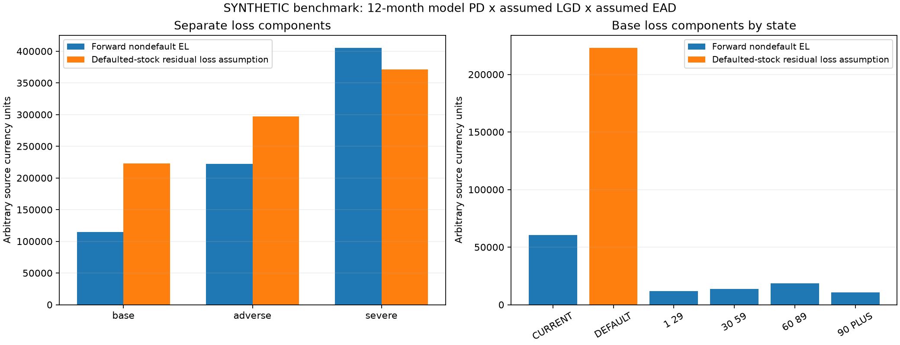

# Phase 7: expected loss and portfolio analytics

Phase 7 adds model-derived longitudinal PDs, expected-loss arithmetic, LGD/EAD assumptions, scenario sensitivities, and exposure/loss concentration summaries. The measured run uses only the independent synthetic portfolio. It is an educational analytical benchmark, not validated forecasting, regulatory IFRS 9/ECL compliance, or a lending/provision recommendation.

## Population and model provenance

Snapshot: 2024-12-31, all 500 booked synthetic accounts observed (100% coverage); 236 nondefault accounts and 264 already in recorded default. Source generator version 0.3.0, seed 42; analytics version 0.7.0. The source-manifest checks match both preserved Phase 3 CSVs. Missing snapshot exposure is rejected by default; partial reporting requires explicit opt-in.

Accounts SHA-256: `d5f34bd3dcace07f99464ffa48b48c2ff5a2e05732e8406f3bc006f24a73c1c1`. History SHA-256: `cdee1724fa8ed25544f84b4d453b05a739e3651e6292fca6750f4d3478c7e453`.

The portfolio PD comes from a separate empirical count-weighted Markov transition model. The applicant model cannot be applied to these accounts: its ten predictors are absent and its inherited two-year delinquency label differs from recorded portfolio default. No artificial join or invented applicant features are used, and the consumed Phase 5 final holdout is not rescored for this analysis.

The transition model fits 14,642 observed consecutive monthly pairs at/before the snapshot. All five nondefault origin states exceed the minimum support of 20 pairs. Its matrix uses the same observed migrations as Phase 6, with structural absorbing DEFAULT. Twelve-month PDs are the DEFAULT column of P^12, meaning recorded default by the horizon. These are uncalibrated state-only benchmark predictions, not held-out accuracy results.

| Current state | Fitted origin pairs | 12-month benchmark PD | Interpretation |
| --- | ---: | ---: | --- |
| CURRENT | 8,628 | 22.27% | Nondefault-account forward probability |
| DPD_1_29 | 923 | 40.80% | Nondefault-account forward probability |
| DPD_30_59 | 543 | 57.87% | Nondefault-account forward probability |
| DPD_60_89 | 337 | 76.30% | Nondefault-account forward probability |
| DPD_90_PLUS | 289 | 90.18% | Nondefault-account forward probability |
| DEFAULT | 3,922 | 100.00% | Already defaulted stock; not a new-default forecast |

The final history date is 2024-12-31, so outcomes for the resulting forward 12-month forecast are unavailable. Fit coverage does not validate future probabilities. The model assumes stationary transitions and sufficient risk information in state, despite account heterogeneity, persistent simulation risk, repeated dependent observations and age/calendar mixtures. Sparse nondefault states are refused, not silently filled. Future validated behavioral PDs can replace this model through the keyed score interface.

## Expected-loss definitions

For nondefault accounts: `EAD = balance + CCF * max(limit - balance, 0)` and `forward EL = PD * LGD * EAD`. Over-limit balances remain intact; unused exposure is never negative. LGD and conversion factors are configured assumptions rather than fitted recovery/utilization models. Amounts are arbitrary source currency units. All accounts must share compatible currency/valuation conventions before aggregation.

Already-defaulted accounts have PD 1, effective CCF 0 and unavailable undrawn credit. Forward new-default EL is zero for this stock. Its separate residual-loss assumption is `LGD * observed balance`, excluding historical write-offs. The combined-loss proxy is the arithmetic sum of forward nondefault EL and this stock assumption; it is not a provision estimate. The export records effective CCF and available undrawn exposure explicitly.

Model PDs join exposure by account_id/observation_date, one-to-one. Missing, extra, duplicated, nonfinite or invalid scores fail instead of being filled with zero. Snapshot selection uses the exact latest month-end at/before cutoff; it never forward-fills each account's latest observation.

## Scenarios

PD scenarios multiply odds using `p / (p + (1-p)/multiplier)`, preserving exact 0/1. The base preserves model PD. These are deterministic sensitivities, not macroeconomic forecasts, calibrated stress scenarios or stressed transition matrices. They are not probability-weighted or averaged into a single loss figure.

| Scenario | PD odds multiplier | LGD | CCF on nondefault unused lines |
| --- | ---: | ---: | ---: |
| base | 1.0 | 45% | 50% |
| adverse | 1.5 | 60% | 75% |
| severe | 2.5 | 75% | 100% |

| Scenario | Nondefault EAD | Forward expected loss | Defaulted-stock loss assumption | Combined loss proxy | Expected new defaults | Mean nondefault PD | Forward EL / nondefault EAD |
| --- | ---: | ---: | ---: | ---: | ---: | ---: | ---: |
| base | 799,131.42 | 114,915.16 | 222,877.22 | 337,792.38 | 73.36 | 31.08% | 14.38% |
| adverse | 935,991.81 | 221,991.68 | 297,169.63 | 519,161.31 | 91.94 | 38.96% | 23.72% |
| severe | 1,072,852.21 | 404,967.63 | 371,462.03 | 776,429.66 | 118.07 | 50.03% | 37.75% |

Base nondefault EAD is 799,131.42, with forward EL 114,915.16. Defaulted balance is 495,282.71; at LGD 45%, its residual-loss assumption is 222,877.22. The arithmetic combined proxy is 337,792.38. Expected new defaults are 73.36 among 236 nondefault accounts, under the model assumptions; this is a sum of probabilities, not a claim of observed future events.

Adverse and severe cases co-move PD odds, severity and conversion assumptions. Their higher loss cannot be attributed to one driver alone. Historical recorded-default prevalence is not used as a flat PD for every account, and already-defaulted accounts do not inflate new-default counts.

## Portfolio composition and concentration

| Base current state | Accounts | EAD | Forward EL | Separate defaulted-stock loss |
| --- | ---: | ---: | ---: | ---: |
| CURRENT | 180 | 602,907.17 | 60,413.06 | 0.00 |
| DEFAULT | 264 | 495,282.71 | 0.00 | 222,877.22 |
| DPD_1_29 | 23 | 63,474.03 | 11,653.73 | 0.00 |
| DPD_30_59 | 13 | 52,564.83 | 13,687.90 | 0.00 |
| DPD_60_89 | 12 | 54,085.01 | 18,568.88 | 0.00 |
| DPD_90_PLUS | 8 | 26,100.37 | 10,591.59 | 0.00 |

Base EAD-weighted nondefault PD is 31.96%, versus the account-weighted mean 31.08%. The ten largest account EADs account for 8.00% of total EAD (including defaulted stock). The ten largest nondefault account losses account for 21.51% of forward EL. Account EAD HHI is 0.003178.

Concentration measures do not identify connected borrowers, default dependence or capital/variance. Zero-exposure or zero-loss ratios remain unavailable. State and origination-month exports reconcile to portfolio totals separately; adding overlapping dimensions would double-count accounts. Cohort losses reflect today's stock, not lifetime vintage realized-loss curves.

## Limits and validation

No prospective PD validation/calibration is claimed; the model is a new benchmark distinct from the validated applicant ranking experiment. Synthetic mechanics do not establish real losses. LGD/CCF are illustrative; there are no recovery cash flows, discounting, stage allocation, contractual maturities, weighted macroeconomic scenarios, lifetime loss modeling or realized-loss validation. Missing exposure and observed-pair selection can bias incomplete real-source runs. No production model is promoted.

144 tests passed. Coverage includes hand-calculated multi-period PDs and EL, source cutoff isolation, sparse-state refusal, absorbing-default semantics, scalar/vector boundaries, over-limit/zero exposure, keyed scoring, defaulted-stock separation, scenario assumptions, portfolio/segment conservation, snapshot coverage, reproducible exports and CLI failures. Snapshot/delinquency SQL results agree with Python in DuckDB, including unknown exposure categories. Databricks execution is unverified.

Lint/format and original-file preservation checks passed. Locked dependency sync, wheel/source-package checks and an isolated installed-wheel modeled-PD/loss arithmetic check passed. Prior source data, V1 files, applicant models and day-trading files were not changed.

Local run: `artifacts/phase7-loss-002`, containing model metadata/matrix, scored snapshot, exclusions, account losses, scenario/segment CSVs, aggregate JSON and figure. Row-level artifacts remain ignored. [Aggregate evidence](phase7_expected_loss_summary.json) records model/source/config/code/artifact hashes and definitions; [methodology and reproduction](../docs/expected_loss.md) gives commands. SQL companions: [portfolio_snapshot.sql](../sql/portfolio_snapshot.sql) and [delinquency_analysis.sql](../sql/delinquency_analysis.sql).

Next authorized phase: Phase 8, decisioning and credit-limit strategy. The phase should retain the distinct origination and longitudinal PD definitions rather than transferring this synthetic state benchmark directly into applicant underwriting.
