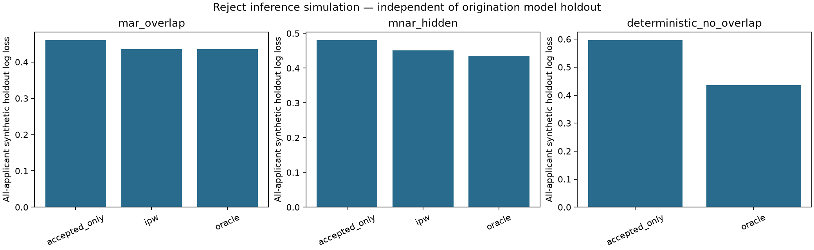

# Phase 9: reject inference and selection bias

A separate synthetic experiment demonstrates outcomes observed only after financing.
The Give Me Some Credit source has no historical financing indicator or rejected
applicant population. Phase 8 decisions are hypothetical; they are not used to
invent a historical approval process. No original source/model/calibration/test
artifacts are accessed by this experiment, and no lender policy is changed.

Three seeds (91, 92, 93), each with 12,000 synthetic applicants, reserve 30% for an
independent simulation holdout before learning. Each scenario uses the same features,
potential outcomes and partition for a given seed, changing only selection. The
potential outcome assumes everyone could receive the same hypothetical loan.
Acceptance equals financing in this simplified simulation; real customer take-up,
terms, maturity and censoring would require separate treatment.

| Scenario | Model | Holdout mean PD | Synthetic bad rate | Brier | Log loss | Seed SD of log loss |
| --- | --- | ---: | ---: | ---: | ---: | ---: |
| deterministic_no_overlap | accepted_only | 11.13% | 22.06% | 0.1839 | 0.5960 | 0.0720 |
| deterministic_no_overlap | oracle_all_labels_benchmark | 21.51% | 22.06% | 0.1331 | 0.4353 | 0.0167 |
| mar_overlap | accepted_only | 18.88% | 22.06% | 0.1474 | 0.4599 | 0.0223 |
| mar_overlap | ipw | 21.77% | 22.06% | 0.1335 | 0.4356 | 0.0170 |
| mar_overlap | oracle_all_labels_benchmark | 21.51% | 22.06% | 0.1331 | 0.4353 | 0.0167 |
| mnar_hidden | accepted_only | 14.27% | 22.06% | 0.1554 | 0.4802 | 0.0283 |
| mnar_hidden | ipw | 15.91% | 22.06% | 0.1398 | 0.4515 | 0.0206 |
| mnar_hidden | oracle_all_labels_benchmark | 21.51% | 22.06% | 0.1331 | 0.4353 | 0.0167 |

With selection based only on recorded features and positive support (MAR), IPW
improves average all-applicant log loss from 0.4599 to 0.4356 and mean PD from
18.88% to 21.77%, against 22.06% synthetic realized bad rate. This demonstration
deliberately misspecifies the outcome model: a nonlinear risk effect and latent
risk enter the generator, while fitted models use only three linear recorded
features. Under MAR with a correctly specified conditional model, accepted-only
estimation need not be biased; weighting is not universally necessary or superior.

Under MNAR, an unrecorded factor affects financing and outcomes. IPW improves
log loss here but mean PD remains 15.91%, well below the same synthetic bad rate
of 22.06%. This improvement does not establish identification or remove hidden
selection bias. Good propensity metrics cannot verify the missing-at-random
assumption. For deterministic rejection, IPW is explicitly disabled because
some applicant regions have zero financing probability. Accepted-only predictions
extrapolate into these regions and mean PD is 11.13%; no corrected estimate is
claimed. The oracle benchmark uses all synthetic training labels within the same
misspecified model family and is unavailable in actual lending.

Weights use out-of-fold logistic propensities from training applicants only,
including their recorded features and financing indicators, without outcomes.
Only observed accepted outcomes enter the two practical outcome models. Estimated
propensities are floored at .05, weights capped at 20 and normalized to mean one.
In the MAR runs, accepted-row effective sample size is approximately 3,071–3,161
from roughly 4,764–4,845 accepted training rows. Clipping affects a small fraction
in this particular design; it is not proof of robust overlap on real data.

Reject sensitivity varies assumed reject prediction odds by .5, 1 and 2, combining
those assumptions with observed accepted bad counts. It creates no new labels
and is not a fitted MNAR correction. For MAR seed 91, resulting aggregate risk
assumptions range from 15.04% to 25.24%. With no assumptions about rejected
outcomes, the same observed sample permits a much wider 8.64%–51.36% aggregate
bad-rate interval. These finite-sample worst-case bounds are not confidence
intervals. Seed SDs above reflect Monte Carlo variation, not statistical coverage.

Detailed configuration, diagnostics, segment metrics, sensitivity assumptions and
hashes are in [phase9_reject_summary.json](phase9_reject_summary.json). Row files
remain ignored in artifacts/phase9-reject-002: training files contain masked
rejected outcomes; holdout files explicitly name synthetic oracle truth. No
pseudo-label is represented as an observed repayment outcome, and no model is
promoted from this experiment.

Reproduction and assumptions are in [reject_inference.md](../docs/reject_inference.md).
Tests cover masking, learner input isolation, out-of-fold fit/score separation,
weights/ESS/clipping, structural zero support, sensitivity and worst-case bounds,
reproducibility and disjoint simulation partitions. Full suite: 203 tests passed.
Lint, format, configuration, packaging and V1 preservation checks passed.
