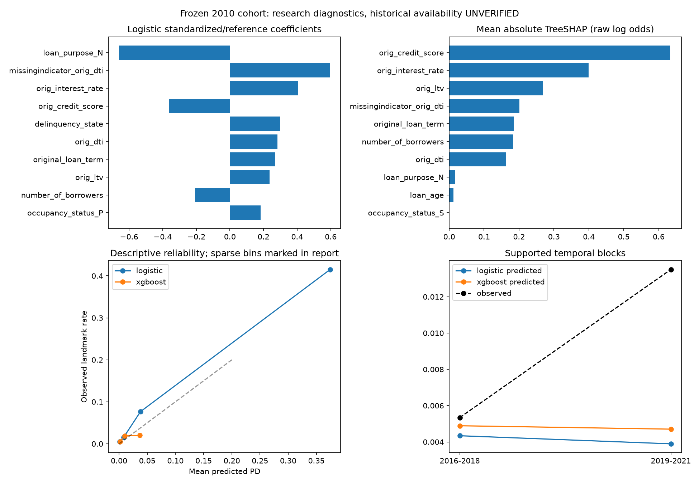

# Expanded-cohort PD temporal validation

## Executive Summary

TEMPORAL VALIDATION SUPPORTS RESEARCH PD WITH MATERIAL LIMITATIONS; research champion: logistic

Logistic improves temporal probability quality over the null, but substantially underpredicts risk: mean 0.396% versus observed 0.832%; CITL +0.987, slope 0.768. No claim of satisfactory temporal calibration. This specific XGBoost challenger is inferior on paired discrimination/probability-quality intervals and used no delinquency splits. Origination-only AP is 0.0195 versus full-model 0.176; removing both ageing and delinquency materially changes the question.

## Research Question

Twelve-month facility default before payoff in the frozen 2010 Freddie cohort. Historical operational knowledge time UNVERIFIED. No regulatory/production/IFRS9/fairness claim.

## Cohort

| partition | landmarks | loans | positive_landmarks | default_loans |
| --- | --- | --- | --- | --- |
| primary | 1241045 | 19590 | 7153 | 618 |
| development | 478796 | 13801 | 2560 | 246 |
| evaluation | 128812 | 2423 | 1072 | 95 |

## Temporal Design

Original loan hash groups; development <=2014-12; all 2015 landmarks purged; evaluation >=2016-01. No overlapping loans. Dates and outcomes unchanged.

## Feature-Time Governance

Registry: expanded_pd_feature_registry.json. Eight numeric predictors: origination credit score/LTV/DTI/rate/term/borrowers, plus t0 loan age/delinquency. Two categorical predictors: purpose/occupancy. Exact provider historical vintage unverified. No raw-source joins, macro or post-t0 fields.

## Models

Null development prevalence; fixed C=1 logistic; one monthly logistic hazard; two shallow XGB configurations, with only one selected challenger. Static-only sensitivities are prespecified within these families. Median/missing-indicator, scaling, modal categorical imputation and reference OHE fit on fit groups only.

## Development Selection

| partition | landmarks | loans | positive_landmarks | default_loans |
| --- | --- | --- | --- | --- |
| fit | 287484 | 8261 | 1556 | 151 |
| calibration | 95742 | 2764 | 525 | 47 |
| selection | 95570 | 2776 | 479 | 48 |

Identifier hash assigns disjoint 60% fit / 20% calibration / 20% selection groups. Internal groups share development calendar coverage; this is not internal temporal CV. No final refit. Sigmoid only retained when independent selection improves both Brier and log loss by >=1%, positive slope, and no material AUC loss.

XGBoost trials:

| depth | trees | landmarks | loans | positive_landmarks | default_loans | roc_auc | average_precision | brier | log_loss |
| --- | --- | --- | --- | --- | --- | --- | --- | --- | --- |
| 2 | 120 | 95570 | 2776 | 479 | 48 | 0.88982 | 0.027072 | 0.0049309 | 0.026516 |
| 3 | 180 | 95570 | 2776 | 479 | 48 | 0.8796 | 0.022967 | 0.004951 | 0.026723 |

Development selection/raw versus sigmoid:

{
  "hazard_monthly": {
    "effective_sample": {
      "landmarks": 95601,
      "loans": 2778,
      "positive_landmarks": 43,
      "default_loans": 43
    },
    "metrics": {
      "brier": 0.00018883292619655388,
      "log_loss": 0.0005504886030134198,
      "observed_rate": 0.00044978609010366,
      "mean_probability": 0.0003584367423845947,
      "roc_auc": 0.9998924310914058,
      "gini": 0.9997848621828116,
      "pr_auc_trapezoid": 0.7856407396235766,
      "average_precision": 0.7884658662928465,
      "discrimination_status": "estimated"
    }
  },
  "logistic": {
    "decision": "RAW RETAINED",
    "effective_sample": {
      "landmarks": 95570,
      "loans": 2776,
      "positive_landmarks": 479,
      "default_loans": 48
    },
    "raw": {
      "brier": 0.0043085464829401895,
      "log_loss": 0.02249991906843506,
      "observed_rate": 0.005012033064769279,
      "mean_probability": 0.004919921491001277,
      "roc_auc": 0.9085199543722419,
      "gini": 0.8170399087444837,
      "pr_auc_trapezoid": 0.22849968999948603,
      "average_precision": 0.22891840121654286,
      "discrimination_status": "estimated"
    },
    "sigmoid": {
      "brier": 0.004351582474564729,
      "log_loss": 0.022465613081523637,
      "observed_rate": 0.005012033064769279,
      "mean_probability": 0.00536939184412083,
      "roc_auc": 0.9085199543722419,
      "gini": 0.8170399087444837,
      "pr_auc_trapezoid": 0.22849968999948603,
      "average_precision": 0.22891840121654286,
      "discrimination_status": "estimated"
    },
    "sigmoid_intercept": 0.46267015963725533,
    "sigmoid_slope": 1.0828259548104615,
    "fit_sample": {
      "landmarks": 287484,
      "loans": 8261,
      "positive_landmarks": 1556,
      "default_loans": 151
    },
    "calibration_sample": {
      "landmarks": 95742,
      "loans": 2764,
      "positive_landmarks": 525,
      "default_loans": 47
    }
  },
  "xgboost": {
    "decision": "RAW RETAINED",
    "effective_sample": {
      "landmarks": 95570,
      "loans": 2776,
      "positive_landmarks": 479,
      "default_loans": 48
    },
    "raw": {
      "brier": 0.004930901056189123,
      "log_loss": 0.026515919762395878,
      "observed_rate": 0.005012033064769279,
      "mean_probability": 0.005153118550905374,
      "roc_auc": 0.8898204069504765,
      "gini": 0.779640813900953,
      "pr_auc_trapezoid": 0.026079772322080554,
      "average_precision": 0.027071718708665152,
      "discrimination_status": "estimated"
    },
    "sigmoid": {
      "brier": 0.004934135689200365,
      "log_loss": 0.02650300541373368,
      "observed_rate": 0.005012033064769279,
      "mean_probability": 0.005424075783727051,
      "roc_auc": 0.8898204069504765,
      "gini": 0.779640813900953,
      "pr_auc_trapezoid": 0.026079772322080554,
      "average_precision": 0.027071718708665152,
      "discrimination_status": "estimated"
    },
    "sigmoid_intercept": 0.1709112972021103,
    "sigmoid_slope": 1.026476502418518,
    "fit_sample": {
      "landmarks": 287484,
      "loans": 8261,
      "positive_landmarks": 1556,
      "default_loans": 151
    },
    "calibration_sample": {
      "landmarks": 95742,
      "loans": 2764,
      "positive_landmarks": 525,
      "default_loans": 47
    }
  },
  "static_logistic": {
    "effective_sample": {
      "landmarks": 95570,
      "loans": 2776,
      "positive_landmarks": 479,
      "default_loans": 48
    },
    "decision": "RAW RETAINED",
    "metrics": {
      "brier": 0.0049153301388470535,
      "log_loss": 0.026673581772647677,
      "observed_rate": 0.005012033064769279,
      "mean_probability": 0.005010807214695145,
      "roc_auc": 0.865265025004397,
      "gini": 0.7305300500087939,
      "pr_auc_trapezoid": 0.03092087133449307,
      "average_precision": 0.03363044341930305,
      "discrimination_status": "estimated"
    }
  },
  "static_xgboost": {
    "effective_sample": {
      "landmarks": 95570,
      "loans": 2776,
      "positive_landmarks": 479,
      "default_loans": 48
    },
    "decision": "RAW RETAINED",
    "metrics": {
      "brier": 0.004931955748416409,
      "log_loss": 0.026618010067622273,
      "observed_rate": 0.005012033064769279,
      "mean_probability": 0.005138517122302764,
      "roc_auc": 0.8852144355119321,
      "gini": 0.7704288710238643,
      "pr_auc_trapezoid": 0.025371705910480352,
      "average_precision": 0.02702599860505675,
      "discrimination_status": "estimated"
    }
  }
}

## Locked Temporal Evaluation

Task5 metrics opened once after model/artifact/calibration specifications froze. Tasks3/4 aggregate labels and nested Task3 predictions were previously inspected; this is NOT never-seen data. No post-evaluation model changes. Ledger and artifact/code hashes are in JSON. Prediction arrays and models remain private under Git-ignore.

## Discrimination

| model | metric | landmarks | loans | positive_landmarks | default_loans | estimate | lower | upper |
| --- | --- | --- | --- | --- | --- | --- | --- | --- |
| null | roc_auc | 128812 | 2423 | 1072 | 95 | 0.5 | 0.5 | 0.5 |
| null | gini | 128812 | 2423 | 1072 | 95 | 0 | 0 | 0 |
| null | average_precision | 128812 | 2423 | 1072 | 95 | 0.0083222 | 0.0065039 | 0.01004 |
| null | pr_auc_trapezoid | 128812 | 2423 | 1072 | 95 | 0.50416 | 0.50325 | 0.50502 |
| logistic_raw | roc_auc | 128812 | 2423 | 1072 | 95 | 0.78338 | 0.74336 | 0.82268 |
| logistic_raw | gini | 128812 | 2423 | 1072 | 95 | 0.56675 | 0.48673 | 0.64536 |
| logistic_raw | average_precision | 128812 | 2423 | 1072 | 95 | 0.1763 | 0.14021 | 0.22276 |
| logistic_raw | pr_auc_trapezoid | 128812 | 2423 | 1072 | 95 | 0.17575 | 0.1392 | 0.2216 |
| logistic | roc_auc | 128812 | 2423 | 1072 | 95 | 0.78338 | 0.74336 | 0.82268 |
| logistic | gini | 128812 | 2423 | 1072 | 95 | 0.56675 | 0.48673 | 0.64536 |
| logistic | average_precision | 128812 | 2423 | 1072 | 95 | 0.1763 | 0.14021 | 0.22276 |
| logistic | pr_auc_trapezoid | 128812 | 2423 | 1072 | 95 | 0.17575 | 0.1392 | 0.2216 |
| xgboost_raw | roc_auc | 128812 | 2423 | 1072 | 95 | 0.7223 | 0.67665 | 0.76978 |
| xgboost_raw | gini | 128812 | 2423 | 1072 | 95 | 0.44459 | 0.3533 | 0.53956 |
| xgboost_raw | average_precision | 128812 | 2423 | 1072 | 95 | 0.017483 | 0.013295 | 0.024776 |
| xgboost_raw | pr_auc_trapezoid | 128812 | 2423 | 1072 | 95 | 0.016951 | 0.012625 | 0.023164 |
| xgboost | roc_auc | 128812 | 2423 | 1072 | 95 | 0.7223 | 0.67665 | 0.76978 |
| xgboost | gini | 128812 | 2423 | 1072 | 95 | 0.44459 | 0.3533 | 0.53956 |
| xgboost | average_precision | 128812 | 2423 | 1072 | 95 | 0.017483 | 0.013295 | 0.024776 |
| xgboost | pr_auc_trapezoid | 128812 | 2423 | 1072 | 95 | 0.016951 | 0.012625 | 0.023164 |
| static_logistic | roc_auc | 128812 | 2423 | 1072 | 95 | 0.71292 | 0.66353 | 0.76112 |
| static_logistic | gini | 128812 | 2423 | 1072 | 95 | 0.42585 | 0.32706 | 0.52223 |
| static_logistic | average_precision | 128812 | 2423 | 1072 | 95 | 0.019546 | 0.014376 | 0.029162 |
| static_logistic | pr_auc_trapezoid | 128812 | 2423 | 1072 | 95 | 0.018913 | 0.013589 | 0.026843 |
| static_xgboost | roc_auc | 128812 | 2423 | 1072 | 95 | 0.72037 | 0.67468 | 0.76972 |
| static_xgboost | gini | 128812 | 2423 | 1072 | 95 | 0.44074 | 0.34936 | 0.53944 |
| static_xgboost | average_precision | 128812 | 2423 | 1072 | 95 | 0.017669 | 0.013383 | 0.025478 |
| static_xgboost | pr_auc_trapezoid | 128812 | 2423 | 1072 | 95 | 0.017111 | 0.012836 | 0.023848 |

## Probability Quality

| model | metric | landmarks | loans | positive_landmarks | default_loans | estimate | lower | upper |
| --- | --- | --- | --- | --- | --- | --- | --- | --- |
| null | brier | 128812 | 2423 | 1072 | 95 | 0.0082618 | 0.006463 | 0.0099611 |
| null | log_loss | 128812 | 2423 | 1072 | 95 | 0.048852 | 0.03935 | 0.057828 |
| null | observed_rate | 128812 | 2423 | 1072 | 95 | 0.0083222 | 0.0065039 | 0.01004 |
| null | mean_probability | 128812 | 2423 | 1072 | 95 | 0.0053467 | 0.0053467 | 0.0053467 |
| logistic_raw | brier | 128812 | 2423 | 1072 | 95 | 0.0074225 | 0.0058546 | 0.0089179 |
| logistic_raw | log_loss | 128812 | 2423 | 1072 | 95 | 0.04233 | 0.033023 | 0.051207 |
| logistic_raw | observed_rate | 128812 | 2423 | 1072 | 95 | 0.0083222 | 0.0065039 | 0.01004 |
| logistic_raw | mean_probability | 128812 | 2423 | 1072 | 95 | 0.0039588 | 0.0033924 | 0.0047311 |
| logistic | brier | 128812 | 2423 | 1072 | 95 | 0.0074225 | 0.0058546 | 0.0089179 |
| logistic | log_loss | 128812 | 2423 | 1072 | 95 | 0.04233 | 0.033023 | 0.051207 |
| logistic | observed_rate | 128812 | 2423 | 1072 | 95 | 0.0083222 | 0.0065039 | 0.01004 |
| logistic | mean_probability | 128812 | 2423 | 1072 | 95 | 0.0039588 | 0.0033924 | 0.0047311 |
| xgboost_raw | brier | 128812 | 2423 | 1072 | 95 | 0.008264 | 0.0064669 | 0.0099514 |
| xgboost_raw | log_loss | 128812 | 2423 | 1072 | 95 | 0.048156 | 0.038551 | 0.057511 |
| xgboost_raw | observed_rate | 128812 | 2423 | 1072 | 95 | 0.0083222 | 0.0065039 | 0.01004 |
| xgboost_raw | mean_probability | 128812 | 2423 | 1072 | 95 | 0.0047974 | 0.0044015 | 0.0052127 |
| xgboost | brier | 128812 | 2423 | 1072 | 95 | 0.008264 | 0.0064669 | 0.0099514 |
| xgboost | log_loss | 128812 | 2423 | 1072 | 95 | 0.048156 | 0.038551 | 0.057511 |
| xgboost | observed_rate | 128812 | 2423 | 1072 | 95 | 0.0083222 | 0.0065039 | 0.01004 |
| xgboost | mean_probability | 128812 | 2423 | 1072 | 95 | 0.0047974 | 0.0044015 | 0.0052127 |
| static_logistic | brier | 128812 | 2423 | 1072 | 95 | 0.0082659 | 0.006493 | 0.0099625 |
| static_logistic | log_loss | 128812 | 2423 | 1072 | 95 | 0.048218 | 0.038455 | 0.057641 |
| static_logistic | observed_rate | 128812 | 2423 | 1072 | 95 | 0.0083222 | 0.0065039 | 0.01004 |
| static_logistic | mean_probability | 128812 | 2423 | 1072 | 95 | 0.0047652 | 0.004381 | 0.0051794 |
| static_xgboost | brier | 128812 | 2423 | 1072 | 95 | 0.0082643 | 0.0064669 | 0.0099476 |
| static_xgboost | log_loss | 128812 | 2423 | 1072 | 95 | 0.048218 | 0.0385 | 0.057506 |
| static_xgboost | observed_rate | 128812 | 2423 | 1072 | 95 | 0.0083222 | 0.0065039 | 0.01004 |
| static_xgboost | mean_probability | 128812 | 2423 | 1072 | 95 | 0.0047831 | 0.0043835 | 0.0051964 |

Average Precision is primary PR summary. Trapezoidal PR area is secondary; constant-null area can be misleading. All intervals are 95% fixed-fit loan-cluster percentiles.

## Calibration

Raw probabilities retained alongside the development-selected variant. Calibration numbers are diagnostic point estimates; no iid Wald intervals. Reliability bins with fewer than 20 event loans are sparse.

| model | landmarks | loans | positive_landmarks | default_loans | CITL | slope | support |
| --- | --- | --- | --- | --- | --- | --- | --- |
| null | 128812 | 2423 | 1072 | 95 | 0.44544 | None | constant logits: joint slope unidentifiable |
| logistic_raw | 128812 | 2423 | 1072 | 95 | 0.98711 | 0.76808 | estimated |
| logistic | 128812 | 2423 | 1072 | 95 | 0.98711 | 0.76808 | estimated |
| xgboost_raw | 128812 | 2423 | 1072 | 95 | 0.56501 | 0.58375 | estimated |
| xgboost | 128812 | 2423 | 1072 | 95 | 0.56501 | 0.58375 | estimated |
| static_logistic | 128812 | 2423 | 1072 | 95 | 0.5738 | 0.56508 | estimated |
| static_xgboost | 128812 | 2423 | 1072 | 95 | 0.56855 | 0.57817 | estimated |

logistic: RAW RETAINED

| bin | landmarks | loans | positive_landmarks | default_loans | observed_rate | mean_probability | support |
| --- | --- | --- | --- | --- | --- | --- | --- |
| (-0.001000000001, 0.005] | 116335 | 2200 | 564 | 67 | 0.0048481 | 0.0012741 | descriptive |
| (0.005, 0.02] | 10710 | 396 | 163 | 36 | 0.015219 | 0.008049 | descriptive |
| (0.02, 0.1] | 1148 | 163 | 88 | 50 | 0.076655 | 0.038065 | descriptive |
| (0.1, 1.0] | 619 | 156 | 257 | 95 | 0.41519 | 0.3745 | descriptive |

xgboost: RAW RETAINED

| bin | landmarks | loans | positive_landmarks | default_loans | observed_rate | mean_probability | support |
| --- | --- | --- | --- | --- | --- | --- | --- |
| (-0.001000000001, 0.005] | 98654 | 1811 | 498 | 44 | 0.0050479 | 0.001768 | descriptive |
| (0.005, 0.02] | 24722 | 498 | 465 | 40 | 0.018809 | 0.0098695 | descriptive |
| (0.02, 0.1] | 5436 | 114 | 109 | 11 | 0.020052 | 0.036709 | sparse |

## Hazard Model

monthly default hazard with payoff censored; twelve-month net-default projection not primary CIF

Each eligible t0 predicts the next known month. Default event appears once per facility. Payoff exits the risk set; first-month ambiguous/admin follow-up is excluded. Development t0<=2014-12 means monthly event labels end 2015-01, whereas twelve-month landmark labels can extend through2015-12. No purged t0 is reused. Future projection freezes t0 predictors except deterministic ageing. PD=1-product(1-h), not sum(h). Net-risk projection is NOT the primary default-before-payoff CIF and is excluded from champion selection.

{
  "estimand": "monthly default hazard with payoff censored; twelve-month net-default projection not primary CIF",
  "development_selection": {
    "effective_sample": {
      "landmarks": 95601,
      "loans": 2778,
      "positive_landmarks": 43,
      "default_loans": 43
    },
    "metrics": {
      "brier": 0.00018883292619655388,
      "log_loss": 0.0005504886030134198,
      "observed_rate": 0.00044978609010366,
      "mean_probability": 0.0003584367423845947,
      "roc_auc": 0.9998924310914058,
      "gini": 0.9997848621828116,
      "pr_auc_trapezoid": 0.7856407396235766,
      "average_precision": 0.7884658662928465,
      "discrimination_status": "estimated"
    }
  },
  "temporal_monthly": {
    "effective_sample": {
      "landmarks": 132409,
      "loans": 2423,
      "positive_landmarks": 95,
      "default_loans": 95
    },
    "metrics": {
      "brier": 0.0006499596701805678,
      "log_loss": 0.0024993394525466032,
      "observed_rate": 0.0007174738877266651,
      "mean_probability": 0.00012524543056332134,
      "roc_auc": 0.9993094576458075,
      "gini": 0.998618915291615,
      "pr_auc_trapezoid": 0.33924377404762485,
      "average_precision": 0.3445219494770987,
      "discrimination_status": "estimated"
    },
    "calibration": {
      "epsilon": 1e-12,
      "clipped_rows": 0,
      "calibration_intercept": 2.421779258223696,
      "joint_intercept": 1.7635927710264105,
      "calibration_slope": 0.8080066678871363,
      "slope_status": "estimated",
      "confidence_intervals": null,
      "interval_reason": "Point calibration diagnostics only; no iid/Wald interval; loan-cluster intervals supplied for core predictive metrics",
      "support_status": "estimated"
    },
    "reliability": [
      {
        "bin": "(-0.001000000001, 0.005]",
        "landmarks": 132173,
        "loans": 2421,
        "positive_landmarks": 5,
        "default_loans": 5,
        "observed_rate": 3.782920868861265e-05,
        "mean_probability": 1.6457313742962945e-06,
        "support": "sparse"
      },
      {
        "bin": "(0.005, 0.02]",
        "landmarks": 38,
        "loans": 24,
        "positive_landmarks": 17,
        "default_loans": 17,
        "observed_rate": 0.4473684210526316,
        "mean_probability": 0.012440273390289726,
        "support": "sparse"
      },
      {
        "bin": "(0.02, 0.1]",
        "landmarks": 139,
        "loans": 75,
        "positive_landmarks": 56,
        "default_loans": 56,
        "observed_rate": 0.4028776978417266,
        "mean_probability": 0.0492745528834675,
        "support": "descriptive"
      },
      {
        "bin": "(0.1, 1.0]",
        "landmarks": 59,
        "loans": 26,
        "positive_landmarks": 17,
        "default_loans": 17,
        "observed_rate": 0.288135593220339,
        "mean_probability": 0.15329165632018574,
        "support": "sparse"
      }
    ]
  },
  "clustered_uncertainty": {
    "draws": 1000,
    "seed": 51005,
    "unit": "loan_id",
    "invalid_single_class_draws": 0,
    "loan_sample_sequence_sha256": "68fb663b88d629471e55fbe59fb07caea4c6c7b4ac57c374269e2eacd3368d82",
    "fixed_fit_only": true,
    "intervals": {
      "hazard_monthly": {
        "brier": {
          "lower": 0.0005155300607334696,
          "upper": 0.0007874231411007196,
          "valid_draws": 1000
        },
        "log_loss": {
          "lower": 0.0019748674150871096,
          "upper": 0.00302888262322994,
          "valid_draws": 1000
        },
        "observed_rate": {
          "lower": 0.0005694169154897823,
          "upper": 0.0008651790181225709,
          "valid_draws": 1000
        },
        "mean_probability": {
          "lower": 8.537918109854048e-05,
          "upper": 0.00017448363515049862,
          "valid_draws": 1000
        },
        "roc_auc": {
          "lower": 0.9989741187660405,
          "upper": 0.9995722018652331,
          "valid_draws": 1000
        },
        "gini": {
          "lower": 0.9979482375320808,
          "upper": 0.9991444037304663,
          "valid_draws": 1000
        },
        "average_precision": {
          "lower": 0.2619014445586954,
          "upper": 0.4718031084401012,
          "valid_draws": 1000
        },
        "pr_auc_trapezoid": {
          "lower": 0.2517329206422408,
          "upper": 0.45932800618136743,
          "valid_draws": 1000
        }
      }
    },
    "paired": {}
  },
  "net_12m": {
    "effective_sample": {
      "landmarks": 128812,
      "loans": 2423,
      "positive_landmarks": 1072,
      "default_loans": 95
    },
    "mean": 0.00082445566356322,
    "minimum": 4.175028798046392e-08,
    "maximum": 0.980367694361545
  },
  "events_once_per_facility": true
}

## Nonlinear Challenger

Bounded depth2/120 and depth3/180 tree search; development selection only. All configurations recorded. Champion promotion requires paired probability-quality improvements, discrimination retention and supported-calendar stability under the prespecified rule.

## Paired Uncertainty

{
  "draws": 1000,
  "seed": 51005,
  "unit": "loan_id",
  "invalid_single_class_draws": 0,
  "loan_sample_sequence_sha256": "68fb663b88d629471e55fbe59fb07caea4c6c7b4ac57c374269e2eacd3368d82",
  "fixed_fit_only": true,
  "paired": {
    "xgboost-minus-logistic": {
      "roc_auc": {
        "point": -0.06107967822933247,
        "lower": -0.08563797685842676,
        "upper": -0.035000580040540775,
        "valid_draws": 1000
      },
      "average_precision": {
        "point": -0.15881892794608257,
        "lower": -0.20348153879984424,
        "upper": -0.12291266882871729,
        "valid_draws": 1000
      },
      "brier": {
        "point": 0.000841507701348599,
        "lower": 0.0005293733529794522,
        "upper": 0.001182520849511761,
        "valid_draws": 1000
      },
      "log_loss": {
        "point": 0.005826069279653019,
        "lower": 0.003942391862550103,
        "upper": 0.00806472957117753,
        "valid_draws": 1000
      }
    },
    "logistic-minus-null": {
      "roc_auc": {
        "point": 0.2833771782234904,
        "lower": 0.2433638060294455,
        "upper": 0.32268244899981346,
        "valid_draws": 1000
      },
      "average_precision": {
        "point": 0.16798006111895505,
        "lower": 0.13215754380271083,
        "upper": 0.21391239822980834,
        "valid_draws": 1000
      },
      "brier": {
        "point": -0.0008392638588140856,
        "lower": -0.0011761256143829881,
        "upper": -0.0005186810193216821,
        "valid_draws": 1000
      },
      "log_loss": {
        "point": -0.0065218093624867385,
        "lower": -0.009317930066578148,
        "upper": -0.004259394672632313,
        "valid_draws": 1000
      }
    },
    "xgboost-minus-null": {
      "roc_auc": {
        "point": 0.22229749999415793,
        "lower": 0.1766482199636648,
        "upper": 0.2697812549023401,
        "valid_draws": 1000
      },
      "average_precision": {
        "point": 0.009161133172872479,
        "lower": 0.005958349317588182,
        "upper": 0.016230061833713474,
        "valid_draws": 1000
      },
      "brier": {
        "point": 2.243842534513374e-06,
        "lower": -3.7432489053466605e-05,
        "upper": 3.8095596830396465e-05,
        "valid_draws": 1000
      },
      "log_loss": {
        "point": -0.0006957400828337193,
        "lower": -0.0025183583101298108,
        "upper": 0.0009757559669044185,
        "valid_draws": 1000
      }
    }
  }
}

## Interpretability

Logistic effects are associations, not causal. Numeric odds ratios use development-standardized units; categorical effects use stored references. TreeSHAP is raw-model log-odds contribution; any retained sigmoid adds another mapping. Deterministic bounded explanation sample, one earliest evaluation landmark per facility. Direction bins and rank stability are descriptive.

| feature | coefficient | odds_ratio | direction | scale |
| --- | --- | --- | --- | --- |
| orig_credit_score | -0.36119 | 0.69684 | negative | one development SD for numeric features; category vs reference for one-hot |
| orig_ltv | 0.23543 | 1.2654 | positive | one development SD for numeric features; category vs reference for one-hot |
| orig_dti | 0.28358 | 1.3279 | positive | one development SD for numeric features; category vs reference for one-hot |
| orig_interest_rate | 0.40491 | 1.4992 | positive | one development SD for numeric features; category vs reference for one-hot |
| original_loan_term | 0.2679 | 1.3072 | positive | one development SD for numeric features; category vs reference for one-hot |
| number_of_borrowers | -0.20836 | 0.81192 | negative | one development SD for numeric features; category vs reference for one-hot |
| loan_age | -0.095166 | 0.90922 | negative | one development SD for numeric features; category vs reference for one-hot |
| delinquency_state | 0.29714 | 1.346 | positive | one development SD for numeric features; category vs reference for one-hot |
| missingindicator_orig_ltv | -0.070131 | 0.93227 | negative | one development SD for numeric features; category vs reference for one-hot |
| missingindicator_orig_dti | 0.5965 | 1.8158 | positive | one development SD for numeric features; category vs reference for one-hot |
| loan_purpose_N | -0.65962 | 0.51705 | negative | one development SD for numeric features; category vs reference for one-hot |
| loan_purpose_P | -0.16392 | 0.84881 | negative | one development SD for numeric features; category vs reference for one-hot |
| occupancy_status_P | 0.18232 | 1.2 | positive | one development SD for numeric features; category vs reference for one-hot |
| occupancy_status_S | -0.019355 | 0.98083 | negative | one development SD for numeric features; category vs reference for one-hot |

Categorical references: {"loan_purpose": "C", "occupancy_status": "I"}

{
  "effective_sample": {
    "landmarks": 1000,
    "loans": 1000,
    "positive_landmarks": 6,
    "default_loans": 6
  },
  "unit": "one earliest evaluation landmark per deterministic selected facility",
  "scale": "raw XGBoost log odds; calibrated probabilities have a further sigmoid mapping if retained",
  "global_mean_abs": {
    "orig_credit_score": 0.6334701180458069,
    "orig_ltv": 0.2675439119338989,
    "orig_dti": 0.16294711828231812,
    "orig_interest_rate": 0.3997829258441925,
    "original_loan_term": 0.18422552943229675,
    "number_of_borrowers": 0.18401332199573517,
    "loan_age": 0.011886627413332462,
    "delinquency_state": 0.0,
    "missingindicator_orig_ltv": 0.0,
    "missingindicator_orig_dti": 0.20139899849891663,
    "loan_purpose_N": 0.016138657927513123,
    "loan_purpose_P": 0.0,
    "occupancy_status_P": 0.0,
    "occupancy_status_S": 0.0
  },
  "half_sample_rank_spearman": 0.9954022988505749,
  "causal": false,
  "direction_bins": [
    {
      "feature": "orig_credit_score",
      "bin": "(-5.205, -0.644]",
      "rows": 255,
      "mean_standardized_feature": -1.4869881456046763,
      "mean_shap_logodds": 0.6449297666549683
    },
    {
      "feature": "orig_credit_score",
      "bin": "(-0.644, 0.263]",
      "rows": 248,
      "mean_standardized_feature": -0.1478815053538897,
      "mean_shap_logodds": -0.2117745727300644
    },
    {
      "feature": "orig_credit_score",
      "bin": "(0.263, 0.782]",
      "rows": 253,
      "mean_standardized_feature": 0.5280012655649947,
      "mean_shap_logodds": -0.6173028349876404
    },
    {
      "feature": "orig_credit_score",
      "bin": "(0.782, 1.754]",
      "rows": 244,
      "mean_standardized_feature": 1.0351762863227092,
      "mean_shap_logodds": -0.8785048723220825
    },
    {
      "feature": "orig_interest_rate",
      "bin": "(-2.808, -0.824]",
      "rows": 301,
      "mean_standardized_feature": -1.2921438731048696,
      "mean_shap_logodds": -0.40498602390289307
    },
    {
      "feature": "orig_interest_rate",
      "bin": "(-0.824, -0.0798]",
      "rows": 274,
      "mean_standardized_feature": -0.35259877403331746,
      "mean_shap_logodds": -0.37477701902389526
    },
    {
      "feature": "orig_interest_rate",
      "bin": "(-0.0798, 0.664]",
      "rows": 232,
      "mean_standardized_feature": 0.4103511887532749,
      "mean_shap_logodds": -0.29472869634628296
    },
    {
      "feature": "orig_interest_rate",
      "bin": "(0.664, 2.399]",
      "rows": 193,
      "mean_standardized_feature": 1.3045368855671844,
      "mean_shap_logodds": 0.5503770709037781
    },
    {
      "feature": "orig_ltv",
      "bin": "(-2.984, -0.71]",
      "rows": 260,
      "mean_standardized_feature": -1.4323101766446633,
      "mean_shap_logodds": -0.5219911932945251
    },
    {
      "feature": "orig_ltv",
      "bin": "(-0.71, 0.189]",
      "rows": 247,
      "mean_standardized_feature": -0.1761061520446576,
      "mean_shap_logodds": -0.16235999763011932
    },
    {
      "feature": "orig_ltv",
      "bin": "(0.189, 0.559]",
      "rows": 298,
      "mean_standardized_feature": 0.4723064937916392,
      "mean_shap_logodds": 0.017234841361641884
    },
    {
      "feature": "orig_ltv",
      "bin": "(0.559, 2.833]",
      "rows": 195,
      "mean_standardized_feature": 1.2278106088574272,
      "mean_shap_logodds": 0.31909844279289246
    },
    {
      "feature": "missingindicator_orig_dti",
      "bin": "(-0.7, 1.431]",
      "rows": 1000,
      "mean_standardized_feature": 0.05521923953368471,
      "mean_shap_logodds": -0.043250661343336105
    }
  ]
}

Model agreement: {
  "rank_spearman": 0.870025477860681,
  "top_5_percent_overlap": 0.6788819875776397,
  "disagreement_top_1_percent_effective_sample": {
    "landmarks": 1288,
    "loans": 205,
    "positive_landmarks": 308,
    "default_loans": 95
  },
  "disagreement_observed_rate": 0.2391304347826087,
  "mean_logistic": 0.1986074436562148,
  "mean_xgboost": 0.03246394544839859,
  "ids_published": false
}

## Delinquency Sensitivity

Origination-only sensitivity removes both age and current delinquency. Raw-only fixed pipelines; no champion selection from this sensitivity. Results appear in the core metric tables.

## Segment Diagnostics

Segments with fewer than 20 event loans suppress discrimination/calibration; descriptive exposure/event-rate counts remain. Loan counts can overlap across bins/blocks. No segment-specific optimized models.

{
  "logistic": {
    "delinquency_state:(-1.0, 0.5]": {
      "effective_sample": {
        "landmarks": 127668,
        "loans": 2418,
        "positive_landmarks": 705,
        "default_loans": 88
      },
      "metrics": {
        "brier": 0.005500209923032128,
        "log_loss": 0.036177393133222734,
        "observed_rate": 0.005522135539054423,
        "mean_probability": 0.001992460188086108,
        "roc_auc": 0.6763917203107646,
        "gini": 0.3527834406215291,
        "pr_auc_trapezoid": 0.010084639195814165,
        "average_precision": 0.01012660452774749,
        "discrimination_status": "estimated"
      },
      "calibration": {
        "epsilon": 1e-12,
        "clipped_rows": 0,
        "calibration_intercept": 1.0320859537303162,
        "joint_intercept": -1.8338844308994555,
        "calibration_slope": 0.512125504799847,
        "slope_status": "estimated",
        "confidence_intervals": null,
        "interval_reason": "Point calibration diagnostics only; no iid/Wald interval; loan-cluster intervals supplied for core predictive metrics",
        "support_status": "estimated"
      },
      "reliability": [
        {
          "bin": "(-0.001000000001, 0.005]",
          "landmarks": 116307,
          "loans": 2200,
          "positive_landmarks": 564,
          "default_loans": 67,
          "observed_rate": 0.004849235213701669,
          "mean_probability": 0.001273542776512384,
          "support": "descriptive"
        },
        {
          "bin": "(0.005, 0.02]",
          "landmarks": 10618,
          "loans": 345,
          "positive_landmarks": 141,
          "default_loans": 21,
          "observed_rate": 0.013279336974948201,
          "mean_probability": 0.008005541844151899,
          "support": "descriptive"
        },
        {
          "bin": "(0.02, 0.1]",
          "landmarks": 743,
          "loans": 30,
          "positive_landmarks": 0,
          "default_loans": 0,
          "observed_rate": 0.0,
          "mean_probability": 0.028598417609080117,
          "support": "sparse"
        }
      ]
    },
    "delinquency_state:(0.5, 2.0]": {
      "effective_sample": {
        "landmarks": 1144,
        "loans": 262,
        "positive_landmarks": 367,
        "default_loans": 95
      },
      "metrics": {
        "brier": 0.22195013879498607,
        "log_loss": 0.7289873085940916,
        "observed_rate": 0.3208041958041958,
        "mean_probability": 0.22339330384190662,
        "roc_auc": 0.6612135685705168,
        "gini": 0.32242713714103366,
        "pr_auc_trapezoid": 0.47070089486141503,
        "average_precision": 0.47228114677338745,
        "discrimination_status": "estimated"
      },
      "calibration": {
        "epsilon": 1e-12,
        "clipped_rows": 0,
        "calibration_intercept": 0.7965634489854352,
        "joint_intercept": -0.17104670986573936,
        "calibration_slope": 0.3418473850467093,
        "slope_status": "estimated",
        "confidence_intervals": null,
        "interval_reason": "Point calibration diagnostics only; no iid/Wald interval; loan-cluster intervals supplied for core predictive metrics",
        "support_status": "estimated"
      },
      "reliability": [
        {
          "bin": "(-0.001000000001, 0.005]",
          "landmarks": 28,
          "loans": 16,
          "positive_landmarks": 0,
          "default_loans": 0,
          "observed_rate": 0.0,
          "mean_probability": 0.0034184835316052272,
          "support": "sparse"
        },
        {
          "bin": "(0.005, 0.02]",
          "landmarks": 92,
          "loans": 51,
          "positive_landmarks": 22,
          "default_loans": 15,
          "observed_rate": 0.2391304347826087,
          "mean_probability": 0.013069430456944644,
          "support": "sparse"
        },
        {
          "bin": "(0.02, 0.1]",
          "landmarks": 405,
          "loans": 133,
          "positive_landmarks": 88,
          "default_loans": 50,
          "observed_rate": 0.21728395061728395,
          "mean_probability": 0.05543320768147414,
          "support": "descriptive"
        },
        {
          "bin": "(0.1, 1.0]",
          "landmarks": 619,
          "loans": 156,
          "positive_landmarks": 257,
          "default_loans": 95,
          "observed_rate": 0.41518578352180935,
          "mean_probability": 0.374496583753183,
          "support": "descriptive"
        }
      ]
    },
    "orig_ltv:(-inf, 80.0]": {
      "effective_sample": {
        "landmarks": 105507,
        "loans": 1962,
        "positive_landmarks": 842,
        "default_loans": 74
      },
      "metrics": {
        "brier": 0.0070097558320855995,
        "log_loss": 0.041125615311423606,
        "observed_rate": 0.00798051314130816,
        "mean_probability": 0.0027690214043917635,
        "roc_auc": 0.7968132236851587,
        "gini": 0.5936264473703174,
        "pr_auc_trapezoid": 0.21403682261016013,
        "average_precision": 0.21464690022209487,
        "discrimination_status": "estimated"
      },
      "calibration": {
        "epsilon": 1e-12,
        "clipped_rows": 0,
        "calibration_intercept": 1.358774672828683,
        "joint_intercept": 0.6543816870211745,
        "calibration_slope": 0.8692438441801308,
        "slope_status": "estimated",
        "confidence_intervals": null,
        "interval_reason": "Point calibration diagnostics only; no iid/Wald interval; loan-cluster intervals supplied for core predictive metrics",
        "support_status": "estimated"
      },
      "reliability": [
        {
          "bin": "(-0.001000000001, 0.005]",
          "landmarks": 100208,
          "loans": 1872,
          "positive_landmarks": 502,
          "default_loans": 60,
          "observed_rate": 0.00500958007344723,
          "mean_probability": 0.001103543934592988,
          "support": "descriptive"
        },
        {
          "bin": "(0.005, 0.02]",
          "landmarks": 4523,
          "loans": 197,
          "positive_landmarks": 80,
          "default_loans": 24,
          "observed_rate": 0.017687375635640063,
          "mean_probability": 0.00776862797500432,
          "support": "descriptive"
        },
        {
          "bin": "(0.02, 0.1]",
          "landmarks": 432,
          "loans": 118,
          "positive_landmarks": 76,
          "default_loans": 45,
          "observed_rate": 0.17592592592592593,
          "mean_probability": 0.0498657244064967,
          "support": "descriptive"
        },
        {
          "bin": "(0.1, 1.0]",
          "landmarks": 344,
          "loans": 109,
          "positive_landmarks": 184,
          "default_loans": 74,
          "observed_rate": 0.5348837209302325,
          "mean_probability": 0.3630456786073156,
          "support": "descriptive"
        }
      ]
    },
    "orig_ltv:(80.0, inf]": {
      "effective_sample": {
        "landmarks": 23305,
        "loans": 461,
        "positive_landmarks": 230,
        "default_loans": 21
      },
      "metrics": {
        "brier": 0.009291287305697251,
        "log_loss": 0.047784450242503745,
        "observed_rate": 0.009869126796824716,
        "mean_probability": 0.009344956257221907,
        "roc_auc": 0.7873789627396487,
        "gini": 0.5747579254792974,
        "pr_auc_trapezoid": 0.14468746604462726,
        "average_precision": 0.1464534456136483,
        "discrimination_status": "estimated"
      },
      "calibration": {
        "epsilon": 1e-12,
        "clipped_rows": 0,
        "calibration_intercept": 0.07756848272798939,
        "joint_intercept": -1.0973081189543679,
        "calibration_slope": 0.6986494916289839,
        "slope_status": "estimated",
        "confidence_intervals": null,
        "interval_reason": "Point calibration diagnostics only; no iid/Wald interval; loan-cluster intervals supplied for core predictive metrics",
        "support_status": "estimated"
      },
      "reliability": [
        {
          "bin": "(-0.001000000001, 0.005]",
          "landmarks": 16127,
          "loans": 328,
          "positive_landmarks": 62,
          "default_loans": 7,
          "observed_rate": 0.0038444844050350346,
          "mean_probability": 0.002333585083959609,
          "support": "sparse"
        },
        {
          "bin": "(0.005, 0.02]",
          "landmarks": 6187,
          "loans": 199,
          "positive_landmarks": 83,
          "default_loans": 12,
          "observed_rate": 0.013415225472765475,
          "mean_probability": 0.008254036943963025,
          "support": "sparse"
        },
        {
          "bin": "(0.02, 0.1]",
          "landmarks": 716,
          "loans": 45,
          "positive_landmarks": 12,
          "default_loans": 5,
          "observed_rate": 0.01675977653631285,
          "mean_probability": 0.030945643087900807,
          "support": "sparse"
        },
        {
          "bin": "(0.1, 1.0]",
          "landmarks": 275,
          "loans": 47,
          "positive_landmarks": 73,
          "default_loans": 21,
          "observed_rate": 0.26545454545454544,
          "mean_probability": 0.3888206250992863,
          "support": "descriptive"
        }
      ]
    },
    "orig_credit_score:(-inf, 720.0]": {
      "effective_sample": {
        "landmarks": 24375,
        "loans": 464,
        "positive_landmarks": 403,
        "default_loans": 37
      },
      "metrics": {
        "brier": 0.014430830002193027,
        "log_loss": 0.07191800009013614,
        "observed_rate": 0.016533333333333334,
        "mean_probability": 0.010728277711519999,
        "roc_auc": 0.7809569187211383,
        "gini": 0.5619138374422765,
        "pr_auc_trapezoid": 0.211309707600684,
        "average_precision": 0.21257652344222833,
        "discrimination_status": "estimated"
      },
      "calibration": {
        "epsilon": 1e-12,
        "clipped_rows": 0,
        "calibration_intercept": 0.620483838914208,
        "joint_intercept": -0.4753288659876899,
        "calibration_slope": 0.723755774283417,
        "slope_status": "estimated",
        "confidence_intervals": null,
        "interval_reason": "Point calibration diagnostics only; no iid/Wald interval; loan-cluster intervals supplied for core predictive metrics",
        "support_status": "estimated"
      },
      "reliability": [
        {
          "bin": "(-0.001000000001, 0.005]",
          "landmarks": 16376,
          "loans": 333,
          "positive_landmarks": 124,
          "default_loans": 18,
          "observed_rate": 0.007572056668295066,
          "mean_probability": 0.0020791799827645915,
          "support": "sparse"
        },
        {
          "bin": "(0.005, 0.02]",
          "landmarks": 6750,
          "loans": 190,
          "positive_landmarks": 102,
          "default_loans": 16,
          "observed_rate": 0.015111111111111112,
          "mean_probability": 0.00871327464988938,
          "support": "sparse"
        },
        {
          "bin": "(0.02, 0.1]",
          "landmarks": 877,
          "loans": 68,
          "positive_landmarks": 35,
          "default_loans": 14,
          "observed_rate": 0.039908779931584946,
          "mean_probability": 0.0330293757891708,
          "support": "sparse"
        },
        {
          "bin": "(0.1, 1.0]",
          "landmarks": 372,
          "loans": 67,
          "positive_landmarks": 142,
          "default_loans": 37,
          "observed_rate": 0.3817204301075269,
          "mean_probability": 0.37546169722228734,
          "support": "descriptive"
        }
      ]
    },
    "orig_credit_score:(720.0, 780.0]": {
      "effective_sample": {
        "landmarks": 51504,
        "loans": 977,
        "positive_landmarks": 473,
        "default_loans": 41
      },
      "metrics": {
        "brier": 0.00822997771555622,
        "log_loss": 0.04886180504532635,
        "observed_rate": 0.009183752718235476,
        "mean_probability": 0.0035111934279846266,
        "roc_auc": 0.7270169030034102,
        "gini": 0.4540338060068203,
        "pr_auc_trapezoid": 0.16620947179137027,
        "average_precision": 0.16799848846609008,
        "discrimination_status": "estimated"
      },
      "calibration": {
        "epsilon": 1e-12,
        "clipped_rows": 0,
        "calibration_intercept": 1.2386030482036992,
        "joint_intercept": 0.06297743460109279,
        "calibration_slope": 0.7773949746664194,
        "slope_status": "estimated",
        "confidence_intervals": null,
        "interval_reason": "Point calibration diagnostics only; no iid/Wald interval; loan-cluster intervals supplied for core predictive metrics",
        "support_status": "estimated"
      },
      "reliability": [
        {
          "bin": "(-0.001000000001, 0.005]",
          "landmarks": 47701,
          "loans": 899,
          "positive_landmarks": 297,
          "default_loans": 33,
          "observed_rate": 0.0062262845642649,
          "mean_probability": 0.0014304763453876343,
          "support": "descriptive"
        },
        {
          "bin": "(0.005, 0.02]",
          "landmarks": 3383,
          "loans": 159,
          "positive_landmarks": 45,
          "default_loans": 13,
          "observed_rate": 0.013301803133313627,
          "mean_probability": 0.006955186249239903,
          "support": "sparse"
        },
        {
          "bin": "(0.02, 0.1]",
          "landmarks": 206,
          "loans": 65,
          "positive_landmarks": 41,
          "default_loans": 27,
          "observed_rate": 0.19902912621359223,
          "mean_probability": 0.058729078972372444,
          "support": "descriptive"
        },
        {
          "bin": "(0.1, 1.0]",
          "landmarks": 214,
          "loans": 65,
          "positive_landmarks": 90,
          "default_loans": 41,
          "observed_rate": 0.4205607476635514,
          "mean_probability": 0.35970920006587553,
          "support": "descriptive"
        }
      ]
    },
    "orig_credit_score:(780.0, inf]": {
      "effective_sample": {
        "landmarks": 52933,
        "loans": 982,
        "positive_landmarks": 196,
        "default_loans": 17
      },
      "status": "SUPPRESSED \u2014 INSUFFICIENT EVENT LOANS",
      "observed_rate": 0.003702794098199611,
      "mean_probability": 0.0012769552331154134
    },
    "loan_age:(-inf, 120.0]": {
      "effective_sample": {
        "landmarks": 94837,
        "loans": 2423,
        "positive_landmarks": 821,
        "default_loans": 77
      },
      "metrics": {
        "brier": 0.00781911768453686,
        "log_loss": 0.04461711797628701,
        "observed_rate": 0.008656958781910013,
        "mean_probability": 0.0042067441866209115,
        "roc_auc": 0.7703616182883116,
        "gini": 0.5407232365766232,
        "pr_auc_trapezoid": 0.15880809484185296,
        "average_precision": 0.15950033845111689,
        "discrimination_status": "estimated"
      },
      "calibration": {
        "epsilon": 1e-12,
        "clipped_rows": 0,
        "calibration_intercept": 0.9462908070961056,
        "joint_intercept": -0.3033825271775493,
        "calibration_slope": 0.7436057593589643,
        "slope_status": "estimated",
        "confidence_intervals": null,
        "interval_reason": "Point calibration diagnostics only; no iid/Wald interval; loan-cluster intervals supplied for core predictive metrics",
        "support_status": "estimated"
      },
      "reliability": [
        {
          "bin": "(-0.001000000001, 0.005]",
          "landmarks": 84086,
          "loans": 2178,
          "positive_landmarks": 438,
          "default_loans": 54,
          "observed_rate": 0.005208952738862593,
          "mean_probability": 0.0013289428807025069,
          "support": "descriptive"
        },
        {
          "bin": "(0.005, 0.02]",
          "landmarks": 9245,
          "loans": 379,
          "positive_landmarks": 126,
          "default_loans": 27,
          "observed_rate": 0.013628988642509464,
          "mean_probability": 0.007955163364702767,
          "support": "descriptive"
        },
        {
          "bin": "(0.02, 0.1]",
          "landmarks": 998,
          "loans": 131,
          "positive_landmarks": 62,
          "default_loans": 36,
          "observed_rate": 0.06212424849699399,
          "mean_probability": 0.0356704375450093,
          "support": "descriptive"
        },
        {
          "bin": "(0.1, 1.0]",
          "landmarks": 508,
          "loans": 122,
          "positive_landmarks": 195,
          "default_loans": 68,
          "observed_rate": 0.3838582677165354,
          "mean_probability": 0.35052150665988185,
          "support": "descriptive"
        }
      ]
    },
    "loan_age:(120.0, inf]": {
      "effective_sample": {
        "landmarks": 33975,
        "loans": 992,
        "positive_landmarks": 251,
        "default_loans": 29
      },
      "metrics": {
        "brier": 0.006315528929704417,
        "log_loss": 0.0359471167048356,
        "observed_rate": 0.007387785136129507,
        "mean_probability": 0.0032665297560309347,
        "roc_auc": 0.8138168474246769,
        "gini": 0.6276336948493537,
        "pr_auc_trapezoid": 0.23456036392722673,
        "average_precision": 0.2370912410898042,
        "discrimination_status": "estimated"
      },
      "calibration": {
        "epsilon": 1e-12,
        "clipped_rows": 0,
        "calibration_intercept": 1.1376338370096244,
        "joint_intercept": 0.3591797365092127,
        "calibration_slope": 0.84927529974906,
        "slope_status": "estimated",
        "confidence_intervals": null,
        "interval_reason": "Point calibration diagnostics only; no iid/Wald interval; loan-cluster intervals supplied for core predictive metrics",
        "support_status": "estimated"
      },
      "reliability": [
        {
          "bin": "(-0.001000000001, 0.005]",
          "landmarks": 32249,
          "loans": 943,
          "positive_landmarks": 126,
          "default_loans": 18,
          "observed_rate": 0.003907097894508357,
          "mean_probability": 0.0011309549499196807,
          "support": "sparse"
        },
        {
          "bin": "(0.005, 0.02]",
          "landmarks": 1465,
          "loans": 82,
          "positive_landmarks": 37,
          "default_loans": 9,
          "observed_rate": 0.025255972696245733,
          "mean_probability": 0.008641464571035283,
          "support": "sparse"
        },
        {
          "bin": "(0.02, 0.1]",
          "landmarks": 150,
          "loans": 50,
          "positive_landmarks": 26,
          "default_loans": 15,
          "observed_rate": 0.17333333333333334,
          "mean_probability": 0.05399984483082847,
          "support": "sparse"
        },
        {
          "bin": "(0.1, 1.0]",
          "landmarks": 111,
          "loans": 45,
          "positive_landmarks": 62,
          "default_loans": 29,
          "observed_rate": 0.5585585585585585,
          "mean_probability": 0.4842203600000024,
          "support": "descriptive"
        }
      ]
    }
  },
  "xgboost": {
    "delinquency_state:(-1.0, 0.5]": {
      "effective_sample": {
        "landmarks": 127668,
        "loans": 2418,
        "positive_landmarks": 705,
        "default_loans": 88
      },
      "metrics": {
        "brier": 0.00552031707484753,
        "log_loss": 0.03411427581518406,
        "observed_rate": 0.005522135539054423,
        "mean_probability": 0.004720607311777299,
        "roc_auc": 0.6995316946920873,
        "gini": 0.3990633893841746,
        "pr_auc_trapezoid": 0.010253240496954433,
        "average_precision": 0.010586536170637099,
        "discrimination_status": "estimated"
      },
      "calibration": {
        "epsilon": 1e-12,
        "clipped_rows": 0,
        "calibration_intercept": 0.16005838987793816,
        "joint_intercept": -2.1989819291763135,
        "calibration_slope": 0.523452893333789,
        "slope_status": "estimated",
        "confidence_intervals": null,
        "interval_reason": "Point calibration diagnostics only; no iid/Wald interval; loan-cluster intervals supplied for core predictive metrics",
        "support_status": "estimated"
      },
      "reliability": [
        {
          "bin": "(-0.001000000001, 0.005]",
          "landmarks": 98275,
          "loans": 1809,
          "positive_landmarks": 368,
          "default_loans": 41,
          "observed_rate": 0.0037445942508267617,
          "mean_probability": 0.0017650106456130743,
          "support": "descriptive"
        },
        {
          "bin": "(0.005, 0.02]",
          "landmarks": 24123,
          "loans": 497,
          "positive_landmarks": 266,
          "default_loans": 37,
          "observed_rate": 0.01102682087634208,
          "mean_probability": 0.00985162053257227,
          "support": "descriptive"
        },
        {
          "bin": "(0.02, 0.1]",
          "landmarks": 5270,
          "loans": 112,
          "positive_landmarks": 71,
          "default_loans": 10,
          "observed_rate": 0.013472485768500948,
          "mean_probability": 0.03634979948401451,
          "support": "sparse"
        }
      ]
    },
    "delinquency_state:(0.5, 2.0]": {
      "effective_sample": {
        "landmarks": 1144,
        "loans": 262,
        "positive_landmarks": 367,
        "default_loans": 95
      },
      "metrics": {
        "brier": 0.31445822460629835,
        "log_loss": 1.6152300514349969,
        "observed_rate": 0.3208041958041958,
        "mean_probability": 0.013371527834345222,
        "roc_auc": 0.45547922387159445,
        "gini": -0.0890415522568111,
        "pr_auc_trapezoid": 0.2782460080888584,
        "average_precision": 0.283828395616205,
        "discrimination_status": "estimated"
      },
      "calibration": {
        "epsilon": 1e-12,
        "clipped_rows": 0,
        "calibration_intercept": 3.9478584962859293,
        "joint_intercept": -1.316323917248214,
        "calibration_slope": -0.1151378395435976,
        "slope_status": "estimated",
        "confidence_intervals": null,
        "interval_reason": "Point calibration diagnostics only; no iid/Wald interval; loan-cluster intervals supplied for core predictive metrics",
        "support_status": "estimated"
      },
      "reliability": [
        {
          "bin": "(-0.001000000001, 0.005]",
          "landmarks": 379,
          "loans": 139,
          "positive_landmarks": 130,
          "default_loans": 44,
          "observed_rate": 0.34300791556728233,
          "mean_probability": 0.0025516997557133436,
          "support": "descriptive"
        },
        {
          "bin": "(0.005, 0.02]",
          "landmarks": 599,
          "loans": 95,
          "positive_landmarks": 199,
          "default_loans": 40,
          "observed_rate": 0.332220367278798,
          "mean_probability": 0.010589172132313251,
          "support": "descriptive"
        },
        {
          "bin": "(0.02, 0.1]",
          "landmarks": 166,
          "loans": 28,
          "positive_landmarks": 38,
          "default_loans": 11,
          "observed_rate": 0.2289156626506024,
          "mean_probability": 0.04811457172036171,
          "support": "sparse"
        }
      ]
    },
    "orig_ltv:(-inf, 80.0]": {
      "effective_sample": {
        "landmarks": 105507,
        "loans": 1962,
        "positive_landmarks": 842,
        "default_loans": 74
      },
      "metrics": {
        "brier": 0.007918366072134465,
        "log_loss": 0.04655362145187273,
        "observed_rate": 0.00798051314130816,
        "mean_probability": 0.0034464484579543094,
        "roc_auc": 0.7538461416261565,
        "gini": 0.507692283252313,
        "pr_auc_trapezoid": 0.018621923735074,
        "average_precision": 0.0192799523130973,
        "discrimination_status": "estimated"
      },
      "calibration": {
        "epsilon": 1e-12,
        "clipped_rows": 0,
        "calibration_intercept": 0.8574662932209367,
        "joint_intercept": -0.7313127992804771,
        "calibration_slope": 0.6941572381763009,
        "slope_status": "estimated",
        "confidence_intervals": null,
        "interval_reason": "Point calibration diagnostics only; no iid/Wald interval; loan-cluster intervals supplied for core predictive metrics",
        "support_status": "estimated"
      },
      "reliability": [
        {
          "bin": "(-0.001000000001, 0.005]",
          "landmarks": 88411,
          "loans": 1617,
          "positive_landmarks": 454,
          "default_loans": 40,
          "observed_rate": 0.005135107622354684,
          "mean_probability": 0.0016005990328267217,
          "support": "descriptive"
        },
        {
          "bin": "(0.005, 0.02]",
          "landmarks": 14555,
          "loans": 294,
          "positive_landmarks": 352,
          "default_loans": 30,
          "observed_rate": 0.024184129165235314,
          "mean_probability": 0.00962316244840622,
          "support": "descriptive"
        },
        {
          "bin": "(0.02, 0.1]",
          "landmarks": 2541,
          "loans": 51,
          "positive_landmarks": 36,
          "default_loans": 4,
          "observed_rate": 0.014167650531286895,
          "mean_probability": 0.03228994458913803,
          "support": "sparse"
        }
      ]
    },
    "orig_ltv:(80.0, inf]": {
      "effective_sample": {
        "landmarks": 23305,
        "loans": 461,
        "positive_landmarks": 230,
        "default_loans": 21
      },
      "metrics": {
        "brier": 0.009829006654732846,
        "log_loss": 0.05541264128263548,
        "observed_rate": 0.009869126796824716,
        "mean_probability": 0.01091367022823814,
        "roc_auc": 0.6445185359649537,
        "gini": 0.28903707192990735,
        "pr_auc_trapezoid": 0.01689830952948484,
        "average_precision": 0.018880214709775852,
        "discrimination_status": "estimated"
      },
      "calibration": {
        "epsilon": 1e-12,
        "clipped_rows": 0,
        "calibration_intercept": -0.10326189482656412,
        "joint_intercept": -2.1899366202609327,
        "calibration_slope": 0.5098946471361341,
        "slope_status": "estimated",
        "confidence_intervals": null,
        "interval_reason": "Point calibration diagnostics only; no iid/Wald interval; loan-cluster intervals supplied for core predictive metrics",
        "support_status": "estimated"
      },
      "reliability": [
        {
          "bin": "(-0.001000000001, 0.005]",
          "landmarks": 10243,
          "loans": 194,
          "positive_landmarks": 44,
          "default_loans": 4,
          "observed_rate": 0.004295616518598067,
          "mean_probability": 0.0032132137566804886,
          "support": "sparse"
        },
        {
          "bin": "(0.005, 0.02]",
          "landmarks": 10167,
          "loans": 204,
          "positive_landmarks": 113,
          "default_loans": 10,
          "observed_rate": 0.01111438969214124,
          "mean_probability": 0.010222134180366993,
          "support": "sparse"
        },
        {
          "bin": "(0.02, 0.1]",
          "landmarks": 2895,
          "loans": 63,
          "positive_landmarks": 73,
          "default_loans": 7,
          "observed_rate": 0.02521588946459413,
          "mean_probability": 0.040587808936834335,
          "support": "sparse"
        }
      ]
    },
    "orig_credit_score:(-inf, 720.0]": {
      "effective_sample": {
        "landmarks": 24375,
        "loans": 464,
        "positive_landmarks": 403,
        "default_loans": 37
      },
      "metrics": {
        "brier": 0.016396771440912925,
        "log_loss": 0.0873288189369712,
        "observed_rate": 0.016533333333333334,
        "mean_probability": 0.013654707971473152,
        "roc_auc": 0.5895590451059736,
        "gini": 0.17911809021194713,
        "pr_auc_trapezoid": 0.02010765674798721,
        "average_precision": 0.02136580487809951,
        "discrimination_status": "estimated"
      },
      "calibration": {
        "epsilon": 1e-12,
        "clipped_rows": 0,
        "calibration_intercept": 0.1975180596431866,
        "joint_intercept": -2.6794163399557425,
        "calibration_slope": 0.3063008250362881,
        "slope_status": "estimated",
        "confidence_intervals": null,
        "interval_reason": "Point calibration diagnostics only; no iid/Wald interval; loan-cluster intervals supplied for core predictive metrics",
        "support_status": "estimated"
      },
      "reliability": [
        {
          "bin": "(-0.001000000001, 0.005]",
          "landmarks": 6751,
          "loans": 130,
          "positive_landmarks": 49,
          "default_loans": 5,
          "observed_rate": 0.0072581839727447785,
          "mean_probability": 0.002882306929677725,
          "support": "sparse"
        },
        {
          "bin": "(0.005, 0.02]",
          "landmarks": 12792,
          "loans": 235,
          "positive_landmarks": 257,
          "default_loans": 22,
          "observed_rate": 0.02009068167604753,
          "mean_probability": 0.0103890560567379,
          "support": "descriptive"
        },
        {
          "bin": "(0.02, 0.1]",
          "landmarks": 4832,
          "loans": 99,
          "positive_landmarks": 97,
          "default_loans": 10,
          "observed_rate": 0.020074503311258277,
          "mean_probability": 0.03735063225030899,
          "support": "sparse"
        }
      ]
    },
    "orig_credit_score:(720.0, 780.0]": {
      "effective_sample": {
        "landmarks": 51504,
        "loans": 977,
        "positive_landmarks": 473,
        "default_loans": 41
      },
      "metrics": {
        "brier": 0.009118921345588683,
        "log_loss": 0.05428625854367593,
        "observed_rate": 0.009183752718235476,
        "mean_probability": 0.003907328072074606,
        "roc_auc": 0.6643981233808758,
        "gini": 0.32879624676175156,
        "pr_auc_trapezoid": 0.015225109353993113,
        "average_precision": 0.01635273102406351,
        "discrimination_status": "estimated"
      },
      "calibration": {
        "epsilon": 1e-12,
        "clipped_rows": 0,
        "calibration_intercept": 0.8676807061533319,
        "joint_intercept": -1.4365962659988336,
        "calibration_slope": 0.5645597004417183,
        "slope_status": "estimated",
        "confidence_intervals": null,
        "interval_reason": "Point calibration diagnostics only; no iid/Wald interval; loan-cluster intervals supplied for core predictive metrics",
        "support_status": "estimated"
      },
      "reliability": [
        {
          "bin": "(-0.001000000001, 0.005]",
          "landmarks": 40444,
          "loans": 736,
          "positive_landmarks": 276,
          "default_loans": 24,
          "observed_rate": 0.006824250815943032,
          "mean_probability": 0.002082723891362548,
          "support": "descriptive"
        },
        {
          "bin": "(0.005, 0.02]",
          "landmarks": 10456,
          "loans": 226,
          "positive_landmarks": 185,
          "default_loans": 16,
          "observed_rate": 0.01769319051262433,
          "mean_probability": 0.0093665961176157,
          "support": "sparse"
        },
        {
          "bin": "(0.02, 0.1]",
          "landmarks": 604,
          "loans": 15,
          "positive_landmarks": 12,
          "default_loans": 1,
          "observed_rate": 0.019867549668874173,
          "mean_probability": 0.031576499342918396,
          "support": "sparse"
        }
      ]
    },
    "orig_credit_score:(780.0, inf]": {
      "effective_sample": {
        "landmarks": 52933,
        "loans": 982,
        "positive_landmarks": 196,
        "default_loans": 17
      },
      "status": "SUPPRESSED \u2014 INSUFFICIENT EVENT LOANS",
      "observed_rate": 0.003702794098199611,
      "mean_probability": 0.001584852347150445
    },
    "loan_age:(-inf, 120.0]": {
      "effective_sample": {
        "landmarks": 94837,
        "loans": 2423,
        "positive_landmarks": 821,
        "default_loans": 77
      },
      "metrics": {
        "brier": 0.008613175382989873,
        "log_loss": 0.050210842298690835,
        "observed_rate": 0.008656958781910013,
        "mean_probability": 0.004774363435218718,
        "roc_auc": 0.7225677993804563,
        "gini": 0.4451355987609127,
        "pr_auc_trapezoid": 0.01664925802444408,
        "average_precision": 0.01714510423156953,
        "discrimination_status": "estimated"
      },
      "calibration": {
        "epsilon": 1e-12,
        "clipped_rows": 0,
        "calibration_intercept": 0.6109455775842978,
        "joint_intercept": -1.5359903451339705,
        "calibration_slope": 0.5638337695364035,
        "slope_status": "estimated",
        "confidence_intervals": null,
        "interval_reason": "Point calibration diagnostics only; no iid/Wald interval; loan-cluster intervals supplied for core predictive metrics",
        "support_status": "estimated"
      },
      "reliability": [
        {
          "bin": "(-0.001000000001, 0.005]",
          "landmarks": 72565,
          "loans": 1811,
          "positive_landmarks": 379,
          "default_loans": 36,
          "observed_rate": 0.005222903603665679,
          "mean_probability": 0.001770157483406365,
          "support": "descriptive"
        },
        {
          "bin": "(0.005, 0.02]",
          "landmarks": 18356,
          "loans": 498,
          "positive_landmarks": 384,
          "default_loans": 34,
          "observed_rate": 0.020919590324689475,
          "mean_probability": 0.009732112288475037,
          "support": "descriptive"
        },
        {
          "bin": "(0.02, 0.1]",
          "landmarks": 3916,
          "loans": 114,
          "positive_landmarks": 58,
          "default_loans": 7,
          "observed_rate": 0.01481103166496425,
          "mean_probability": 0.037204332649707794,
          "support": "sparse"
        }
      ]
    },
    "loan_age:(120.0, inf]": {
      "effective_sample": {
        "landmarks": 33975,
        "loans": 992,
        "positive_landmarks": 251,
        "default_loans": 29
      },
      "metrics": {
        "brier": 0.007289487430894166,
        "log_loss": 0.04242174812460965,
        "observed_rate": 0.007387785136129507,
        "mean_probability": 0.004861845975471308,
        "roc_auc": 0.720279716149044,
        "gini": 0.4405594322980879,
        "pr_auc_trapezoid": 0.025848799203699046,
        "average_precision": 0.03145581125104091,
        "discrimination_status": "estimated"
      },
      "calibration": {
        "epsilon": 1e-12,
        "clipped_rows": 0,
        "calibration_intercept": 0.42812914111503764,
        "joint_intercept": -1.2570614183320543,
        "calibration_slope": 0.6509334367442392,
        "slope_status": "estimated",
        "confidence_intervals": null,
        "interval_reason": "Point calibration diagnostics only; no iid/Wald interval; loan-cluster intervals supplied for core predictive metrics",
        "support_status": "estimated"
      },
      "reliability": [
        {
          "bin": "(-0.001000000001, 0.005]",
          "landmarks": 26089,
          "loans": 761,
          "positive_landmarks": 119,
          "default_loans": 14,
          "observed_rate": 0.004561309364099812,
          "mean_probability": 0.0017621234292164445,
          "support": "sparse"
        },
        {
          "bin": "(0.005, 0.02]",
          "landmarks": 6366,
          "loans": 190,
          "positive_landmarks": 81,
          "default_loans": 10,
          "observed_rate": 0.012723845428840716,
          "mean_probability": 0.010265614837408066,
          "support": "sparse"
        },
        {
          "bin": "(0.02, 0.1]",
          "landmarks": 1520,
          "loans": 41,
          "positive_landmarks": 51,
          "default_loans": 5,
          "observed_rate": 0.03355263157894737,
          "mean_probability": 0.035433076322078705,
          "support": "sparse"
        }
      ]
    }
  }
}

## Temporal Stability

Calendar blocks are fixed, not selected by performance. Sparse blocks are suppressed. PSI uses development-derived bins and has no universal pass/fail cutoff.

{
  "logistic": {
    "2016-2018": {
      "effective_sample": {
        "landmarks": 67600,
        "loans": 2423,
        "positive_landmarks": 361,
        "default_loans": 38
      },
      "metrics": {
        "brier": 0.004687551590373015,
        "log_loss": 0.02492460895296247,
        "observed_rate": 0.005340236686390533,
        "mean_probability": 0.00434062709215046,
        "roc_auc": 0.8610280053222311,
        "gini": 0.7220560106444622,
        "pr_auc_trapezoid": 0.1922391711082842,
        "average_precision": 0.19363205152245155,
        "discrimination_status": "estimated"
      },
      "calibration": {
        "epsilon": 1e-12,
        "clipped_rows": 0,
        "calibration_intercept": 0.27219792189649744,
        "joint_intercept": -0.27087331869676995,
        "calibration_slope": 0.8757734992580529,
        "slope_status": "estimated",
        "confidence_intervals": null,
        "interval_reason": "Point calibration diagnostics only; no iid/Wald interval; loan-cluster intervals supplied for core predictive metrics",
        "support_status": "estimated"
      },
      "reliability": [
        {
          "bin": "(-0.001000000001, 0.005]",
          "landmarks": 59005,
          "loans": 2142,
          "positive_landmarks": 131,
          "default_loans": 20,
          "observed_rate": 0.0022201508346750276,
          "mean_probability": 0.0013718695688440545,
          "support": "descriptive"
        },
        {
          "bin": "(0.005, 0.02]",
          "landmarks": 7430,
          "loans": 356,
          "positive_landmarks": 75,
          "default_loans": 15,
          "observed_rate": 0.010094212651413189,
          "mean_probability": 0.00792619745340254,
          "support": "sparse"
        },
        {
          "bin": "(0.02, 0.1]",
          "landmarks": 794,
          "loans": 95,
          "positive_landmarks": 34,
          "default_loans": 16,
          "observed_rate": 0.042821158690176324,
          "mean_probability": 0.03303870962836144,
          "support": "sparse"
        },
        {
          "bin": "(0.1, 1.0]",
          "landmarks": 371,
          "loans": 78,
          "positive_landmarks": 121,
          "default_loans": 36,
          "observed_rate": 0.3261455525606469,
          "mean_probability": 0.343274514814091,
          "support": "descriptive"
        }
      ]
    },
    "2019-2021": {
      "effective_sample": {
        "landmarks": 39835,
        "loans": 1503,
        "positive_landmarks": 538,
        "default_loans": 49
      },
      "metrics": {
        "brier": 0.012441225077346638,
        "log_loss": 0.07343329316364842,
        "observed_rate": 0.013505711058114723,
        "mean_probability": 0.003894804463665874,
        "roc_auc": 0.7485357670350082,
        "gini": 0.4970715340700165,
        "pr_auc_trapezoid": 0.15334411580210086,
        "average_precision": 0.15452835230398104,
        "discrimination_status": "estimated"
      },
      "calibration": {
        "epsilon": 1e-12,
        "clipped_rows": 0,
        "calibration_intercept": 1.6866599398748994,
        "joint_intercept": -0.028880520962399306,
        "calibration_slope": 0.6794828927781035,
        "slope_status": "estimated",
        "confidence_intervals": null,
        "interval_reason": "Point calibration diagnostics only; no iid/Wald interval; loan-cluster intervals supplied for core predictive metrics",
        "support_status": "estimated"
      },
      "reliability": [
        {
          "bin": "(-0.001000000001, 0.005]",
          "landmarks": 36841,
          "loans": 1408,
          "positive_landmarks": 347,
          "default_loans": 38,
          "observed_rate": 0.009418853994191255,
          "mean_probability": 0.0012281526576844001,
          "support": "descriptive"
        },
        {
          "bin": "(0.005, 0.02]",
          "landmarks": 2539,
          "loans": 158,
          "positive_landmarks": 62,
          "default_loans": 15,
          "observed_rate": 0.024419062623079954,
          "mean_probability": 0.008362793857067837,
          "support": "sparse"
        },
        {
          "bin": "(0.02, 0.1]",
          "landmarks": 265,
          "loans": 79,
          "positive_landmarks": 34,
          "default_loans": 26,
          "observed_rate": 0.12830188679245283,
          "mean_probability": 0.04670916496545823,
          "support": "descriptive"
        },
        {
          "bin": "(0.1, 1.0]",
          "landmarks": 190,
          "loans": 84,
          "positive_landmarks": 95,
          "default_loans": 47,
          "observed_rate": 0.5,
          "mean_probability": 0.40153737594440747,
          "support": "descriptive"
        }
      ]
    },
    "2022-2026": {
      "effective_sample": {
        "landmarks": 21377,
        "loans": 688,
        "positive_landmarks": 173,
        "default_loans": 16
      },
      "status": "SUPPRESSED \u2014 INSUFFICIENT EVENT LOANS",
      "observed_rate": 0.008092810029470926,
      "mean_probability": 0.0028703475533618937
    }
  },
  "xgboost": {
    "2016-2018": {
      "effective_sample": {
        "landmarks": 67600,
        "loans": 2423,
        "positive_landmarks": 361,
        "default_loans": 38
      },
      "metrics": {
        "brier": 0.00533815235942321,
        "log_loss": 0.03181529840362088,
        "observed_rate": 0.005340236686390533,
        "mean_probability": 0.004891343816882818,
        "roc_auc": 0.7666661146192897,
        "gini": 0.5333322292385794,
        "pr_auc_trapezoid": 0.012382298155840764,
        "average_precision": 0.013102248888117524,
        "discrimination_status": "estimated"
      },
      "calibration": {
        "epsilon": 1e-12,
        "clipped_rows": 0,
        "calibration_intercept": 0.08965353466032491,
        "joint_intercept": -1.4733681815665525,
        "calibration_slope": 0.6735888234568371,
        "slope_status": "estimated",
        "confidence_intervals": null,
        "interval_reason": "Point calibration diagnostics only; no iid/Wald interval; loan-cluster intervals supplied for core predictive metrics",
        "support_status": "estimated"
      },
      "reliability": [
        {
          "bin": "(-0.001000000001, 0.005]",
          "landmarks": 51373,
          "loans": 1811,
          "positive_landmarks": 135,
          "default_loans": 14,
          "observed_rate": 0.0026278395265995754,
          "mean_probability": 0.0017774513689801097,
          "support": "sparse"
        },
        {
          "bin": "(0.005, 0.02]",
          "landmarks": 13276,
          "loans": 498,
          "positive_landmarks": 195,
          "default_loans": 19,
          "observed_rate": 0.014688159084061464,
          "mean_probability": 0.009733244776725769,
          "support": "sparse"
        },
        {
          "bin": "(0.02, 0.1]",
          "landmarks": 2951,
          "loans": 114,
          "positive_landmarks": 31,
          "default_loans": 5,
          "observed_rate": 0.010504913588614028,
          "mean_probability": 0.037317268550395966,
          "support": "sparse"
        }
      ]
    },
    "2019-2021": {
      "effective_sample": {
        "landmarks": 39835,
        "loans": 1503,
        "positive_landmarks": 538,
        "default_loans": 49
      },
      "metrics": {
        "brier": 0.013396679996976163,
        "log_loss": 0.07720140084061936,
        "observed_rate": 0.013505711058114723,
        "mean_probability": 0.004704071661180577,
        "roc_auc": 0.6966397257071848,
        "gini": 0.3932794514143696,
        "pr_auc_trapezoid": 0.023656987437213957,
        "average_precision": 0.024821298786245824,
        "discrimination_status": "estimated"
      },
      "calibration": {
        "epsilon": 1e-12,
        "clipped_rows": 0,
        "calibration_intercept": 1.0904577699661422,
        "joint_intercept": -1.405132559045727,
        "calibration_slope": 0.5018013542512365,
        "slope_status": "estimated",
        "confidence_intervals": null,
        "interval_reason": "Point calibration diagnostics only; no iid/Wald interval; loan-cluster intervals supplied for core predictive metrics",
        "support_status": "estimated"
      },
      "reliability": [
        {
          "bin": "(-0.001000000001, 0.005]",
          "landmarks": 30767,
          "loans": 1154,
          "positive_landmarks": 279,
          "default_loans": 24,
          "observed_rate": 0.009068157441414502,
          "mean_probability": 0.0017617687117308378,
          "support": "descriptive"
        },
        {
          "bin": "(0.005, 0.02]",
          "landmarks": 7488,
          "loans": 288,
          "positive_landmarks": 217,
          "default_loans": 21,
          "observed_rate": 0.028979700854700856,
          "mean_probability": 0.009858442470431328,
          "support": "descriptive"
        },
        {
          "bin": "(0.02, 0.1]",
          "landmarks": 1580,
          "loans": 61,
          "positive_landmarks": 42,
          "default_loans": 4,
          "observed_rate": 0.026582278481012658,
          "mean_probability": 0.037571102380752563,
          "support": "sparse"
        }
      ]
    },
    "2022-2026": {
      "effective_sample": {
        "landmarks": 21377,
        "loans": 688,
        "positive_landmarks": 173,
        "default_loans": 16
      },
      "status": "SUPPRESSED \u2014 INSUFFICIENT EVENT LOANS",
      "observed_rate": 0.008092810029470926,
      "mean_probability": 0.004674462601542473
    }
  }
}

{
  "feature_psi": {
    "orig_credit_score": 0.023861372512793192,
    "orig_ltv": 0.005559920634492713,
    "orig_dti": 0.00580286186759356,
    "orig_interest_rate": 0.03916462359027602,
    "original_loan_term": 0.008861900700795136,
    "number_of_borrowers": 0.007778692831196966,
    "loan_age": 10.630543421952822,
    "delinquency_state": 0.0
  },
  "missingness": {
    "orig_credit_score": {
      "development": 0.0,
      "evaluation": 0.0
    },
    "orig_ltv": {
      "development": 0.00018379435082999858,
      "evaluation": 0.0
    },
    "orig_dti": {
      "development": 0.3304225599211355,
      "evaluation": 0.3356441946402509
    },
    "orig_interest_rate": {
      "development": 0.0,
      "evaluation": 0.0
    },
    "original_loan_term": {
      "development": 0.0,
      "evaluation": 0.0
    },
    "number_of_borrowers": {
      "development": 0.0,
      "evaluation": 0.0
    },
    "loan_age": {
      "development": 0.0,
      "evaluation": 0.0
    },
    "delinquency_state": {
      "development": 0.0,
      "evaluation": 0.0
    },
    "loan_purpose": {
      "development": 0.0,
      "evaluation": 0.0
    },
    "occupancy_status": {
      "development": 0.0,
      "evaluation": 0.0
    }
  },
  "event_rate": {
    "development": 0.005346744751418141,
    "evaluation": 0.008322206005651648
  },
  "prediction_psi": {
    "logistic": 0.23861824188302236,
    "xgboost": 0.00764025746732196
  },
  "psi_interpretation": "Descriptive development-bin statistic; no universal threshold"
}

## Limitations

- Historical operational knowledge time UNVERIFIED; nominal-time retrospective research
- 2010-vintage facilities only; ageing/survival selection and calendar drift confounded
- Unknown borrower identity; loan clusters are not proven independent borrower clusters
- Fixed-fit bootstrap excludes development model uncertainty
- Tasks3/4 outcomes and nested Task3 scores previously seen; Task5 specifications frozen without new predictive evaluation
- Internal development partitions grouped but not time-held-out; calibration from development cannot guarantee temporal calibration
- Hazard net-risk projection with frozen covariates is not payoff-adjusted primary cumulative incidence
- No regulatory/IFRS9/IRB/production/fairness/causal/external-validity claim

## Decision

TEMPORAL VALIDATION SUPPORTS RESEARCH PD WITH MATERIAL LIMITATIONS; champion=logistic

Next task: Formal survival and competing-risk modeling of default versus payoff with the frozen cohort. Not implemented.

References: [Competing-risk estimands](https://pubmed.ncbi.nlm.nih.gov/22253319/), [XGBoost contribution predictions](https://xgboost.readthedocs.io/en/stable/prediction.html).

## Logged descriptive interpretation audit

- This bounded, strongly regularized challenger did not split current delinquency; failure is specific to its prespecified architecture, not a universal failure of boosting
- Monthly hazard discrimination is largely recognition of imminent movement across the delinquency default proxy boundary, not evidence of reliable twelve-month or lifetime forecasting
- Hazard net-risk projection freezes delinquency; future distress evolution and payoff are not modeled. Its low projected mean must not be called calibrated primary CIF
- Static sensitivity removes both age and delinquency, so the difference does not isolate the causal effect of delinquency
- Raw probabilities are materially too low out of time; development sigmoid hurt Brier despite small log-loss improvements, so raw remained frozen. No post-evaluation recalibration permitted here

Mostly-zero delinquency collapses development deciles at zero; reported numeric PSI=0 is uninformative, not proof of stability. Categorical PSI: 0.0020966374995279547.

No model change, no new predictions and no recomputation of primary metrics. This supplement was logged after evaluation and did not influence frozen model selection.
