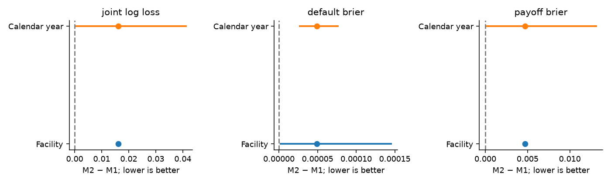
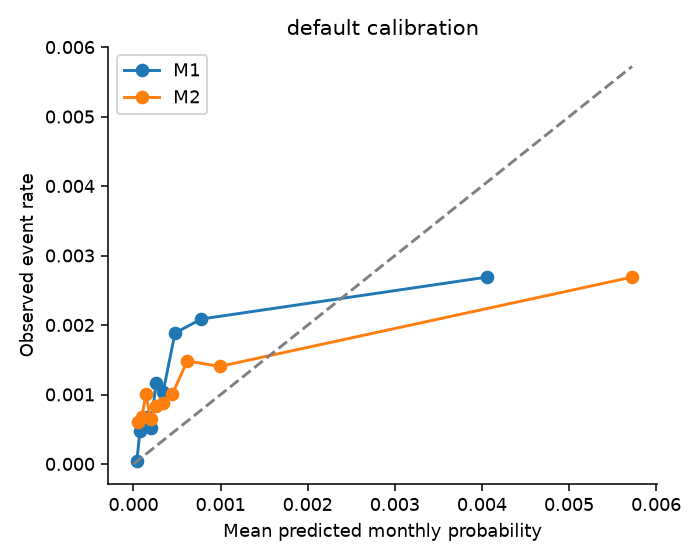
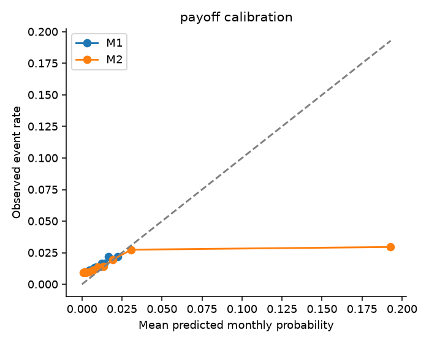
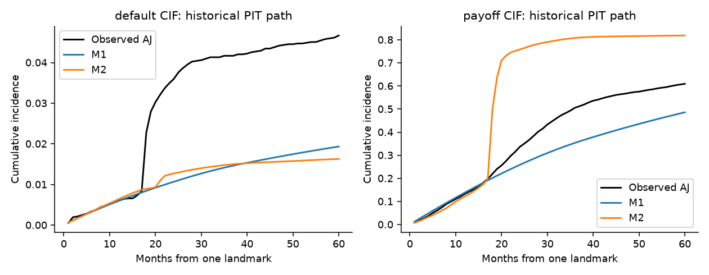
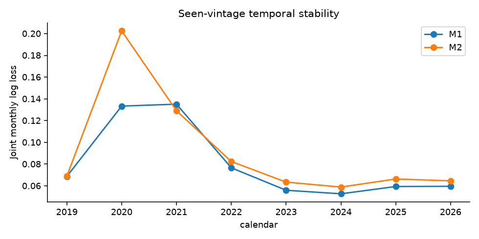
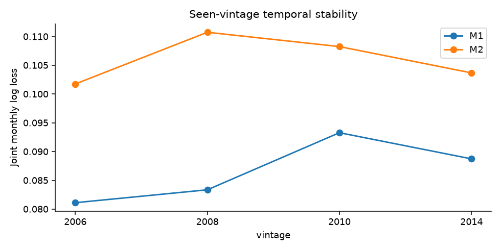
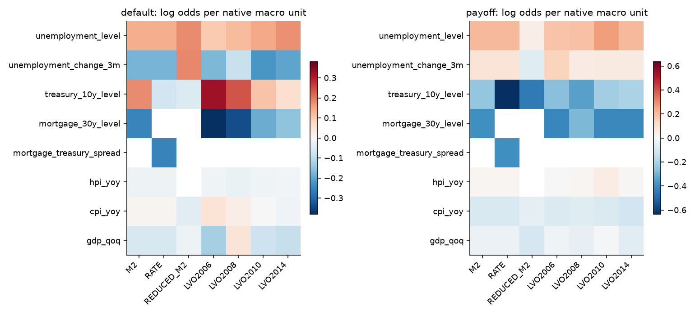

# Track B Task 10 — Macro Competing-Risk Validation

## Executive Summary

NO RELIABLE TEMPORAL MACRO INCREMENT DEMONSTRATED. The main comparison is M2 minus M1 on identical, facility-disjoint, seen-vintage temporal risk intervals. No retuning followed temporal results.

| Model | Joint log loss | Default Brier | Payoff Brier | Default AUC | Payoff AUC |
| --- | --- | --- | --- | --- | --- |
| M0 | 0.08926111 | 0.001123756 | 0.01514126 | 0.6074313 | 0.5420688 |
| M1 | 0.08920131 | 0.001223037 | 0.01512731 | 0.6935076 | 0.5654257 |
| M2 | 0.1053229 | 0.001272182 | 0.01982496 | 0.6228311 | 0.625868 |

Payoff discrimination and probability accuracy must be read separately: M1/M2 payoff AUC is 0.565426/0.625868, while payoff Brier is 0.015127/0.019825. Better ranking alone cannot establish a macro increment. M1 is a research comparator; this study does not establish that it is deployable.

## Research Question

Does frozen PIT macro information improve default/payoff hazards beyond structural duration/cohort and static mortgage predictors? Predictive association only; discrimination is secondary to joint multinomial log loss.

## Data Boundary

Frozen seven-vintage, 140,000-facility source sample. Task 9A primary 119,629 contributing facilities / 5,541,179 intervals / 5,617 defaults / 76,729 payoffs remains unchanged. No new data acquisition, prior holdout access or model artifact regeneration. New fitted artifacts and row-level predictions remain private.

## PIT Macro Information

Seven primary coefficient terms: unemployment_level, unemployment_change_3m, treasury_10y_level, mortgage_30y_level, hpi_yoy, cpi_yoy, gdp_qoq. Full eight-feature eligibility is preserved. Each source/version, operand and assessment timestamp passes the frozen PIT join; no current-revised or future values. Primary interval window 2010-09–2026-02; reduced 2006-02–2026-02.

## Eligibility

| Split | Facilities | Intervals | Defaults | Payoffs |
| --- | --- | --- | --- | --- |
| development | 42609 | 1568661 | 1904 | 25822 |
| reduced_development | 54359 | 2241245 | 3652 | 35789 |
| evaluation_seen | 5619 | 248939 | 280 | 3823 |
| evaluation_unseen | 17352 | 652508 | 588 | 7323 |

Counts exactly match Task 9A. Six known pre-t0 months, unchanged incident prefix, consecutive months and first-payment proxy age; delayed entry retained. No facility deletion, redraw, post-endpoint exposure or date changes.

## Competing Events

Monthly 0=no event, 1=research default, 2=payoff/maturity. Unknown/ambiguous/admin source states censor according to the existing protocol; they are not no-event labels. Default/payoff remove facilities from the risk set.

## Model Specifications

M0: duration bands + vintage indicators. M1: M0 + credit score, LTV, DTI, log1p original UPB, original rate, term, purpose, occupancy. M2: M1 + seven PIT macro terms. Weak-L2 C=1, lbfgs, 3000-iteration limit, tolerance 1e-8, seed 61010; no class reweighting or hyperparameter search. Training-only medians, missing indicators, means/scales and categorical mappings are published in JSON. [Protocol](../../docs/track_b/macro_competing_risk_protocol.json).

## Identification Constraints

No spread alongside both unrestricted rate terms; no month/year fixed effects or interactions. Six vintage indicators with 2006 reference; unseen cohorts get explicitly neutral contribution in separate sensitivity. Frozen duration bands include some absent development levels; their zero effects are unestimated, not learned seasoning. See zero_design_columns in each artifact. Macro/intercept ranks are checked on distinct development months before fitting.

## Development

| Model | Joint log loss | Default Brier | Payoff Brier | Default AUC | Payoff AUC |
| --- | --- | --- | --- | --- | --- |
| M0 | 0.09170963 | 0.001210763 | 0.01615738 | 0.7527685 | 0.601401 |
| M1 | 0.09015128 | 0.001209384 | 0.01611678 | 0.8333172 | 0.6448623 |
| M2 | 0.08959281 | 0.001209363 | 0.01609254 | 0.8343329 | 0.6611182 |
| RATE | 0.08959281 | 0.001209363 | 0.01609254 | 0.8343332 | 0.6611184 |
| REDUCED_M1 | 0.09082287 | 0.001622412 | 0.01565194 | 0.8279204 | 0.6386934 |
| REDUCED_M2 | 0.090037 | 0.00162175 | 0.01562092 | 0.8343614 | 0.6621491 |

In-sample diagnostic only, not the final scientific claim. All models passed convergence and probability conservation before the temporal ledger opened. Leave-vintage-out fits used development periods exclusively; no temporal preprocessing or tuning.

## Temporal Validation

| Model | Joint log loss | Default Brier | Payoff Brier | Default AUC | Payoff AUC |
| --- | --- | --- | --- | --- | --- |
| M0 | 0.08926111 | 0.001123756 | 0.01514126 | 0.6074313 | 0.5420688 |
| M1 | 0.08920131 | 0.001223037 | 0.01512731 | 0.6935076 | 0.5654257 |
| M2 | 0.1053229 | 0.001272182 | 0.01982496 | 0.6228311 | 0.625868 |

LOCKED TEMPORAL EVALUATION AFTER SUPPORT DESIGN: previous aggregate outcomes were inspected. 2018 purge; 2019-01–2026-02 evaluation. New Task 10 ledger registered exact facilities/risk arrays/specification/code before fitting and consumed once. Unseen 2018/2020/2022 vintages are excluded from the primary temporal estimate.

## Paired Macro Increment

| Metric | M2−M1 | 95% lower | 95% upper | Valid replicates |
| --- | --- | --- | --- | --- |
| joint_log_loss | 0.01612164 | 0.01540973 | 0.01678353 | 1000 |
| default_brier | 4.914471e-05 | 1.208964e-06 | 0.0001463016 | 1000 |
| payoff_brier | 0.004697659 | 0.004562481 | 0.004821664 | 1000 |
| default_auc | -0.07067646 | -0.09390646 | -0.04525145 | 1000 |
| payoff_auc | 0.06044225 | 0.05134359 | 0.07003046 | 1000 |

1,000 facility-cluster replicates,seed 61035; all intervals stay together. Models remain fixed. Negative proper-score differences favor M2; positive AUC differences favor M2. Facility uncertainty conditions on the realized macro path. Calendar-year block sensitivity (1,000 draws,seed 61036) is reported separately:

| Metric | Delta | 95% lower | 95% upper |
| --- | --- | --- | --- |
| joint_log_loss | 0.01612164 | 5.325869e-05 | 0.04150209 |
| default_brier | 4.914471e-05 | 2.617678e-05 | 7.761425e-05 |
| payoff_brier | 0.004697659 | -4.738299e-05 | 0.01321485 |

## Calibration

| Model | Cause | Observed | Predicted | Intercept | Slope |
| --- | --- | --- | --- | --- | --- |
| M1 | default | 0.001124774 | 0.0006492802 | -2.934734 | 0.4821349 |
| M1 | payoff | 0.01535718 | 0.0113792 | -1.862509 | 0.5093892 |
| M2 | default | 0.001124774 | 0.0008860212 | -4.049007 | 0.3501244 |
| M2 | payoff | 0.01535718 | 0.02830472 | -3.04293 | 0.249335 |

Diagnostic regressions are never applied as recalibration. Decile reliability and exact support are in JSON; sparse causes (<20) are suppressed.

## Cumulative Incidence

| Months | Model | Facilities | Support | AJ default | Modeled default | IPCW default Brier | AJ payoff | Modeled payoff | IPCW payoff Brier |
| --- | --- | --- | --- | --- | --- | --- | --- | --- | --- |
| 12 | M0 | 5619 | SUPPORTED | 0.006052445 | 0.006219387 | 0.005999653 | 0.1329851 | 0.1306466 | 0.1155671 |
| 12 | M1 | 5619 | SUPPORTED | 0.006052445 | 0.005979277 | 0.006163893 | 0.1329851 | 0.1384545 | 0.1160116 |
| 12 | M2 | 5619 | SUPPORTED | 0.006052445 | 0.006404138 | 0.006164083 | 0.1329851 | 0.1221729 | 0.1170552 |
| 24 | M0 | 5619 | SUPPORTED | 0.03597422 | 0.01126271 | 0.0351729 | 0.3367349 | 0.24486 | 0.233302 |
| 24 | M1 | 5619 | SUPPORTED | 0.03597422 | 0.01067887 | 0.03514624 | 0.3367349 | 0.2586865 | 0.2254934 |
| 24 | M2 | 5619 | SUPPORTED | 0.03597422 | 0.01272818 | 0.03504731 | 0.3367349 | 0.7581426 | 0.3989379 |
| 36 | M0 | 5619 | SUPPORTED | 0.04167362 | 0.01525281 | 0.04046316 | 0.5055798 | 0.3364434 | 0.2811412 |
| 36 | M1 | 5619 | SUPPORTED | 0.04167362 | 0.01439817 | 0.04026868 | 0.5055798 | 0.3535817 | 0.2677342 |
| 36 | M2 | 5619 | SUPPORTED | 0.04167362 | 0.01488489 | 0.04026576 | 0.5055798 | 0.8079165 | 0.3347613 |
| 60 | M0 | 5619 | SUPPORTED | 0.04666203 | 0.02041486 | 0.04494255 | 0.6094393 | 0.465972 | 0.2626474 |
| 60 | M1 | 5619 | SUPPORTED | 0.04666203 | 0.01934353 | 0.04460041 | 0.6094393 | 0.485986 | 0.2549479 |
| 60 | M2 | 5619 | SUPPORTED | 0.04666203 | 0.01630258 | 0.04479697 | 0.6094393 | 0.8186658 | 0.2797145 |

One landmark per unique facility; default/payoff counts reported in JSON. CIFdefault+CIFpayoff+survival=1. AJ handles payoff as a competing event. Pooled Task6 IPCW assumes independent censoring. Calendar-truncated landmarks are excluded per horizon without looking at outcomes. These paths use macro observed at each historical interval, not knowledge available at initial t0. No future scenarios or unsupported 84/120-month claims.

## Calendar Stability

| Cell | Model | Facilities | Defaults | Payoffs | Joint LL | Default Brier | Payoff Brier | Default status |
| --- | --- | --- | --- | --- | --- | --- | --- | --- |
| 2019 | M1 | 5615 | 34 | 738 | 0.06866741 | 0.0006145389 | 0.01159001 | SUPPORTED |
| 2019 | M2 | 5615 | 34 | 738 | 0.06884553 | 0.0006258364 | 0.01158874 | SUPPORTED |
| 2020 | M1 | 4844 | 167 | 1146 | 0.1333343 | 0.003307747 | 0.02168053 | SUPPORTED |
| 2020 | M2 | 4844 | 167 | 1146 | 0.2025382 | 0.003356823 | 0.04429144 | SUPPORTED |
| 2021 | M1 | 3530 | 33 | 951 | 0.1351263 | 0.001002681 | 0.02562638 | SUPPORTED |
| 2021 | M2 | 3530 | 33 | 951 | 0.1290458 | 0.001091547 | 0.02548698 | SUPPORTED |
| 2022 | M1 | 2546 | 15 | 369 | 0.0765854 | None | 0.01300789 | SPARSE_CAUSE_SUPPRESSED |
| 2022 | M2 | 2546 | 15 | 369 | 0.08239404 | None | 0.01304514 | SPARSE_CAUSE_SUPPRESSED |
| 2023 | M1 | 2161 | 13 | 216 | 0.05594296 | None | 0.008678843 | SPARSE_CAUSE_SUPPRESSED |
| 2023 | M2 | 2161 | 13 | 216 | 0.06343946 | None | 0.008710836 | SPARSE_CAUSE_SUPPRESSED |
| 2024 | M1 | 1932 | 5 | 190 | 0.05268811 | None | 0.00852513 | SPARSE_CAUSE_SUPPRESSED |
| 2024 | M2 | 1932 | 5 | 190 | 0.05887919 | None | 0.008553059 | SPARSE_CAUSE_SUPPRESSED |
| 2025 | M1 | 1737 | 10 | 187 | 0.05937979 | None | 0.009388386 | SPARSE_CAUSE_SUPPRESSED |
| 2025 | M2 | 1737 | 10 | 187 | 0.06631839 | None | 0.009419761 | SPARSE_CAUSE_SUPPRESSED |
| 2026 | M1 | 1532 | 3 | 26 | 0.05956209 | None | 0.008467797 | SPARSE_CAUSE_SUPPRESSED |
| 2026 | M2 | 1532 | 3 | 26 | 0.06459598 | None | 0.008487538 | SPARSE_CAUSE_SUPPRESSED |

Cause diagnostics with fewer than 20 events are suppressed. No per-cell models were tuned. 2026 is partial. Exact AUC and event support are in JSON.

## Vintage Stability

| Cell | Model | Facilities | Defaults | Payoffs | Joint LL | Default Brier | Payoff Brier | Default status |
| --- | --- | --- | --- | --- | --- | --- | --- | --- |
| 2006 | M1 | 300 | 30 | 173 | 0.08111903 | 0.002121047 | 0.01209739 | SUPPORTED |
| 2006 | M2 | 300 | 30 | 173 | 0.1017539 | 0.002129213 | 0.01705093 | SUPPORTED |
| 2008 | M1 | 361 | 29 | 222 | 0.0833625 | 0.001699889 | 0.01288975 | SUPPORTED |
| 2008 | M2 | 361 | 29 | 222 | 0.1107387 | 0.00170496 | 0.02019973 | SUPPORTED |
| 2010 | M1 | 1554 | 62 | 1131 | 0.09328537 | 0.0008957075 | 0.01613153 | SUPPORTED |
| 2010 | M2 | 1554 | 62 | 1131 | 0.108253 | 0.0008968597 | 0.01964178 | SUPPORTED |
| 2014 | M1 | 3404 | 159 | 2297 | 0.08873809 | 0.001235377 | 0.01520437 | SUPPORTED |
| 2014 | M2 | 3404 | 159 | 2297 | 0.1036777 | 0.001315798 | 0.02013072 | SUPPORTED |

Cause diagnostics with fewer than 20 events are suppressed. No per-cell models were tuned. 2026 is partial. Exact AUC and event support are in JSON.

## Pandemic Sensitivity

Descriptive 2020–2021 versus adjacent 2019/2022, using unchanged M1/M2:

### pandemic_2020_2021

| Model | Joint log loss | Default Brier | Payoff Brier | Default AUC | Payoff AUC |
| --- | --- | --- | --- | --- | --- |
| M1 | 0.1340737 | 0.002356593 | 0.02330873 | 0.6783122 | 0.5746509 |
| M2 | 0.1722126 | 0.002422088 | 0.03653203 | 0.5317049 | 0.5745584 |

### adjacent_2019_2022

| Model | Joint log loss | Default Brier | Payoff Brier | Default AUC | Payoff AUC |
| --- | --- | --- | --- | --- | --- |
| M1 | 0.07110845 | 0.0006228023 | 0.01202713 | 0.7270084 | 0.5200274 |
| M2 | 0.07302241 | 0.0006418673 | 0.01203774 | 0.7091349 | 0.5311356 |

No causal pandemic effect. Calendar coefficients can also reflect policy/intervention changes not identified by these fields.

## Reduced Historical Sensitivity

| Model | Joint log loss | Default Brier | Payoff Brier | Default AUC | Payoff AUC |
| --- | --- | --- | --- | --- | --- |
| REDUCED_M1 | 0.08896284 | 0.001380022 | 0.01511927 | 0.691606 | 0.564989 |
| REDUCED_M2 | 0.09094518 | 0.001415378 | 0.01531408 | 0.8136037 | 0.6084029 |

Five frozen terms,development begins 2006-02; evaluated on the identical primary seen-vintage temporal intervals. It cannot replace primary by performance. The 2007–2009 behavior below is explicitly in-sample descriptive:

### 2007 — development only

| Model | Joint log loss | Default Brier | Payoff Brier | Default AUC | Payoff AUC |
| --- | --- | --- | --- | --- | --- |
| REDUCED_M1 | 0.05084556 | 0.0007670359 | 0.007326125 | 0.7934073 | 0.5313335 |
| REDUCED_M2 | 0.04957276 | 0.0007643345 | 0.007292776 | 0.7949252 | 0.5320559 |

### 2008 — development only

| Model | Joint log loss | Default Brier | Payoff Brier | Default AUC | Payoff AUC |
| --- | --- | --- | --- | --- | --- |
| REDUCED_M1 | 0.06931208 | 0.001702108 | 0.01004259 | 0.788858 | 0.5637232 |
| REDUCED_M2 | 0.06768898 | 0.001698865 | 0.009992459 | 0.7942186 | 0.5872693 |

### 2009 — development only

| Model | Joint log loss | Default Brier | Payoff Brier | Default AUC | Payoff AUC |
| --- | --- | --- | --- | --- | --- |
| REDUCED_M1 | 0.1221705 | 0.003696503 | 0.02047564 | 0.7996062 | 0.6433387 |
| REDUCED_M2 | 0.1213265 | 0.00369487 | 0.02043658 | 0.8018811 | 0.6503695 |

## Rate Representation Sensitivity

| Model | Joint log loss | Default Brier | Payoff Brier | Default AUC | Payoff AUC |
| --- | --- | --- | --- | --- | --- |
| M2 | 0.1053229 | 0.001272182 | 0.01982496 | 0.6228311 | 0.625868 |
| RATE | 0.105324 | 0.001272088 | 0.01982534 | 0.6227663 | 0.6258668 |

Exactly one alternate basis: Treasury+spread replaces Treasury+mortgage rate. All other terms,rows and regularization are unchanged. L2 is not invariant to this basis change; differences are sensitivity, not representation selection. The Treasury coefficient changes its conditioning interpretation when mortgage rate is replaced by spread; its sign cannot be compared as an identical coefficient.

## Updated-State Sensitivity

Not performed, as frozen before fitting: Optional; omitted to isolate structural/macro research. No future loan-state trajectories.

## Coefficient Interpretation

| Cause | Macro term | Log odds per development SD | Odds ratio |
| --- | --- | --- | --- |
| default | unemployment_level | 0.2473525 | 1.28063 |
| default | unemployment_change_3m | -0.04110396 | 0.9597293 |
| default | treasury_10y_level | 0.08849756 | 1.092532 |
| default | mortgage_30y_level | -0.09670799 | 0.9078211 |
| default | hpi_yoy | -0.08055466 | 0.9226045 |
| default | cpi_yoy | 0.009888359 | 1.009937 |
| default | gdp_qoq | -0.01777117 | 0.9823858 |
| payoff | unemployment_level | 0.3719376 | 1.450542 |
| payoff | unemployment_change_3m | 0.01880948 | 1.018987 |
| payoff | treasury_10y_level | -0.1204107 | 0.8865563 |
| payoff | mortgage_30y_level | -0.1502491 | 0.8604936 |
| payoff | hpi_yoy | 0.0477774 | 1.048937 |
| payoff | cpi_yoy | -0.100083 | 0.9047623 |
| payoff | gdp_qoq | -0.01080325 | 0.9892549 |

Conditional cause-versus-no-event odds, not hazard ratios or causal CIF changes. Signs are reported unchanged, including unexpected directions. Labor stress, equity and refinancing hypotheses do not justify forcing signs. Correlated macros, seasoning/cohort restrictions and changing selection can affect associations. Sensitivity artifacts include all LVO coefficients; coefficient plots use native macro units to avoid confusing different development SDs. No naive independent-row coefficient significance claim.

Unseen-vintage extrapolation:

| Model | Joint log loss | Default Brier | Payoff Brier | Default AUC | Payoff AUC |
| --- | --- | --- | --- | --- | --- |
| M1 | 0.07063051 | 0.000899455 | 0.01121684 | 0.7779348 | 0.5521968 |
| M2 | 0.06981128 | 0.0009001708 | 0.01168198 | 0.7364958 | 0.7373419 |

Neutral/reference cohort contribution is explicit and never pooled with primary temporal results. Leave-vintage-out development-only transport diagnostics follow; no temporal observations enter these fits. Full coefficient and support details are in JSON:

| Held-out vintage | Facilities | Defaults | Payoffs | M1 joint LL | M2 joint LL |
| --- | --- | --- | --- | --- | --- |
| 2006 | 6479 | 772 | 4865 | 0.1251439 | 0.1254282 |
| 2008 | 8810 | 691 | 7158 | 0.1329867 | 0.1318877 |
| 2010 | 13797 | 296 | 9232 | 0.07670181 | 0.07493726 |
| 2014 | 13523 | 145 | 4567 | 0.06808481 | 0.06633133 |

## Limitations

- Research mortgage hazards, not regulatory/IRB/IFRS9/underwriting or borrower-level PD.
- Mortgage operational knowledge time is unverified retrospective disclosure; macro PIT alone does not cure this.
- Delayed entry conditions on surviving facilities; payoff includes maturity and default is a monthly proxy.
- Unseen cohort and unobserved development duration-band effects are reference/zero restrictions, not estimated effects.
- IPCW assumes pooled independent administrative censoring; informative censoring is not ruled out.
- Facility bootstrap conditions on the macro path; calendar uncertainty has only eight annual blocks, including partial 2026.
- Previously inspected support outcomes mean this is locked temporal evaluation after support design, not a virgin holdout.
- Rolling historical PIT CIF paths use subsequently observed macro information; prospective future paths remain unsolved.
- Coefficients are conditional predictive associations; no causal shocks, fairness assessment or EAD/LGD/ECL claims.
- Coefficient uncertainty is represented by prespecified fit sensitivity, not naive independent-row standard errors.

[Research model card](../../docs/track_b/MACRO_COMPETING_RISK_MODEL_CARD.md). Method references: [multinomial logistic implementation](https://scikit-learn.org/stable/modules/generated/sklearn.linear_model.LogisticRegression.html), [competing-risk reference](https://scikit-survival.readthedocs.io/en/stable/user_guide/competing-risks.html).

## Decision

NO RELIABLE TEMPORAL MACRO INCREMENT DEMONSTRATED. Decision uses paired temporal proper scores, facility/calendar uncertainty and prespecified degradation checks; development fit is not the acceptance gate. Next: Track B Task 11 — Macro Signal Attribution and Stability Analysis. Not implemented. Preservation and deterministic replay passed; no retuning or prior ledger reuse. Retained Track A AUC 0.868152 / Brier 0.048545 / log loss 0.176030 remain historical evidence only. Tests/checks are in macro_competing_risk_verification.json.

