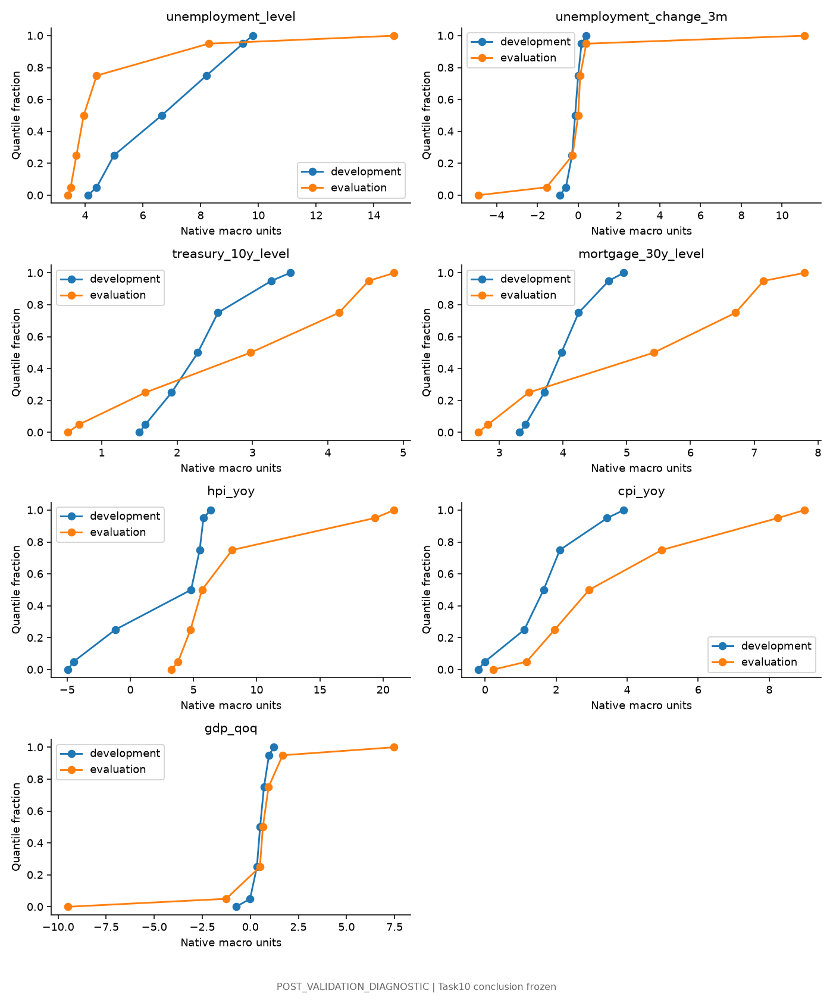
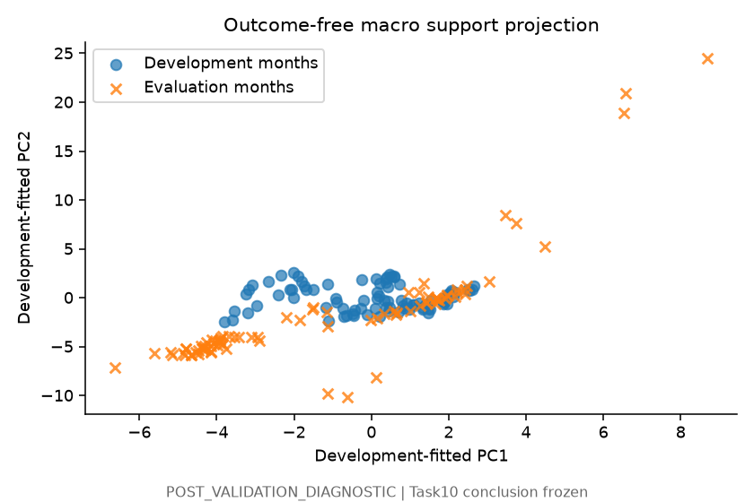
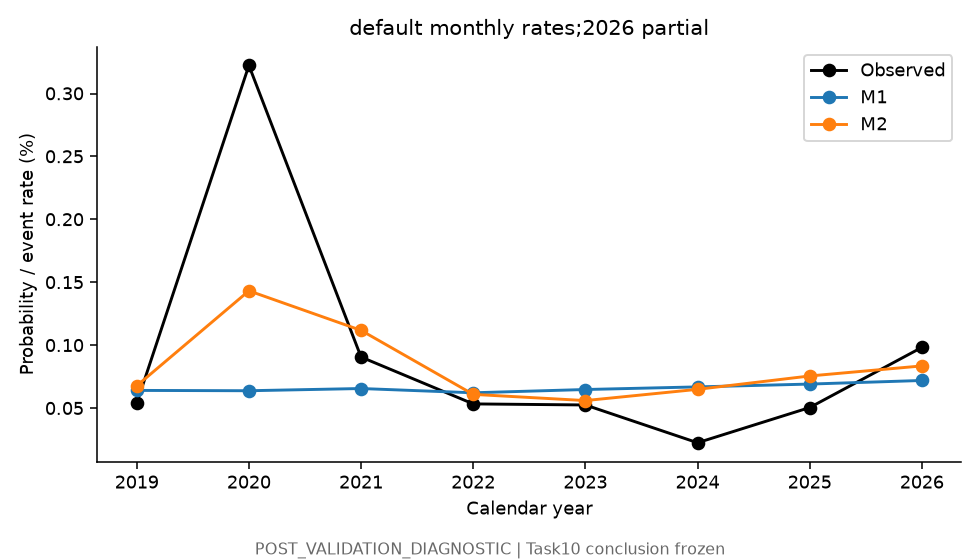
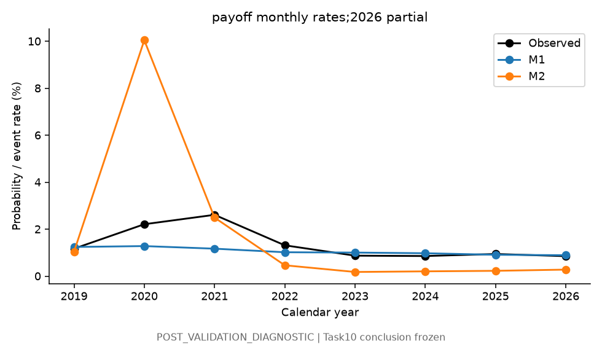
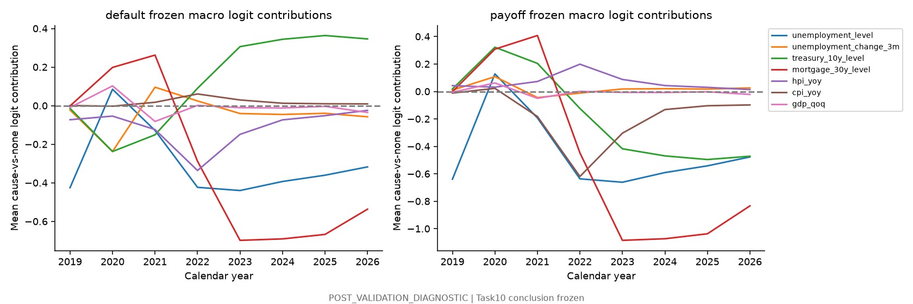
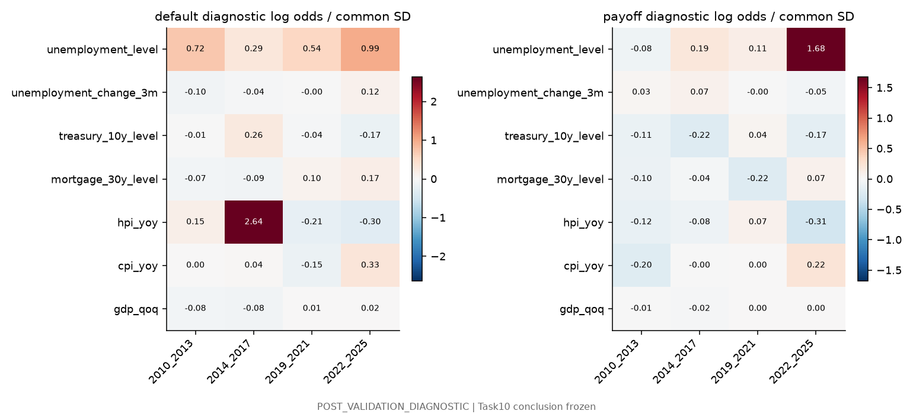
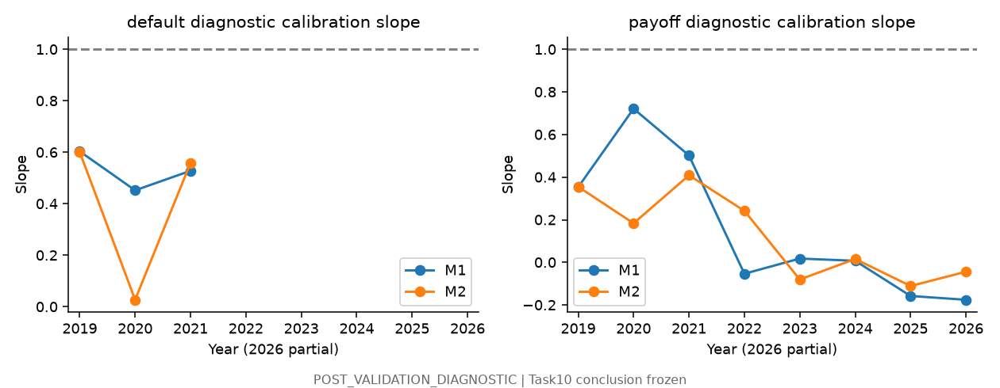
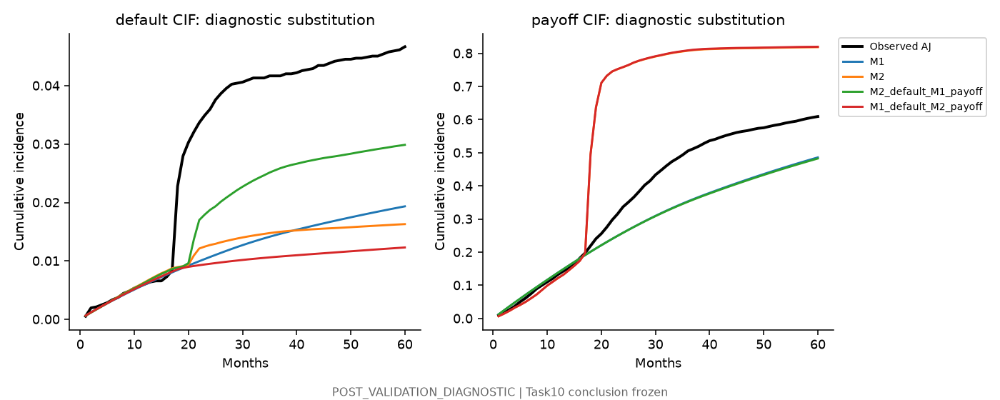
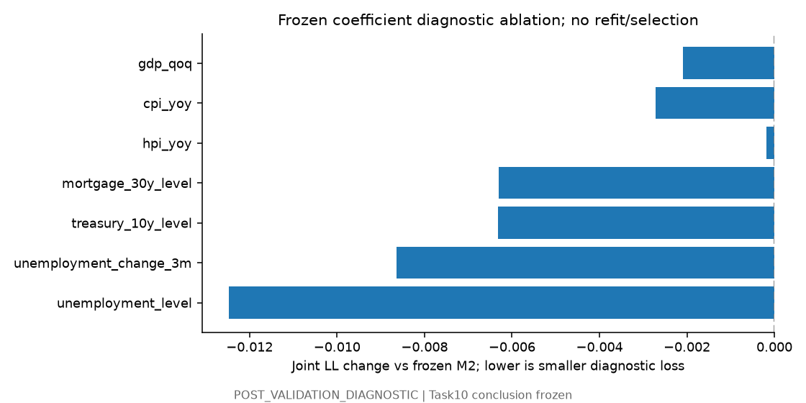

# Track B Task 11 — Macro Signal Attribution and Stability Analysis

## Executive Summary

**POST_VALIDATION_DIAGNOSTIC.** MACRO FAILURE MECHANISMS PARTIALLY IDENTIFIED. Task10 remains frozen. The failure is not a uniform probability-level offset: payoff is severely overpredicted in 2020 and underpredicted after 2022. Macro support shifts, nonlinear tail amplification and changing conditional coefficient mappings are the strongest diagnostic mechanisms. A global intercept oracle removes only 27.3% of excess joint loss. No corrected model, independent confirmation, causal attribution or promotion is claimed.

## Frozen Task 10 Result

**NO RELIABLE TEMPORAL MACRO INCREMENT DEMONSTRATED** remains unchanged.

| Model | Joint LL | Default Brier | Payoff Brier | Default AUC | Payoff AUC |
| --- | --- | --- | --- | --- | --- |
| M1 | 0.0892013 | 0.00122304 | 0.0151273 | 0.693508 | 0.565426 |
| M2 | 0.105323 | 0.00127218 | 0.019825 | 0.622831 | 0.625868 |

Paired joint-loss difference 0.016122, with facility95 interval [0.015410,0.016784]. Neither the decision nor its input/output files were changed.

## Diagnostic Boundary

Every analysis is POST_VALIDATION_DIAGNOSTIC or a specifically labeled post-hoc diagnostic. Primary attribution uses frozen Task10 coefficients and exact preprocessing. Four separate DIAGNOSTIC_REFIT_ONLY window fits inspect coefficients without replacement scoring. Evaluation rows enter isolated copies for these explicitly post-hoc fits; original risk arrays/role flags remain read-only. No prior ledger API, new macro series, model family, regularization search, variable selection or Task12 implementation. [Frozen diagnostic protocol](../../docs/track_b/macro_signal_diagnostic_protocol.json).

## Macro Distribution Shift

| Feature | Dev mean | Eval mean | Dev SD | Eval SD | SMD | PSI | KS |
| --- | --- | --- | --- | --- | --- | --- | --- |
| unemployment_level | 6.79617 | 4.86168 | 1.7912 | 2.35894 | -1.07999 | 4.41656 | 0.664765 |
| unemployment_change_3m | -0.175213 | 0.109073 | 0.234052 | 2.40187 | 1.21463 | 0.820998 | 0.201866 |
| treasury_10y_level | 2.26378 | 2.42868 | 0.491989 | 1.2782 | 0.335174 | 1.26752 | 0.306461 |
| mortgage_30y_level | 3.98905 | 4.55949 | 0.385235 | 1.55464 | 1.48076 | 2.3512 | 0.352797 |
| hpi_yoy | 2.06791 | 7.52721 | 3.96326 | 4.69109 | 1.37748 | 7.26151 | 0.446197 |
| cpi_yoy | 1.68379 | 3.17454 | 1.02423 | 2.21747 | 1.45548 | 1.49149 | 0.329884 |
| gdp_qoq | 0.496644 | 0.417433 | 0.294193 | 2.65225 | -0.26925 | 1.11782 | 0.28406 |

JSON includes median, minimum, maximum and5/25/50/75/95 quantiles, plus distinct-month weighting. PSI uses development-frozen deciles and declared smoothing; KS reports distance only. Neither uses threshold labels to prove invalidity. Primary macro histories contain88 development and86 evaluation months; risk rows share common macro values and are not independent economic observations. Calendar-regime summaries include 2010–12,2013–15,2016–17 and each evaluation year.

## Support Extrapolation

| Feature | Dev min | Dev max | Eval min | Eval max | Outside dev range % | Outside central90 % |
| --- | --- | --- | --- | --- | --- | --- |
| unemployment_level | 4.1 | 9.8 | 3.4 | 14.7 | 65.8989 | 77.1486 |
| unemployment_change_3m | -0.9 | 0.4 | -4.9 | 11.1 | 19.5686 | 27.3228 |
| treasury_10y_level | 1.5 | 3.5 | 0.55 | 4.88 | 53.855 | 60.4128 |
| mortgage_30y_level | 3.32 | 4.95 | 2.67 | 7.79 | 64.0856 | 64.0856 |
| hpi_yoy | -4.94553 | 6.35441 | 3.24637 | 20.8776 | 30.3837 | 45.1797 |
| cpi_yoy | -0.19181 | 3.90428 | 0.235532 | 8.99522 | 25.1194 | 26.7102 |
| gdp_qoq | -0.740796 | 1.21921 | -9.49472 | 7.47874 | 25.3805 | 39.7254 |

Outcome-free development PCA/covariance diagnostics place 77/86 evaluation months and 202,675 intervals beyond the development95 Mahalanobis-type squared-distance reference. This is descriptive geometry, not an inference about Gaussian coverage or a new exclusion rule. Development support and evaluation membership remain unchanged.

## Mortgage Composition Shift

| Split weighting | Age median | Age mean | Credit score median | LTV median | Original rate median |
| --- | --- | --- | --- | --- | --- |
| development / risk_intervals | 35 | 40.7739 | 756 | 75 | 4.875 |
| development / unique_facility_first_split_row | 4 | 15.0455 | 757 | 76 | 4.875 |
| evaluation / risk_intervals | 104 | 106.752 | 757 | 75 | 4.5 |
| evaluation / unique_facility_first_split_row | 55 | 73.9528 | 758 | 76 | 4.5 |

JSON reports vintage counts, DTI, term, purpose, occupancy, missingness, UPB, each calendar regime and older-vintage survivor composition. Credit-score/LTV medians barely change; age/vintage mix changes strongly. These are disjoint-role conditional survivors, not a matched survival/attrition estimate. Original rate minus PIT market mortgage rate is descriptive context only, not a validated borrower refinancing incentive or a fitted new feature.

## Macro Contribution Attribution

Cause-versus-no-event contribution is frozen beta×Task10 standardized feature. Exact reconstruction includes both cause contrasts and multinomial normalization.

| Component | Mean default logit gap | Mean payoff logit gap |
| --- | --- | --- |
| intercept | -0.82957 | -0.42745 |
| mortgage | 0.00456627 | 0.00787456 |
| duration | 0.846921 | 0.484363 |
| cohort | 0.779435 | 0.435552 |
| macro_total | -0.522389 | -0.718633 |
| nonmacro_total | 0.801353 | 0.500339 |
| total_M2_minus_M1 | 0.278963 | -0.218293 |

Mortgage/duration/cohort/intercept coefficients also changed when M2 was fitted. Their allocation cannot be misattributed to macros. JSON contains contribution distributions by development/evaluation, calendar year and represented vintage. One-at-a-time probability attribution starts from M1, inserts one frozen M2 macro contrast and holds others at centered development reference. It is nonadditive and not unique; it is POST_HOC_PROBABILITY_ATTRIBUTION, not model performance.

## Default Attribution

| Feature | Dev contribution mean | Eval contribution mean | Eval SD | Eval5% | Eval95% |
| --- | --- | --- | --- | --- | --- |
| unemployment_level | -7.33857e-13 | -0.267139 | 0.325754 | -0.455179 | 0.594331 |
| unemployment_change_3m | -2.17297e-14 | -0.049926 | 0.421814 | -1.20742 | 0.53121 |
| treasury_10y_level | 1.73784e-12 | 0.0296621 | 0.229919 | -0.29208 | 0.389654 |
| mortgage_30y_level | 4.77643e-12 | -0.143201 | 0.39027 | -0.763388 | 0.298495 |
| hpi_yoy | -1.23644e-13 | -0.110962 | 0.0953481 | -0.351432 | -0.0401375 |
| cpi_yoy | 6.05119e-14 | 0.0143923 | 0.0214084 | -0.00940652 | 0.0631433 |
| gdp_qoq | 9.12056e-14 | 0.00478488 | 0.160213 | -0.0728573 | 0.107706 |

Default ranking deterioration is partitioned by calendar, macro support, vintage and duration in JSON. The 2020 calibration slope falls near zero; later default cells are sparse and suppressed. Zeroing the frozen unemployment-change contribution raises diagnostic default AUC from0.622831 to0.790554, whereas zeroing unemployment level lowers it to0.521343. The two terms therefore have different ranking roles; neither change is selected or applied.

## Payoff Attribution

| Feature | Dev contribution mean | Eval contribution mean | Eval SD | Eval5% | Eval95% |
| --- | --- | --- | --- | --- | --- |
| unemployment_level | -1.10346e-12 | -0.40169 | 0.489829 | -0.68444 | 0.89368 |
| unemployment_change_3m | 9.94319e-15 | 0.0228465 | 0.193025 | -0.243086 | 0.552524 |
| treasury_10y_level | -2.36452e-12 | -0.0403585 | 0.312831 | -0.530167 | 0.397407 |
| mortgage_30y_level | 7.42085e-12 | -0.222483 | 0.606338 | -1.18603 | 0.463752 |
| hpi_yoy | 7.33365e-14 | 0.0658123 | 0.0565515 | 0.0238058 | 0.208436 |
| cpi_yoy | -6.12463e-13 | -0.145669 | 0.216681 | -0.639093 | 0.0952062 |
| gdp_qoq | 5.54447e-14 | 0.00290877 | 0.097395 | -0.0442906 | 0.0654757 |

Mean macro payoff contribution is negative overall even though mean payoff probability is too high. The macro payoff logit has a large right tail, amplified nonlinearly by softmax and interacting with redistributed structural effects. A mean logit is not a mean probability. Pandemic unemployment/rates and later high-rate/inflation suppression have opposite effects. No coefficient sign was repaired.

## Calibration Drift

| Year | Cause | Observed % | M1 predicted % | M2 predicted % | M2 O/E | M1 slope | M2 slope |
| --- | --- | --- | --- | --- | --- | --- | --- |
| 2019 | default | 0.0539888 | 0.0641598 | 0.0678411 | 0.795813 | 0.603905 | 0.60144 |
| 2019 | payoff | 1.17188 | 1.24444 | 1.04584 | 1.12051 | 0.353252 | 0.355356 |
| 2020 | default | 0.322338 | 0.0639042 | 0.143282 | 2.24968 | 0.452481 | 0.0273161 |
| 2020 | payoff | 2.21197 | 1.28186 | 10.0477 | 0.220146 | 0.721753 | 0.183551 |
| 2021 | default | 0.0906668 | 0.0656591 | 0.111858 | 0.810554 | 0.528381 | 0.559307 |
| 2021 | payoff | 2.61285 | 1.17114 | 2.49406 | 1.04763 | 0.50207 | 0.409144 |
| 2022 | default | 0.0534416 | 0.0622686 | 0.0610225 | 0.87577 | None | None |
| 2022 | payoff | 1.31466 | 1.01951 | 0.464427 | 2.83072 | -0.0530565 | 0.24234 |
| 2023 | default | 0.0525911 | 0.0648699 | 0.0560855 | 0.937696 | None | None |
| 2023 | payoff | 0.873822 | 1.00551 | 0.179463 | 4.86909 | 0.0182059 | -0.0800726 |
| 2024 | default | 0.0225856 | 0.0669493 | 0.0650171 | 0.347379 | None | None |
| 2024 | payoff | 0.858253 | 0.976848 | 0.206024 | 4.16578 | 0.00769748 | 0.0161982 |
| 2025 | default | 0.0505536 | 0.0691952 | 0.0756265 | 0.668464 | None | None |
| 2025 | payoff | 0.945352 | 0.912223 | 0.228762 | 4.13247 | -0.157401 | -0.110531 |
| 2026 | default | 0.0983284 | 0.0720507 | 0.0836173 | 1.17593 | None | None |
| 2026 | payoff | 0.85218 | 0.892746 | 0.279853 | 3.0451 | -0.175322 | -0.0437271 |

Counts, diagnostic joint intercept/slope fits and development-year/subperiod behavior are in JSON. Sparse cause fits are suppressed;2026 is partial. Severe payoff divergence is visible in2020, followed by underprediction after2022; no new training cutoff is chosen.

Payoff AUC/Brier divergence has exact probability-scale accounting:

| Model | Var(y) | Var(p) | Cov(y,p) | Mean bias² | Brier |
| --- | --- | --- | --- | --- | --- |
| M1 | 0.0151213 | 2.57683e-05 | 1.781e-05 | 1.58243e-05 | 0.0151273 |
| M2 | 0.0151213 | 0.00513891 | 0.000301457 | 0.000167639 | 0.019825 |

Brier=Var(y)+Var(p)−2Cov(y,p)+mean-bias². This is an exact identity, not a binned Murphy reliability decomposition. Increased ranking/covariance cannot compensate for inflated probability dispersion and bias. Joint-loss contributions by realized no-event/default/payoff class are separately reported in JSON: no-event intervals contribute +0.020298 to excess joint loss, outweighing reductions on payoff-event intervals (−0.004135) and default-event intervals (−0.000042). The model assigns excessive event probability to many intervals without exits.

## Coefficient Stability

| Cause | Feature | 2010–13 | 2014–17 | 2019–21 | 2022–25 | Sign reversal |
| --- | --- | --- | --- | --- | --- | --- |
| default | unemployment_level | 0.720074 | 0.29488 | 0.543752 | 0.987656 | False |
| default | unemployment_change_3m | -0.0971266 | -0.0353004 | -0.00212511 | 0.120363 | True |
| default | treasury_10y_level | -0.0113406 | 0.260387 | -0.040421 | -0.170468 | True |
| default | mortgage_30y_level | -0.0724249 | -0.0867268 | 0.0991334 | 0.169829 | True |
| default | hpi_yoy | 0.15447 | 2.63924 | -0.209764 | -0.302085 | True |
| default | cpi_yoy | 0.00440637 | 0.0367064 | -0.148671 | 0.329263 | True |
| default | gdp_qoq | -0.0798689 | -0.0842448 | 0.012829 | 0.0162186 | True |
| payoff | unemployment_level | -0.0768948 | 0.193165 | 0.110837 | 1.67984 | True |
| payoff | unemployment_change_3m | 0.0343597 | 0.0712897 | -0.00472366 | -0.0501529 | True |
| payoff | treasury_10y_level | -0.109381 | -0.220071 | 0.0412295 | -0.166945 | True |
| payoff | mortgage_30y_level | -0.0996542 | -0.0389788 | -0.219277 | 0.0660328 | True |
| payoff | hpi_yoy | -0.123819 | -0.0809446 | 0.072207 | -0.311038 | True |
| payoff | cpi_yoy | -0.202816 | -0.00373499 | 0.00376847 | 0.218813 | True |
| payoff | gdp_qoq | -0.0127973 | -0.0179011 | 0.00155969 | 0.00196041 | True |

All coefficients are DIAGNOSTIC_REFIT_ONLY. Comparison uses a common Task10 development SD; within-window SD, native-unit contrasts, odds ratios, class counts, convergence, zero columns and geometry are in JSON. Late default window contains43 events. No naive independent-row coefficient SE or confidence interval is asserted. Multiple changes are already visible between the two development windows and in Task10 leave-vintage-out fits. Treasury/mortgage/HPI payoff relationships do not show uniform transport. Changing window composition/conditioning prevents identifying pure economic coefficient drift.

## Correlation Stability

| Weighting/period | Rank | Condition number | Largest VIF |
| --- | --- | --- | --- |
| development_months | 7 | 69.0962 | 11.5716 |
| evaluation_months | 7 | 137.654 | 26.0313 |
| development_intervals | 7 | 86.1098 | 14.1097 |
| evaluation_intervals | 7 | 115.45 | 20.191 |

Full correlation matrices and window geometry are recorded. Stronger Treasury/mortgage/CPI dependencies can make coefficient attribution unstable. This does not establish their separate causal contribution. Task10 Treasury+spread sensitivity retains its essentially identical failure; no third representation is tested.

## Pandemic Diagnostics

In2020 observed monthly payoff is2.21% while M2 predicts10.05%; M1 predicts1.28%. The frozen positive unemployment-payoff association combines with low Treasury/mortgage rates and extreme unemployment-change/GDP observations. Annual mean term contributions, all-feature independent ablations and class loss accounting quantify the amplification. Their effects cannot be summed as independent causes. Default calibration slope in2020 is0.0273, against M1’s0.4525; rank/support/duration partitions are in JSON. No causal pandemic effect, policy-intervention effect or feature deletion is established.

## Post-2022 Rate Regime

M2 payoff shifts to underprediction:2023 observed0.874% versus predicted0.179%, O/E4.87. In2022–25, higher mortgage rates and inflation generate negative frozen payoff logit contributions. Window diagnostics show changing payoff associations, including a positive late-window mortgage-rate coefficient despite the frozen negative coefficient. Default event counts are too small for reliable annual ranking claims. Support and calibration tables retain every difficult year.

## CIF Error Propagation

| Horizon | Observed payoff AJ | M1 payoff | M2 payoff | M2 payoff error |
| --- | --- | --- | --- | --- |
| 12 | 0.132985 | 0.138454 | 0.122173 | -0.0108122 |
| 24 | 0.336735 | 0.258686 | 0.758143 | 0.421408 |
| 36 | 0.50558 | 0.353582 | 0.807917 | 0.302337 |
| 60 | 0.609439 | 0.485986 | 0.818666 | 0.209226 |

One landmark per5,619 unique facilities. Survival weights carry monthly errors forward; the2020 exit overshoot persists even though later monthly hazards underpredict. All frozen CIFs reconstruct within declared numerical tolerances. Historical paths use subsequently observed macro information, not forecasts.

## Component Substitution

| Horizon | Diagnostic path | Default CIF | Payoff CIF | Survival |
| --- | --- | --- | --- | --- |
| 12 | M1 | 0.00597928 | 0.138454 | 0.855566 |
| 12 | M2 | 0.00640414 | 0.122173 | 0.871423 |
| 12 | M2_default_M1_payoff | 0.0063106 | 0.138447 | 0.855243 |
| 12 | M1_default_M2_payoff | 0.00607156 | 0.122183 | 0.871745 |
| 24 | M1 | 0.0106789 | 0.258686 | 0.730635 |
| 24 | M2 | 0.0127282 | 0.758143 | 0.229129 |
| 24 | M2_default_M1_payoff | 0.0187389 | 0.25843 | 0.722831 |
| 24 | M1_default_M2_payoff | 0.00951512 | 0.758588 | 0.231897 |
| 36 | M1 | 0.0143982 | 0.353582 | 0.63202 |
| 36 | M2 | 0.0148849 | 0.807917 | 0.177199 |
| 36 | M2_default_M1_payoff | 0.0255104 | 0.352174 | 0.622316 |
| 36 | M1_default_M2_payoff | 0.0106862 | 0.809008 | 0.180306 |
| 60 | M1 | 0.0193435 | 0.485986 | 0.49467 |
| 60 | M2 | 0.0163026 | 0.818666 | 0.165032 |
| 60 | M2_default_M1_payoff | 0.0298709 | 0.482716 | 0.487413 |
| 60 | M1_default_M2_payoff | 0.0123067 | 0.819929 | 0.167765 |

POST_HOC_COMPONENT_SUBSTITUTION_DIAGNOSTIC. Holding M2 default hazards fixed and substituting M1 payoff raises60-month default CIF from1.63% to2.99%: excess payoff mechanically removes exposure to later default. These paths are not deployable models or causal interventions. Raw hazard sums are checked; invalid substitutions would be suppressed rather than silently renormalized.

## Frozen-Coefficient Ablation

| Term zeroed | Joint LL difference | Default Brier difference | Payoff Brier difference | Default AUC |
| --- | --- | --- | --- | --- |
| unemployment_level | -0.0124662 | 3.03155e-05 | -0.00423378 | 0.521343 |
| unemployment_change_3m | -0.00863222 | 1.35771e-08 | -0.00318264 | 0.790554 |
| treasury_10y_level | -0.00631758 | -9.00224e-06 | -0.00208817 | 0.666825 |
| mortgage_30y_level | -0.00629535 | 2.76863e-05 | -0.00186721 | 0.58832 |
| hpi_yoy | -0.000178241 | 1.19935e-05 | -0.000220444 | 0.617208 |
| cpi_yoy | -0.00272017 | -1.80358e-06 | -0.000756477 | 0.630794 |
| gdp_qoq | -0.00209624 | -2.91545e-07 | -0.000739562 | 0.610736 |

All differences are diagnostic minus original frozen M2. FROZEN_COEFFICIENT_DIAGNOSTIC_ABLATION subtracts one term’s two cause contrasts without fitting. Unemployment level/change and rates have large joint-score impacts; correlated/nonlinear effects overlap and do not sum. No feature is selected or removed from Task10. Any future deletion hypothesis requires a new prespecified experiment.

POST_HOC_ORACLE_DIAGNOSTIC jointly fits two multinomial intercept offsets on the same consumed outcomes. Offsets=[0.267791712737341, -0.738240401617712]; apparent same-sample joint loss=0.100923. It removes 27.3% of excess loss and leaves 0.011722. This is optimistic error accounting, not independently validated correction or superiority to M1. It improves payoff Brier but worsens default Brier. Optional slope oracle was not added.

## Hypothesis Register

| ID | Prelisted hypothesis | Status | Evidence |
| --- | --- | --- | --- |
| H1 | Macro support extrapolation drives failure | SUPPORTED_BY_DIAGNOSTIC_EVIDENCE | Outcome-free range/PCA distance shifts plus frozen contribution/error diagnostics align; this is predictive/mechanical evidence, not an identified causal effect. |
| H2 | Payoff intercept/base-rate drift dominates | NOT_SUPPORTED | Oracle level correction removes 27.3% of excess joint loss; level drift exists but does not explain most failure. |
| H3 | Payoff macro coefficients are temporally unstable | SUPPORTED_BY_DIAGNOSTIC_EVIDENCE | Coarse-window payoff signs/magnitudes change, including rate/HPI associations. Different populations and correlated predictors limit interpretation. |
| H4 | Default macro relationships are temporally unstable | PARTIALLY_SUPPORTED | Default coefficient changes and 2020 ranking deterioration are visible; the late diagnostic window has only 43 defaults and no coefficient confidence intervals. |
| H5 | Changing macro correlation structure contributes | PARTIALLY_SUPPORTED | Distinct-month correlation geometry and VIF change, consistent with unstable mappings; its separate contribution to failure is not identified. |
| H6 | Mortgage composition/survivor shift contributes | PARTIALLY_SUPPORTED | Age/vintage composition and nonmacro coefficient allocation shift; disjoint roles prevent interpreting split differences as matched-facility attrition or causal APC identification. |
| H7 | Pandemic alone explains failure | NOT_SUPPORTED | 2020 drives much of the aggregate error, but frozen proper-score deterioration and opposite-direction payoff underprediction persist after 2022. |

## Root-Cause Assessment

| Rank | Mechanism | Diagnostic category | Evidence |
| --- | --- | --- | --- |
| 1 | Out-of-support macro mapping with nonlinear payoff-tail amplification | PRIMARY CONTRIBUTOR | Pandemic unemployment/rate contributions and frozen ablations align with the 2020 payoff excess and cumulative exit overshoot. |
| 2 | Regime-dependent coefficient mapping | PRIMARY CONTRIBUTOR | Window sign reversals and overprediction in 2020 followed by underprediction after 2022; not an identified causal attribution. |
| 3 | Calibration-level drift | SECONDARY CONTRIBUTOR | Joint intercept oracle removes 27.3% of excess loss and leaves substantial residual deterioration. |
| 4 | Duration/cohort allocation and survivor composition | SECONDARY CONTRIBUTOR | Exact frozen logit decomposition exposes structural coefficient redistribution, but APC components remain unidentified. |
| 5 | Changing macro collinearity | LIMITED EVIDENCE | Predictor geometry changes; direct attribution of score deterioration to correlation changes is unresolved. |
| 6 | Pandemic alone or global intercept error alone | NOT SUPPORTED | Later-period underprediction persists and oracle correction removes a minority of excess loss. |

This ranks explanatory diagnostic evidence, not candidate features or models. Reduced historical M2 also worsens Task10 proper scores, so failure is not exclusive to the full HPI/mortgage feature vector. Its GFC2007–09 records remain in-sample descriptive context, never new GFC validation.

## Model-Risk Interpretation

Improved discrimination can coexist with worse calibration and joint loss. Macro-to-probability mappings can fail temporal transport despite convergence and coherent class probabilities. Competing payoff calibration changes default CIF mechanically. Historical support, proper scores, regime-specific calibration and model-use boundaries matter together. Neither M1 nor M2 is promoted.

## Future Research Hypotheses

- A prespecified original-coupon versus PIT mortgage-rate incentive representation could improve payoff probability transport, tested against frozen mortgage-only baselines with new independent evidence.
- A later separately prespecified dynamic baseline or time-varying coefficient experiment may be needed if incentive structure alone does not transport.

Exactly one next task: **Track B Task 12 — Prespecified Refinancing-Incentive Payoff Hazard Research**. Prespecify its population, incentive interpretation, benchmark, proper-score gates and fresh independent validation before fitting. Do not reuse Task10 evaluation as untouched confirmation. No Task12 model or stress engine was implemented.

## Limitations

- All findings are post-validation/exploratory; no confirmatory validation or model promotion.
- Macro paths are common calendar observations, not millions of independent macro samples; PSI/KS are descriptive with no threshold invalidity claims.
- Mahalanobis distance uses a development covariance pseudoinverse; its reference quantile is descriptive, not a Gaussian coverage guarantee.
- Frozen ablations and component substitutions are mathematical diagnostics, not causal interventions; correlated contributions and nonlinear responses are nonadditive.
- M1/M2 structural coefficients differ; their full logit gap cannot be attributed exclusively to macros.
- Diagnostic windows have different composition and identifiability; late defaults number only 43. Coefficient confidence intervals are not estimated.
- APC components, policy changes, borrower clustering and behavioral causes are not identified.
- Disjoint facility roles and delayed entry mean composition comparisons are not matched-facility survival estimates.
- Oracle offsets use the same evaluation outcomes and are optimistically biased; they provide no independently validated corrected model.
- CIF paths use subsequently observed historical PIT macro information; they are not prospective t0 forecasts. Prior censoring assumptions remain unverified.
- Mortgage operational knowledge timing remains unverified; fairness, regulatory PD, EAD, LGD and ECL are not established.

## Decision

**MACRO FAILURE MECHANISMS PARTIALLY IDENTIFIED**. Mechanical payoff amplification is clear; causal/APC separation and sparse-default coefficient transport remain unresolved.

Task10 remains **NO RELIABLE TEMPORAL MACRO INCREMENT DEMONSTRATED**. All prior hashes, models, predictions, ledgers, samples and metrics remain unchanged. The output-serialization correction changed no diagnostic arrays; failure evidence is retained privately. Tests and preservation evidence: [verification](macro_signal_verification.json).

