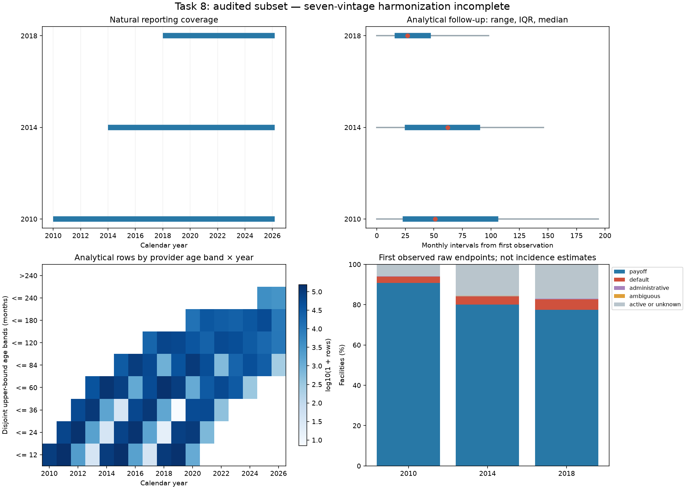

# Multi-Vintage Data Audit

## Executive Summary

STOP — HARMONIZATION INVALID. All seven authorized local archives are present. Stopped vintages remain explicitly represented; the surviving subset is not certified as the prescribed seven-vintage cohort. No model, macro join, holdout evaluation or sample replacement was performed.

## Acquisition

User supplied the seven local Standard archives following the official acquisition request. No authentication automated or alternate mirror used. Exact download dates are unknown; filesystem/ZIP timestamps are not substituted. Private immutable acquisition/preflight manifests retain directory inventory and access provenance.

## Source Integrity

| Vintage | SHA-256 | Status |
| --- | --- | --- |
| 2006 | 4cb95fcea313bcbf8369332d5acab5014f65162c421b2a798353cc6d0d5b6d9a | DATA_QUALITY_STOP |
| 2008 | 7db4997b124bac4bddd628acea9aa396cfc13ac03cc16c314cbc0be939f14fb5 | DATA_QUALITY_STOP |
| 2010 | a82bc0f1efffccfb494b2b33f61877428bb4a6443c1a73d44bc7ee24d77aa45d | READY_WITH_LIMITATIONS |
| 2014 | 42336e0c5a3eb12aa75baa0aaae6217fc4fc39abfc28314ef2f5a9217571ef42 | READY_WITH_LIMITATIONS |
| 2018 | fa01833bff413aefcca5835f76865d8e5ca2972ef85d454732ac077aff4d1c37 | READY_WITH_LIMITATIONS |
| 2020 | 1b17c691b717c6f4d27a1e0a68e6a9dce0fea7350dceb837602289b82e9978f0 | DATA_QUALITY_STOP |
| 2022 | 103730da79901ef080720fe49d9208b5b0f8c40857c5a7de07c0e457ca243b31 | DATA_QUALITY_STOP |

## Vintage Status

| Vintage | Facilities frozen | Rows retained | Error |
| --- | --- | --- | --- |
| 2006 | Not frozen | Not scanned | invalid_numeric |
| 2008 | Not frozen | Not scanned | missing_or_wrong_vintage_loan_id |
| 2010 | 20000 | 1400360 | — |
| 2014 | 20000 | 1352589 | — |
| 2018 | 20000 | 819246 | — |
| 2020 | Not frozen | Not scanned | Origination quarter mismatch |
| 2022 | Not frozen | Not scanned | Origination quarter mismatch |

2006 Q3 line 107274: original rate token `.` is not recognized by the pinned numeric adapter. 2008 Q4 line 206261: source identifier starts `F09Q1`, contrary to the vintage/quarter gate. Neither failure is fixed by shifting columns, deleting records or redrawing a sample.

2020 Q4 line 17103 contains prefix F20Q3; 2022 Q4 line 98552 contains prefix F22Q3. Both stop the quarter-consistency gate before sample freeze. These may reflect legitimate source conventions; wrong archives are not established.

## Release-Aware Schemas

Completed vintages validate 31 origination and 35 performance positions against the pinned July2026 R47 mapping, pipe delimiter and UTF-8 compatible decoding. Failed vintages have 31 columns at the failed origination records; their performance layouts are not certified. Exact archive release attestation remains unverified. No heuristic field shifting; signed loss amounts remain signed. Official layout SHA-256:ce054271c42b7ad5f173a045c73368d997a2ac99253dcb312a45ccef43a4b13e

## Canonical Schema

Version track-b-multivintage-r47-canonical-v1. All 66 supplied positions are registered with explicit numeric/monthly/text types. Private canonical origination and monthly outputs retain facility keys and audit flags; no records or IDs are public. Unavailable borrower identity and timed cash flows are not fabricated.

## Field Comparability

See ../../docs/track_b/MULTI_VINTAGE_FIELD_COMPARABILITY.md and the machine registry. EXACT refers to a supplied concept in the pinned mapping, not causal comparability or verified historical reporting. TRANSFORMABLE uses explicit normalization; PARTIAL preserves disclosure/semantic limits; UNAVAILABLE and SEMANTICALLY_INCOMPATIBLE block invented concepts.

## Sampling

| Vintage | N | Frozen set SHA-256 |
| --- | --- | --- |
| 2010 | 20000 | e719a6b4d23caca8ac55eeaa6fae54da23c95887dd83b3ac22cd925d63902832 |
| 2014 | 20000 | d26b2ba3e08837f82c940ecefbaa18c4bd201d64a0a114760eafeeb80a8126f5 |
| 2018 | 20000 | b3e2952bb5bc0d0a551105cecfa964b18481b3764442edb8362245f4f17f921e |

New samples use SHA256(track-b-multivintage-v1:vintage:loan_id), digest then ID, first 20,000 of the complete valid universe. No outcomes, credit score or geography used. Failed origination universes do not produce samples. Existing 2010 exact set reused:e719a6b4d23caca8ac55eeaa6fae54da23c95887dd83b3ac22cd925d63902832. Combined partial-set hash: 2c341be575da55444fa0461044214f73970cbde587ab99d6af7063c12a21b77d

## Longitudinal Integrity

Raw records retained; analytical follow-up never re-enters after a gap, unknown state, duplicate or endpoint. Post-terminal records are flagged rather than silently deleted. Missing linkage, malformed selected rows or unexplained numeric/schema failures stop a vintage. Balance-above-original flags are descriptive, not automatically impossible after modification.

- **2010**: {"duplicate_facility_months": 0, "initial_nonactive_or_duplicate_facilities": 10, "post_research_endpoint_rows": 26444, "source_termination_rows": 18718}; supplemental: {"current_upb_above_original_rows": 1933, "reporting_after_scheduled_maturity_rows": 19, "reporting_before_first_payment_rows": 17796}

- **2014**: {"duplicate_facility_months": 0, "initial_nonactive_or_duplicate_facilities": 8, "post_research_endpoint_rows": 32195, "source_termination_rows": 16615}; supplemental: {"current_upb_above_original_rows": 1402, "reporting_before_first_payment_rows": 17391}

- **2018**: {"duplicate_facility_months": 0, "initial_nonactive_or_duplicate_facilities": 10, "post_research_endpoint_rows": 41251, "source_termination_rows": 16118}; supplemental: {"current_upb_above_original_rows": 9216, "reporting_before_first_payment_rows": 17878}

## Missingness

Machine evidence reports separate OBSERVED, MISSING_IN_SOURCE, STRUCTURALLY_UNAVAILABLE, NOT_APPLICABLE and PARSER_FAILURE counts, row rates, any/all nonobserved facility rates and special tokens. All-empty current-release columns remain MISSING_IN_SOURCE, not inferred historical structural unavailability. Failed vintages have no certified monthly missingness estimates.

- **2010**, entirely nonobserved fields: special_program, vantage_score

- **2014**, entirely nonobserved fields: vantage_score

- **2018**, entirely nonobserved fields: vantage_score

## Event Support

| Vintage | Default | Payoff/maturity | Administrative | Ambiguous | Active/unknown |
| --- | --- | --- | --- | --- | --- |
| 2010 | 623 | 18147 | 29 | 33 | 1168 |
| 2014 | 800 | 16018 | 33 | 28 | 3121 |
| 2018 | 1051 | 15488 | 42 | 9 | 3410 |

First observed raw endpoint counts preserve Task2/4/6 definitions. They are descriptive feasibility counts, not cumulative incidence or validated 12-month targets. Contiguous analytical support is separately censored at unknowns/gaps.

## Follow-Up

| Vintage | Raw span min/median/max | Analytical prefix min/median/max |
| --- | --- | --- |
| 2010 | 0.0/53.0/194.0 | 0.0/51.0/194.0 |
| 2014 | 0.0/64.0/146.0 | 0.0/62.0/146.0 |
| 2018 | 0.0/29.0/98.0 | 0.0/27.0/98.0 |

Intervals from first observation, not exact origination. Unequal follow-up preserved; no common truncation.

## Horizon Support

| Vintage | 12 | 24 | 36 | 60 | 84 | 120 |
| --- | --- | --- | --- | --- | --- | --- |
| 2006 | Not assessed | Not assessed | Not assessed | Not assessed | Not assessed | Not assessed |
| 2008 | Not assessed | Not assessed | Not assessed | Not assessed | Not assessed | Not assessed |
| 2010 | SUPPORTED | SUPPORTED | SUPPORTED | SUPPORTED | SUPPORTED | SUPPORTED |
| 2014 | SUPPORTED | SUPPORTED | SUPPORTED | SUPPORTED | SUPPORTED | SUPPORTED |
| 2018 | SUPPORTED | SUPPORTED | SUPPORTED | SUPPORTED | SUPPORTED | UNSUPPORTED |
| 2020 | Not assessed | Not assessed | Not assessed | Not assessed | Not assessed | Not assessed |
| 2022 | Not assessed | Not assessed | Not assessed | Not assessed | Not assessed | Not assessed |

Both horizon risk set and known status must meet frozen thresholds: SUPPORTED >=1,000 and >=10,000; LIMITED >=100 and >=2,000; otherwise UNSUPPORTED. Known status includes earlier observed default/payoff; early administrative/unknown/gap censoring is not presumed known. No extrapolation.

## Calendar Coverage

| Vintage | First reporting month | Last reporting month | Provider age min/max |
| --- | --- | --- | --- |
| 2010 | 2010-01 | 2026-03 | 0.0/194.0 |
| 2014 | 2014-01 | 2026-03 | 0.0/146.0 |
| 2018 | 2018-01 | 2026-03 | 0.0/98.0 |

## Age-Period Overlap

The machine age × year × vintage matrix counts only first analytical-prefix records with known nonnegative provider age. Exact provider age 24 months is separately tabulated by calendar year. Failed cohorts are not silently counted as absent economic support.

2018 overlap: {"<= 12": {"2010": 2, "2014": 6, "2018": 105674}, "<= 120": {"2010": 67040}, "<= 24": {"2010": 10, "2014": 6}, "<= 36": {"2010": 6, "2014": 1472}, "<= 60": {"2010": 11, "2014": 141513}, "<= 84": {"2010": 936}}

## APC Identification Diagnostics

{
  "synthetic": {
    "rows": 35,
    "columns": 4,
    "rank": 3,
    "null_vector": [
      0,
      1,
      -1,
      -1
    ],
    "maximum_identity_residual": 0.0,
    "scope": "Exact-clock illustration; does not assert exact mortgage origination month"
  },
  "empirical_proxy": {
    "unique_clock_rows": 8073,
    "columns": 4,
    "rank": 3,
    "maximum_identity_residual": 0.0,
    "scope": "Observed analytical-prefix clock support using first-payment proxy, not exact origination or provider age"
  },
  "unrestricted_parameterization": "For exact clocks, a drift added to period and subtracted from cohort and age leaves the linear predictor unchanged. Unrestricted categorical APC retains this alias plus ordinary dummy/intercept constraints.",
  "future_constraints": [
    "smooth duration basis",
    "parsimonious cohort representation",
    "national macro replacing unrestricted period FE",
    "prespecified interactions only"
  ],
  "constraints_selected_from_outcomes": false,
  "causal_identification_established": false
}

Rank diagnostics show an alias, not an identified model. First-payment proxy clocks are constructed explicitly; provider age residuals remain separately audited. Smooth duration, parsimonious cohort terms and national macro variables may define a constrained predictive design later; they cannot establish causal macro identification.

## Resource Behavior

| Vintage | Seconds | Peak process MiB | ZIP temp MiB | Output MiB |
| --- | --- | --- | --- | --- |
| 2006 | 42.3 | Not recorded | Not recorded | Partial origination DB |
| 2008 | 76.6 | Not recorded | Not recorded | Partial origination DB |
| 2010 | 139.8 | 154.8 | 0.0 | 207.0 |
| 2014 | 508.0 | 154.8 | 0.0 | 763.9 |
| 2018 | 395.4 | 154.8 | 0.0 | 657.3 |
| 2020 | 184.6 | Not recorded | Not recorded | Partial origination DB |
| 2022 | 106.7 | Not recorded | Not recorded | Partial origination DB |

Vintages processed sequentially. Stored nested ZIP members streamed with bounded seek views; no full performance extraction. ZIP temporary materialization is measured; SQLite temporary sort spill is not instrumented. Peak memory is process high-water, not additive per-vintage memory. Per-quarter retained checksums and source/parser/protocol/sample/code identities gate reuse. Partial uncompleted stages require explicit recovery review.

## Limitations

- Current-release retrospective disclosure: operational knowledge time and historical revisions remain unverified.

- ZIP timestamps and matching field counts do not independently attest the exact source release.

- Facility identity is not borrower identity; cross-facility or cross-vintage borrower independence is not established.

- First payment month is not exact origination or accounting recognition; no fabricated daily dates or exact DPD.

- Monthly research default is a proxy; payoff includes maturity, not uniquely voluntary prepayment.

- Loss amounts are signed aggregate disclosures, not timed recovery cash flows, accounting LGD or ECL.

- Modification and assistance disclosures do not identify every intervention or pandemic forbearance.

- Natural follow-up is unequal; no outcome extrapolation, adaptive replacement or global truncation.

- Overlap does not identify unrestricted age, period and cohort effects or causal macro coefficients.

- Four origination gates failed; prescribed seven-vintage harmonization is incomplete. Dataset selection cannot be silently changed to the successful subset.

## Decision

STOP — HARMONIZATION INVALID

## Next Task

One corrective task: resolve the 2006 missing-rate convention and the 2008/2020/2022 archive/identifier vintage/quarter conflicts against official Freddie documentation, with a versioned adapter/protocol amendment and explicit checkpoint recovery before rerunning those origination gates. Do not acquire/join macro data yet.

## Preservation

{
  "status": "PASSED",
  "preexisting_tracked_files": 321,
  "retained_private_byte_hashes": 17,
  "track_a_artifacts": 12,
  "track_a_tag": [
    "20be4bf1bd291afb5dfad5b0befbe761651f1de1",
    "0d3dc5f9dd1be6a40fc03fa91a1fe8b367a28b8c"
  ],
  "source_hashes": {
    "2006": "4cb95fcea313bcbf8369332d5acab5014f65162c421b2a798353cc6d0d5b6d9a",
    "2008": "7db4997b124bac4bddd628acea9aa396cfc13ac03cc16c314cbc0be939f14fb5",
    "2010": "a82bc0f1efffccfb494b2b33f61877428bb4a6443c1a73d44bc7ee24d77aa45d",
    "2014": "42336e0c5a3eb12aa75baa0aaae6217fc4fc39abfc28314ef2f5a9217571ef42",
    "2018": "fa01833bff413aefcca5835f76865d8e5ca2972ef85d454732ac077aff4d1c37",
    "2020": "1b17c691b717c6f4d27a1e0a68e6a9dce0fea7350dceb837602289b82e9978f0",
    "2022": "103730da79901ef080720fe49d9208b5b0f8c40857c5a7de07c0e457ca243b31"
  },
  "original_2010_source_sha256": "a82bc0f1efffccfb494b2b33f61877428bb4a6443c1a73d44bc7ee24d77aa45d",
  "original_2010_location_status": "Old path absent; byte-identical source verified in user-supplied directory",
  "consumed_ledger_byte_hashes": {
    "expanded_pd_v1": "0a28b295dad7540cacedb2042af02cb3392c25c251fc994866463832eb9ec642",
    "survival_v1": "e8a6f0e8d45bc2cd9f9a257be6a63726742e54a2c01200d35487a3f9b2119a26"
  },
  "ledger_check": "Byte hashing against retained public serialization; no consumption API",
  "locked_holdout_scored": false,
  "model_artifacts_regenerated": false,
  "retained_historical_metrics": {
    "auc": 0.868152,
    "brier": 0.048545,
    "log_loss": 0.17603
  },
  "metrics_status": "Retained historical evidence; not newly evaluated"
}

## Aggregate diagnostics

## Reproduction

Ingestion: `python scripts/run_track_b_multivintage.py --source-dir SOURCE`. Reporting: `python scripts/report_track_b_multivintage.py --source-dir SOURCE`. Partial failed stages require explicit recovery review; no silent rebuild.

## Verification

48 targeted tests and 784 full-suite tests passed (four full-suite warnings). Lint, formatting (173 files), governance, repository integrity and public-file hygiene passed. All 321 pre-existing tracked files remain byte-identical. Processing code and protocol still match the pre-access attestation. No commit or push.

## Audit flag interpretation

Reporting before scheduled first payment can be legitimate; it is not proof of an impossible origination date.

Balance above disclosed original UPB may reflect precision or modification effects; flagged rather than silently repaired.

analytical_prefix can include the censor-boundary record; do not use it alone as an exposure indicator. Horizon support uses the separately audited contiguous risk exit. Age/calendar counts are record coverage.

Private Task8 persistent disk footprint: 3183734177 bytes, including failed partial origination stages. ZIP materialization peak was zero; SQLite temporary sort spill was not instrumented.
