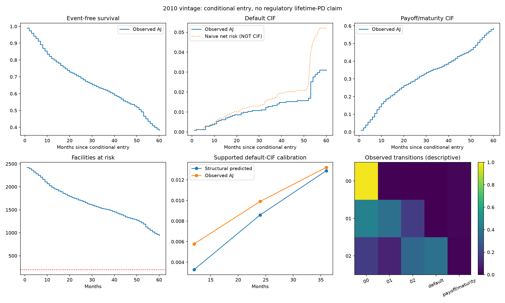

# Survival and competing-risk validation

## Executive Summary

COMPETING-RISK SURVIVAL FOUNDATION ESTABLISHED WITH MATERIAL LIMITATIONS

This establishes monthly first-event risk accounting, coherent competing-risk probabilities and censor-adjusted research evaluation. It does not establish calibrated lifetime PD or production validity. Dynamic risk updates are next-month forecasts; entry-time multi-month dynamic CIF is not identified without future-state assumptions.

Interpretation review: raw audit reconciles, risk sets and probability identities are valid, but this is not a calibrated lifetime-PD model. At12 months predicted default CIF is0.329% versus observed0.578%, and payoff CIF9.42% versus18.61%. At36 months default means nearly match, while payoff is overpredicted; model Brier is slightly worse than the transported development AJ reference. Only54 development months are available: modeled60-month forecasts are suppressed despite941 evaluation facilities still at risk. Dynamic multimonth CIF remains unidentified without a future-state model.

## Research Question

Conditional on eligible entry into the assigned calendar window, estimate default before payoff/maturity, payoff before default and remaining event-free probability. Historical operational knowledge time UNVERIFIED.

## Event Definitions

Unchanged Task2 event_category/protocol; default03..99,RA or credit term02/03/09; payoff01, ambiguous same-month/default-payoff conflicts or mismatched dates; admin15/16/96; unknown/gaps separately censor. Do not call payoff voluntary prepayment.

Raw first endpoint audit: {"default": 623, "payoff": 18147, "administrative": 29, "ambiguous": 33, "active_or_unknown": 1168}

## Time Origin and Delayed Entry

First globally protocol-eligible t0 inside assigned calendar window, conditional on still active; one entry per facility. Relative time zero at this window entry. Mortgage age at entry records delayed observation; no exposure from origination is fabricated. Evaluation clock resets at conditional 2016+ entry, NOT origination lifetime.

Provider loan_age is an available monthly mortgage clock, not proof of exact origination date. An age-scale cohort would require left-truncated risk sets; early-development age support does not cover later evaluation age. Primary origin B avoids manufacturing pre-entry exposure but entry populations differ in seasoning and survival selection.

{
  "global": {
    "minimum": 5.0,
    "median": 5.0,
    "maximum": 106.0
  },
  "development": {
    "minimum": 5.0,
    "median": 5.0,
    "maximum": 53.0
  },
  "evaluation": {
    "minimum": 38.0,
    "median": 63.0,
    "maximum": 101.0
  }
}

## Risk-Set Construction

One interval (t0,t0+1] from eligible current row to consecutive next month with category none/default/payoff. Stop at first endpoint; default/payoff each counted once. No missing/gap/pre-entry/post-event exposure. First-month admin/ambiguity/unknown censor at last known active boundary; record reason separately. Zero-duration entry/exit quarantined. Development interval endpoints must be <=2014-12; no 2015 intervals used.

| partition | facilities | risk_intervals | default_facilities | payoff_facilities | censored_facilities |
| --- | --- | --- | --- | --- | --- |
| development | 13813 | 471976 | 212 | 6577 | 7024 |
| evaluation | 2423 | 132409 | 95 | 2001 | 327 |

Global eligible-entry cohort: {"facilities": 19606, "risk_intervals": null, "default_facilities": 618, "payoff_facilities": 17762, "censored_facilities": 1226}; risk intervals=1254425

Censor reasons: {
  "global": {
    "observation_end": 1168,
    "ambiguous": 32,
    "administrative": 26
  },
  "development": {
    "calendar_censor": 7001,
    "ambiguous": 6,
    "administrative": 17
  },
  "evaluation": {
    "observation_end": 316,
    "ambiguous": 8,
    "administrative": 3
  }
}

Entry/zero-exposure flow: {
  "global": {
    "included": 19606,
    "no_eligible_entry": 392,
    "zero_duration_quarantined": 2
  },
  "development": {
    "included": 13813,
    "no_eligible_entry": 347,
    "zero_duration_quarantined": 1
  },
  "evaluation": {
    "included": 2423,
    "no_eligible_entry": 3416
  }
}

## Transition Diagnostics

Transitions use next observed states as descriptive targets only; no future-state predictor or Markov forecasting model. Terminal causes shown separately.

| current | next | count | probability |
| --- | --- | --- | --- |
| 00 | 00 | 128683 | 0.98067 |
| 00 | 01 | 550 | 0.0041915 |
| 00 | payoff/maturity | 1986 | 0.015135 |
| 01 | 00 | 412 | 0.43876 |
| 01 | 01 | 348 | 0.37061 |
| 01 | 02 | 166 | 0.17678 |
| 01 | payoff/maturity | 13 | 0.013845 |
| 02 | 00 | 45 | 0.17928 |
| 02 | 01 | 25 | 0.099602 |
| 02 | 02 | 84 | 0.33466 |
| 02 | default | 95 | 0.37849 |
| 02 | payoff/maturity | 2 | 0.0079681 |

## Nonparametric Survival

AJ event-free survival equals KM with default and payoff as exits. Default-only KM censors payoff and estimates net risk, not default CIF. All event/censor ties use the documented monthly convention.

## Default CIF

AJ reference and structural forecasts share conditional window-entry origin. Sparse default counts limit horizon discrimination/calibration.

## Payoff CIF

Payoff/maturity is a competing endpoint, not necessarily voluntary prepayment. Probability conservation verified: S+FD+FP=1.

## Cause-Specific Models

Structural and dynamic multinomial logistic models jointly fit two cause logits against no-event reference. Independent binary logits were avoided because their probabilities need not sum to <=1. All preprocessing from development; fixed C=1 and duration bands; grouped development diagnostic followed by pre-evaluation development refit.

{
  "structural": {
    "validation_facilities": 2767,
    "validation_intervals": 95397,
    "metrics": {
      "joint_log_loss": 0.07462959015789515,
      "default_brier": 0.0004501743746640558,
      "payoff_brier": 0.013522523131785895
    },
    "fixed_specification": true
  },
  "dynamic": {
    "validation_facilities": 2767,
    "validation_intervals": 95397,
    "metrics": {
      "joint_log_loss": 0.07130261777946467,
      "default_brier": 0.0002756324699355635,
      "payoff_brier": 0.013494435761252093
    },
    "fixed_specification": true
  }
}

Conditional cause/no-event odds ratios are not proportional hazard ratios, causal effects or direct CIF changes.

| cause | feature | log_odds | odds_ratio |
| --- | --- | --- | --- |
| default | orig_credit_score | -0.37033 | 0.69051 |
| default | orig_ltv | 0.34691 | 1.4147 |
| default | orig_dti | 0.35726 | 1.4294 |
| default | orig_interest_rate | 0.56894 | 1.7664 |
| default | original_loan_term | 0.24372 | 1.276 |
| default | number_of_borrowers | -0.20003 | 0.8187 |
| default | missingindicator_orig_ltv | -0.037939 | 0.96277 |
| default | missingindicator_orig_dti | 0.47774 | 1.6124 |
| default | loan_purpose_N | -0.59838 | 0.5497 |
| default | loan_purpose_P | -0.5333 | 0.58667 |
| default | occupancy_status_P | 0.64472 | 1.9055 |
| default | occupancy_status_S | 0.1668 | 1.1815 |
| default | duration_band_13_24 | 0.63187 | 1.8811 |
| default | duration_band_25_36 | 0.60895 | 1.8385 |
| default | duration_band_37_60 | 0.34983 | 1.4188 |
| payoff_maturity | orig_credit_score | 0.19347 | 1.2134 |
| payoff_maturity | orig_ltv | -0.12585 | 0.88174 |
| payoff_maturity | orig_dti | 0.033137 | 1.0337 |
| payoff_maturity | orig_interest_rate | 0.21113 | 1.2351 |
| payoff_maturity | original_loan_term | -0.11051 | 0.89538 |
| payoff_maturity | number_of_borrowers | 0.091601 | 1.0959 |
| payoff_maturity | missingindicator_orig_ltv | 0.0071528 | 1.0072 |
| payoff_maturity | missingindicator_orig_dti | -0.26104 | 0.77025 |
| payoff_maturity | loan_purpose_N | 0.28317 | 1.3273 |
| payoff_maturity | loan_purpose_P | 0.25649 | 1.2924 |
| payoff_maturity | occupancy_status_P | 0.53363 | 1.7051 |
| payoff_maturity | occupancy_status_S | 0.18914 | 1.2082 |
| payoff_maturity | duration_band_13_24 | 0.86726 | 2.3804 |
| payoff_maturity | duration_band_25_36 | 0.68331 | 1.9804 |
| payoff_maturity | duration_band_37_60 | 0.2151 | 1.24 |

## Dynamic State Model

Updated current-state predictions condition on observed t0 state, balance/rate/age/remaining term. They are rolling one-month updates. No observed future path or frozen-current-delinquency annual projection is scored as a prospective CIF.

{
  "structural": {
    "effective_sample": {
      "facilities": 2423,
      "risk_intervals": 132409,
      "default_facilities": 95,
      "payoff_facilities": 2001,
      "censored_facilities": 327
    },
    "metrics": {
      "joint_log_loss": 0.08743364538018916,
      "default_brier": 0.0007169720517410267,
      "payoff_brier": 0.014955718243224066
    }
  },
  "dynamic": {
    "effective_sample": {
      "facilities": 2423,
      "risk_intervals": 132409,
      "default_facilities": 95,
      "payoff_facilities": 2001,
      "censored_facilities": 327
    },
    "metrics": {
      "joint_log_loss": 0.09843385429093048,
      "default_brier": 0.0005358659876751825,
      "payoff_brier": 0.016520158241498564
    }
  }
}

{
  "unit": "facility, all monthly intervals retained",
  "draws": 400,
  "seed": 61006,
  "valid_draws": 400,
  "failed_draws": 0,
  "intervals": {
    "structural": {
      "joint_log_loss": {
        "lower": 0.08423491076798358,
        "upper": 0.09075810507132315
      },
      "default_brier": {
        "lower": 0.0005786681988632664,
        "upper": 0.000866396964687274
      },
      "payoff_brier": {
        "lower": 0.014312999643075959,
        "upper": 0.015615321005274707
      }
    },
    "dynamic": {
      "joint_log_loss": {
        "lower": 0.09628450030258995,
        "upper": 0.10053239964767431
      },
      "default_brier": {
        "lower": 0.00042694286663558077,
        "upper": 0.000645585652501467
      },
      "payoff_brier": {
        "lower": 0.015989740332365387,
        "upper": 0.017074765089861086
      }
    }
  }
}

## Temporal Validation

Development interval endpoints <=2014-12; no 2015 intervals; evaluation t0>=2016-01 with separate facilities. Task6 ledger frozen before construction and model specifications before temporal metrics. Prior Task4/5 outcomes already inspected; do not claim virgin data.

## Horizon-Specific Discrimination

One-entry-per-facility cumulative/dynamic IPCW-AUC: cases default by horizon; controls event-free at horizon OR competing payoff before it. IPCW Brier divides weighted squared loss by original cohort size, not observed-label/weight sum. Marginal reverse-KM G(t-)=P(C>=t), re-estimated on evaluation for metric weighting only. Last-known censor boundary at horizon counts known event-free status. No binary recalibration intercept/slope as CIF calibration.

## Probability Quality

IPCW Brier divides by total cohort size. Censoring KM re-estimated within each facility bootstrap. Competing payoff remains known non-default at later horizons. Integrated score over months1..36: 0.007377594568089904

## CIF Calibration

Mean predicted CIF compared with observed AJ incidence. No binary calibration intercept/slope or post-evaluation recalibration.

| horizon | status | at_risk | default_facilities | observed_default | predicted_default | observed_payoff | predicted_payoff | observed_survival | AUC | Brier |
| --- | --- | --- | --- | --- | --- | --- | --- | --- | --- | --- |
| 12 | SUPPORTED | 1992 | 14 | 0.005778 | 0.0032853 | 0.18613 | 0.094222 | 0.80809 | 0.76653 | 0.0056699 |
| 24 | SUPPORTED | 1714 | 24 | 0.0099051 | 0.008592 | 0.28849 | 0.27916 | 0.70161 | 0.74491 | 0.0097421 |
| 36 | SUPPORTED | 1513 | 32 | 0.01321 | 0.012887 | 0.36572 | 0.40046 | 0.62107 | 0.74653 | 0.013114 |
| 60 | INSUFFICIENT TRAINING-TIME SUPPORT | 941 |  | 0.031003 |  | 0.58704 |  | 0.38196 |  |  |

Facility-resampled 95% intervals:

{
  "requested_draws": 400,
  "valid_draws": 400,
  "failed_draws": 0,
  "seed": 61006,
  "unit": "facility",
  "models_fixed": true,
  "intervals": {
    "12": {
      "default_cif": {
        "lower": 0.0028889806025588116,
        "upper": 0.008677259595542705,
        "valid_draws": 400
      },
      "payoff_cif": {
        "lower": 0.17002682624845236,
        "upper": 0.2018262484523318,
        "valid_draws": 400
      },
      "survival": {
        "lower": 0.7928085018572016,
        "upper": 0.8241952125464301,
        "valid_draws": 400
      },
      "brier": {
        "lower": 0.0029205828700518575,
        "upper": 0.008635393107059791,
        "valid_draws": 400
      },
      "auc": {
        "lower": 0.6727447577716618,
        "upper": 0.8563345512000929,
        "valid_draws": 400
      },
      "calibration_difference": {
        "lower": -0.005553933243804396,
        "upper": 0.00025109938700739945,
        "valid_draws": 400
      },
      "payoff_calibration_difference": {
        "lower": -0.10817414147085161,
        "upper": -0.07619514492191279,
        "valid_draws": 400
      }
    },
    "24": {
      "default_cif": {
        "lower": 0.006190672719768881,
        "upper": 0.014032191498142797,
        "valid_draws": 400
      },
      "payoff_cif": {
        "lower": 0.2711411473380107,
        "upper": 0.30459141560049524,
        "valid_draws": 400
      },
      "survival": {
        "lower": 0.6855138258357407,
        "upper": 0.7197688815517952,
        "valid_draws": 400
      },
      "brier": {
        "lower": 0.0061467746660956455,
        "upper": 0.013768710595425534,
        "valid_draws": 400
      },
      "auc": {
        "lower": 0.659398338054375,
        "upper": 0.8266367469102172,
        "valid_draws": 400
      },
      "calibration_difference": {
        "lower": -0.005314074338125217,
        "upper": 0.0022935216168594365,
        "valid_draws": 400
      },
      "payoff_calibration_difference": {
        "lower": -0.02474493574891843,
        "upper": 0.009318443156133088,
        "valid_draws": 400
      }
    },
    "36": {
      "default_cif": {
        "lower": 0.008668187667162255,
        "upper": 0.017766405217171346,
        "valid_draws": 400
      },
      "payoff_cif": {
        "lower": 0.3467299225319914,
        "upper": 0.38311756149695414,
        "valid_draws": 400
      },
      "survival": {
        "lower": 0.6037736438726535,
        "upper": 0.6400807613847715,
        "valid_draws": 400
      },
      "brier": {
        "lower": 0.008657862648867996,
        "upper": 0.017812343593093218,
        "valid_draws": 400
      },
      "auc": {
        "lower": 0.6659420446806117,
        "upper": 0.8196628242467136,
        "valid_draws": 400
      },
      "calibration_difference": {
        "lower": -0.0053139240688497525,
        "upper": 0.004282684031393232,
        "valid_draws": 400
      },
      "payoff_calibration_difference": {
        "lower": 0.017338672661085696,
        "upper": 0.054584363711143266,
        "valid_draws": 400
      }
    },
    "60": {
      "default_cif": {
        "lower": 0.024391891649462327,
        "upper": 0.03928379856598325,
        "valid_draws": 400
      },
      "payoff_cif": {
        "lower": 0.5666665236010542,
        "upper": 0.6056545957621521,
        "valid_draws": 400
      },
      "survival": {
        "lower": 0.36423855302577485,
        "upper": 0.4020262259459637,
        "valid_draws": 400
      },
      "brier": null,
      "auc": null,
      "calibration_difference": null,
      "payoff_calibration_difference": null
    }
  }
}

Reliability groups use development-CIF quantiles; sparse groups are not reliable calibration evidence.

{
  "12": [
    {
      "group": 0,
      "facilities": 802,
      "default_facilities_by_horizon": 1,
      "at_risk": 674.0,
      "mean_predicted": 0.0003427263000855102,
      "observed_default_cif": 0.0012468827930174563,
      "support": "sparse"
    },
    {
      "group": 1,
      "facilities": 760,
      "default_facilities_by_horizon": 2,
      "at_risk": 625.0,
      "mean_predicted": 0.001358649245674146,
      "observed_default_cif": 0.002631578947368421,
      "support": "sparse"
    },
    {
      "group": 2,
      "facilities": 861,
      "default_facilities_by_horizon": 11,
      "at_risk": 693.0,
      "mean_predicted": 0.007726795156142402,
      "observed_default_cif": 0.012775842044134726,
      "support": "descriptive"
    }
  ],
  "24": [
    {
      "group": 0,
      "facilities": 799,
      "default_facilities_by_horizon": 2,
      "at_risk": 588.0,
      "mean_predicted": 0.0008704219078521363,
      "observed_default_cif": 0.0025031289111389233,
      "support": "sparse"
    },
    {
      "group": 1,
      "facilities": 767,
      "default_facilities_by_horizon": 5,
      "at_risk": 543.0,
      "mean_predicted": 0.003513324440645423,
      "observed_default_cif": 0.006518904823989568,
      "support": "sparse"
    },
    {
      "group": 2,
      "facilities": 857,
      "default_facilities_by_horizon": 17,
      "at_risk": 583.0,
      "mean_predicted": 0.020336367194251262,
      "observed_default_cif": 0.019836639439906645,
      "support": "descriptive"
    }
  ],
  "36": [
    {
      "group": 0,
      "facilities": 799,
      "default_facilities_by_horizon": 2,
      "at_risk": 522.0,
      "mean_predicted": 0.0012750591280689093,
      "observed_default_cif": 0.0025031289111389233,
      "support": "sparse"
    },
    {
      "group": 1,
      "facilities": 765,
      "default_facilities_by_horizon": 6,
      "at_risk": 487.0,
      "mean_predicted": 0.005195970921203652,
      "observed_default_cif": 0.007843137254901964,
      "support": "sparse"
    },
    {
      "group": 2,
      "facilities": 859,
      "default_facilities_by_horizon": 24,
      "at_risk": 504.0,
      "mean_predicted": 0.030536647039086148,
      "observed_default_cif": 0.027965912533047067,
      "support": "descriptive"
    }
  ]
}

Ambiguity sensitivity: {
  "treatment": "Exclude ambiguous endpoint facilities; primary censored before ambiguous month. No relabeling or refitting",
  "facilities": 2415,
  "curves_at_horizons": {
    "12": {
      "month": 12,
      "at_risk": 1984.0,
      "default_events": 1.0,
      "payoff_events": 33.0,
      "censored": 0.0,
      "survival": 0.8074534161490685,
      "default_cif": 0.005797101449275363,
      "payoff_cif": 0.1867494824016563,
      "naive_net_default": 0.0064299777127410085,
      "censor_survival_before": 1.0,
      "censor_survival_after": 1.0
    },
    "24": {
      "month": 24,
      "at_risk": 1706.0,
      "default_events": 0.0,
      "payoff_events": 14.0,
      "censored": 0.0,
      "survival": 0.7006211180124226,
      "default_cif": 0.009937888198757766,
      "payoff_cif": 0.28944099378881993,
      "naive_net_default": 0.011840369555951802,
      "censor_survival_before": 1.0,
      "censor_survival_after": 1.0
    },
    "36": {
      "month": 36,
      "at_risk": 1506.0,
      "default_events": 1.0,
      "payoff_events": 10.0,
      "censored": 0.0,
      "survival": 0.6198258998975744,
      "default_cif": 0.013253641133527455,
      "payoff_cif": 0.36692045896889836,
      "naive_net_default": 0.01686510689544718,
      "censor_survival_before": 0.9987443557132998,
      "censor_survival_after": 0.9987443557132998
    },
    "60": {
      "month": 60,
      "at_risk": 934.0,
      "default_events": 0.0,
      "payoff_events": 18.0,
      "censored": 0.0,
      "survival": 0.3800731417090547,
      "default_cif": 0.031093536110578635,
      "payoff_cif": 0.5888333221803671,
      "naive_net_default": 0.05233927122988702,
      "censor_survival_before": 0.9979554581179496,
      "censor_survival_after": 0.9979554581179496
    }
  }
}

## Task 5 Bridge

{
  "matched_facilities": 2423,
  "task5_mean_pd": 0.004670686104194372,
  "task6_mean_default_cif": 0.00328527055254624,
  "mean_difference": -0.0013854155516481326,
  "rank_spearman": 0.9810269409007855,
  "cached_Task5_scores_only": true,
  "Task5_ledger_unchanged": true,
  "interpretation": "One conditional window-entry per facility, explicit payoff, risk-set selection and censoring differ from repeated Task5 landmarks; no forced equality"
}

Cached frozen scores only; Task5 ledger/evidence/models unchanged. Different conditioning, competing payoff and risk-set selection need not produce identical probabilities.

## Limitations

- Conditional calendar-window entry differs in mortgage seasoning/survival selection between development and evaluation
- No pre-entry exposure fabricated; this is not origination-lifetime default incidence
- Historical operational knowledge time UNVERIFIED
- Dynamic current-state predictions are next-month only; multi-month dynamic CIF not identified without future-state assumptions
- Training follow-up does not support unrestricted long-horizon extrapolation; tail rules applied
- Marginal IPCW requires noninformative censoring; informative censoring not ruled out
- Facility bootstrap conditions on fitted models and does not identify borrower dependence or future macro uncertainty
- Task4/5 outcomes already inspected; Task6 has its own versioned sealed predictive protocol, not virgin data
- No regulatory lifetime PD/IFRS9/IRB/production/causal/fairness/external-vintage validity

## Decision

COMPETING-RISK SURVIVAL FOUNDATION ESTABLISHED WITH MATERIAL LIMITATIONS

Next task: Vintage-aware macroeconomic data provenance and identification design, before any stress-model fitting. Not implemented.

Methods: [Discrete competing-risk validation](https://pmc.ncbi.nlm.nih.gov/articles/PMC7217187/), [Time-dependent competing-risk discrimination](https://pmc.ncbi.nlm.nih.gov/articles/PMC4512205/), [Censor-adjusted validation](https://www.bmj.com/content/377/bmj-2021-069249).

## Logged time-basis support diagnostic

All-period monthly scores include time extrapolation; bands61+ were unseen in development and encoded as reference by the frozen pipeline. Supported-duration subset is a new descriptive diagnostic using cached scores, not a model revision or primary CIF reevaluation.

{
  "recorded_at": "2026-10-06T22:53:26.145669+00:00",
  "models_modified": false,
  "predictions_regenerated": false,
  "primary_horizon_metrics_recomputed": false,
  "source_sha256_lf": "c6983ae265f3d3ec535c66f61448e4861877912f853a9f68803557e83c9a0d9d",
  "maximum_development_duration": 54,
  "all_intervals": 132409,
  "supported_intervals": 91930,
  "outside_training_duration_intervals": 40479,
  "unseen_duration_band_intervals": 34418,
  "supported_facilities": 2423,
  "supported_default_events": 67,
  "supported_payoff_events": 1262,
  "supported_time_monthly_metrics": {
    "structural": {
      "joint_log_loss": 0.08112018495796487,
      "default_brier": 0.0007284174282218424,
      "payoff_brier": 0.013608294871985626
    },
    "dynamic": {
      "joint_log_loss": 0.08576972492088852,
      "default_brier": 0.0005441267412849004,
      "payoff_brier": 0.01433076465452465
    }
  },
  "supported_time_monthly_uncertainty": {
    "unit": "facility, all monthly intervals retained",
    "draws": 400,
    "seed": 61006,
    "valid_draws": 400,
    "failed_draws": 0,
    "intervals": {
      "structural": {
        "joint_log_loss": {
          "lower": 0.077838665021228,
          "upper": 0.08474715205322837
        },
        "default_brier": {
          "lower": 0.0005616634117328265,
          "upper": 0.0009251165480918454
        },
        "payoff_brier": {
          "lower": 0.012893556478157767,
          "upper": 0.01433059168920997
        }
      },
      "dynamic": {
        "joint_log_loss": {
          "lower": 0.08286601980130129,
          "upper": 0.08869375779598711
        },
        "default_brier": {
          "lower": 0.0004245998739650706,
          "upper": 0.0006998522148698042
        },
        "payoff_brier": {
          "lower": 0.013635428747075089,
          "upper": 0.015056741958624055
        }
      }
    }
  },
  "interpretation": "All-period monthly scores include time extrapolation; bands61+ were unseen in development and encoded as reference by the frozen pipeline. Supported-duration subset is a new descriptive diagnostic using cached scores, not a model revision or primary CIF reevaluation."
}

Monthly dynamic information improves imminent default scoring but can worsen payoff/joint likelihood. It is not automatically a superior structural forecast. Unseen-category handling must not be mistaken for supported long-horizon prediction. No model/primary metric/prediction regeneration; the supplement is logged in the separate Task6 ledger.
