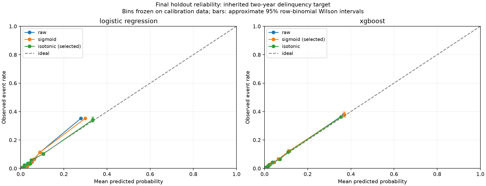
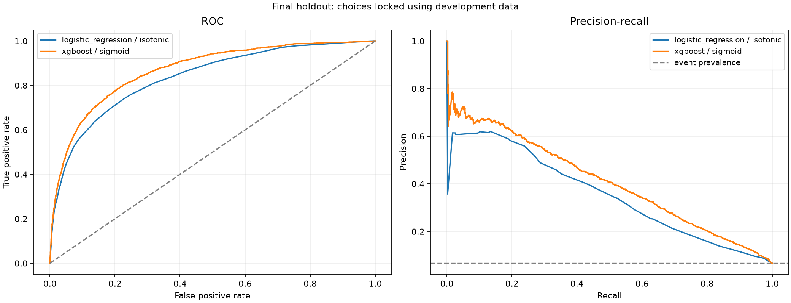

# Phase 5 validation report

Phase 5 adds held-out probability calibration and final-holdout validation to the frozen Phase 4 candidates. XGBoost with sigmoid calibration is the development-selected research candidate. This experiment supports further lab work, not production lending approval.

## Source, partitions and selection

Source: inherited `cs-training.csv`, 150,000 rows; SHA-256 `9d863f88e2ef2190ed608c15c3dd362d1833d940e35f4f2bf22660e04b5f05cb`. Target: Inherited SeriousDlqin2yrs; source two-year delinquency label. There are no observation dates, known borrower IDs or confirmed contractual-default definitions. Results are grouped cross-sectional holdouts, not out-of-time validation.

| Partition | Rows | Events | Purpose |
| --- | ---: | ---: | --- |
| train | 67,562 | 4,514 | Base model and preprocessing fit |
| development | 22,483 | 1,504 | Calibration and candidate selection |
| calibration | 29,964 | 2,005 | Calibrator fit and reliability-bin edges |
| test | 29,991 | 2,003 | Final locked evaluation |

Exact-predictor duplicates remain together; fractions apply to groups. Source IDs are not treated as borrower identity. Source/model/artifact/code hashes, dependency versions and recomputed partitions passed integrity checks before loading trusted locally generated joblib artifacts. No base model or preprocessing was refitted.

Calibration fits only the 29,964-row calibration partition. The prespecified objective is development log loss, with Brier and declared method order as tie-breakers. `selection.json` was written before any final-test prediction, then a persistent test-consumption marker was created in the Phase 4 run. The marker records first access and prevents different choices reusing this consumed holdout. All six variants below were declared before test access; test results cannot change the chosen methods.

| Model | Method | Development log loss | Development Brier | Selected |
| --- | --- | ---: | ---: | --- |
| logistic_regression | raw | 0.199094 | 0.052661 |  |
| logistic_regression | sigmoid | 0.198781 | 0.052509 |  |
| logistic_regression | isotonic | 0.186959 | 0.051085 | yes |
| xgboost | raw | 0.176048 | 0.048595 |  |
| xgboost | sigmoid | 0.175975 | 0.048604 | yes |
| xgboost | isotonic | 0.177158 | 0.048703 |  |

Sigmoid uses a positive-slope mapping of raw log odds, fitted by binary log loss. XGBoost fitted slope 1.026278 and intercept 0.029538; logistic fitted slope 1.092009 and intercept 0.213739. Isotonic has 102 and 94 fitted breakpoints respectively. All variants use epsilon 1e-6 clipping, including the raw reference.

## Final holdout

Final test: 29,991 rows, 2,003 events, observed event rate 6.6787%. Calibration choices were locked before test access. Lower Brier/log loss is better; higher AUC/AP is better.

| Model | Method | AUC | Gini | KS | Average precision | Brier | Log loss | ECE |
| --- | --- | ---: | ---: | ---: | ---: | ---: | ---: | ---: |
| logistic_regression | raw | 0.835426 | 0.670852 | 0.514974 | 0.354026 | 0.052316 | 0.200105 | 0.018007 |
| logistic_regression | sigmoid | 0.835426 | 0.670852 | 0.514974 | 0.354026 | 0.052082 | 0.199798 | 0.014318 |
| logistic_regression | isotonic (selected) | 0.834776 | 0.669551 | 0.512370 | 0.345232 | 0.050967 | 0.188287 | 0.004050 |
| xgboost | raw | 0.868152 | 0.736304 | 0.577380 | 0.408630 | 0.048538 | 0.176073 | 0.003123 |
| xgboost | sigmoid (selected) | 0.868152 | 0.736304 | 0.577380 | 0.408630 | 0.048545 | 0.176030 | 0.002820 |
| xgboost | isotonic | 0.867419 | 0.734837 | 0.575713 | 0.397159 | 0.048602 | 0.177954 | 0.003560 |

Logistic isotonic calibration reduces final log loss from 0.200105 to 0.188287 and Brier from 0.052316 to 0.050967. Its ECE drops from 0.018007 to 0.004050, while AUC declines slightly because isotonic introduces score ties. Average precision declines from 0.354026 to 0.345232. This illustrates that improving probability accuracy can trade off with ranking resolution.

XGBoost raw scores already calibrate fairly well in aggregate. Sigmoid changes final log loss from 0.176073 to 0.176030, an extremely small improvement, and Brier worsens from 0.048538 to 0.048545. AUC and AP remain unchanged. ECE falls slightly, but observed/expected events worsens from 1.0076 to 1.0231: the selected sigmoid model underpredicts aggregate events by about 2.3%. No statistical claim is made about the tiny raw-versus-sigmoid improvement; bootstrap comparisons below concern the two selected models.

At the diagnostic threshold 0.1, selected logistic precision/recall are 0.2885/0.5811; selected XGBoost values are 0.2878/0.6730. This threshold is not a lending policy recommendation. Trapezoidal PR AUC is retained in the JSON; average precision is the primary PR summary because ties/coarse scores affect trapezoidal interpolation.

Reliability bins use calibration-prediction quantiles, with duplicate cuts merged. ECE is bin-dependent. Error bars are approximate 95% row-binomial Wilson intervals, not borrower-cluster robust. Near-correct aggregate average risk does not guarantee accuracy in each risk band or segment.

## Uncertainty and cross-sectional stability

200 paired bootstrap draws resample exact-predictor groups with replacement, preserving rows within each group. Seed 43, 95% percentile intervals, 200 valid draws and zero single-class skips. These are conditional on frozen models/calibrators, not retraining intervals. Unknown borrower identity can leave residual dependence.

| Selected model | AUC [95% interval] | Brier [95% interval] | Log loss [95% interval] |
| --- | --- | --- | --- |
| logistic_regression / isotonic | 0.834776 [0.824061, 0.843597] | 0.050967 [0.048987, 0.052916] | 0.188287 [0.182219, 0.195063] |
| xgboost / sigmoid | 0.868152 [0.859273, 0.875408] | 0.048545 [0.046743, 0.050395] | 0.176030 [0.170154, 0.182341] |

Paired differences are XGBoost minus logistic. The 95% interval for AUC difference is [0.027512, 0.038058], Brier difference [-0.002864, -0.001910], log-loss difference [-0.014010, -0.010569], and AP difference [0.051230, 0.074637]. They favor selected XGBoost on this sample. They do not establish future population performance.

| Selected model | Development AUC | Final AUC | Development Brier | Final Brier | Development log loss | Final log loss |
| --- | ---: | ---: | ---: | ---: | ---: | ---: |
| logistic_regression | 0.841990 | 0.834776 | 0.051085 | 0.050967 | 0.186959 | 0.188287 |
| xgboost | 0.868726 | 0.868152 | 0.048604 | 0.048545 | 0.175975 | 0.176030 |

These are descriptive comparisons of independent cross-sectional partitions, not temporal stability tests or equivalence tests. Logistic discrimination declines modestly; XGBoost remains close to development performance. No model was altered after seeing these results.

## Missingness and segments

| Partition | Income missing | Dependents missing |
| --- | ---: | ---: |
| train | 19.88% | 2.60% |
| development | 19.37% | 2.56% |
| calibration | 19.81% | 2.63% |
| test | 20.05% | 2.69% |

Other predictors have zero missingness in this source. Train-fitted imputation and indicators handle missing values; validation does not drop rows or fill from holdouts. Missingness consistency across these splits does not establish future missingness stability.

| Model | Segment | Rows | Events | AUC | Mean risk | Event rate | Brier | Low support |
| --- | --- | ---: | ---: | ---: | ---: | ---: | ---: | --- |
| logistic_regression | age: 35_to_54 | 13,067 | 1,102 | 0.8180 | 8.24% | 8.43% | 0.062964 | False |
| logistic_regression | age: 55_plus | 13,147 | 479 | 0.8448 | 3.06% | 3.64% | 0.030191 | False |
| logistic_regression | age: under_35 | 3,777 | 422 | 0.8013 | 12.52% | 11.17% | 0.081776 | False |
| logistic_regression | income_missing: missing | 6,012 | 350 | 0.8756 | 4.85% | 5.82% | 0.043688 | False |
| logistic_regression | income_missing: observed | 23,979 | 1,653 | 0.8239 | 6.92% | 6.89% | 0.052792 | False |
| logistic_regression | utilization: not_over_one | 29,296 | 1,743 | 0.8241 | 5.97% | 5.95% | 0.046754 | False |
| logistic_regression | utilization: over_one | 695 | 260 | 0.6642 | 29.17% | 37.41% | 0.228552 | False |
| xgboost | age: 35_to_54 | 13,067 | 1,102 | 0.8533 | 8.23% | 8.43% | 0.060059 | False |
| xgboost | age: 55_plus | 13,147 | 479 | 0.8694 | 3.62% | 3.64% | 0.028405 | False |
| xgboost | age: under_35 | 3,777 | 422 | 0.8319 | 10.77% | 11.17% | 0.078809 | False |
| xgboost | income_missing: missing | 6,012 | 350 | 0.8923 | 5.48% | 5.82% | 0.041394 | False |
| xgboost | income_missing: observed | 23,979 | 1,653 | 0.8614 | 6.79% | 6.89% | 0.050337 | False |
| xgboost | utilization: not_over_one | 29,296 | 1,743 | 0.8587 | 5.81% | 5.95% | 0.045102 | False |
| xgboost | utilization: over_one | 695 | 260 | 0.7538 | 36.96% | 37.41% | 0.193676 | False |

No measured segment triggers the prespecified low-support rule (<100 rows or <20 outcomes in either class). This does not mean each segment passes a business acceptance standard. The over-one utilization segment has only 695 rows and much higher observed risk (37.41%); logistic predicts 29.17% and has weaker AUC (0.6642). XGBoost predicts 36.96%, AUC 0.7538. Among missing-income applicants, selected XGBoost predicts 5.48% against 5.82% observed. Segment differences need further domain and prospective review, not post-test tuning on this sample.

## Backtesting, exclusions and next gate

The dated-backtest helper validates genuine observation/performance-end dates and reports monthly metrics only for known, fully matured outcomes at the supplied cutoff. Tests cover censoring, the exact maturity boundary, unavailable dates, invalid chronology and input preservation. The inherited dataset cannot exercise an actual dated backtest; synthetic test fixtures are not evidence of real out-of-time performance.

Limitations: inherited delinquency rather than confirmed contractual default; no true borrower grouping; no declined-applicant labels; no temporal validation; bootstrap excludes estimation uncertainty; row-binomial reliability bars assume independence; 200 bootstrap draws have Monte Carlo error; no fairness certification or profitability validation. No production champion is promoted.

Phase 5 acceptance: calibration/raw comparisons, final-holdout metrics, reliability, uncertainty, leakage/integrity guards, segment/missingness checks, dated-backtest support and reproducible reports are implemented. 96 tests passed; lint/format, locked dependency sync, original-file preservation, wheel/source-package contents and isolated installed-wheel calibration/reliability checks passed. The isolated install uses copy mode to avoid OneDrive hardlink errors. Phase 6 can proceed to explicitly synthetic portfolio vintage and roll-rate analytics when authorized.

Local run: `artifacts/phase5-validation-001`; aggregate evidence: [phase5_validation_summary.json](phase5_validation_summary.json). Row predictions and joblib models remain ignored local artifacts. Figures are aggregate evidence. Methodology and reproduction commands: [calibration_validation.md](../docs/calibration_validation.md).

Selection lock SHA-256: `717064395e6f5f7a87efbc2c904f695cff5e853b1c35d2a0810a2e9efc7b57c7`. Final-test access is now consumed, recorded in `artifacts/phase4-origination-001/test_consumption.json`.
